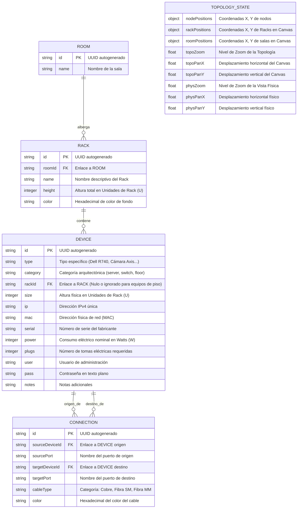
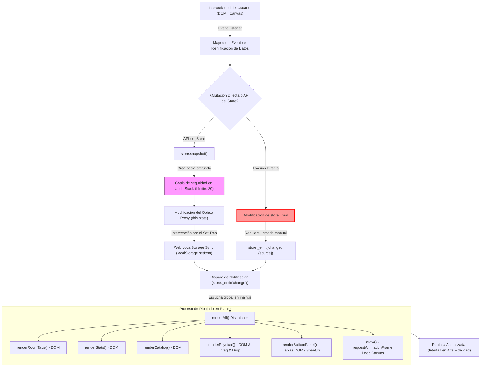
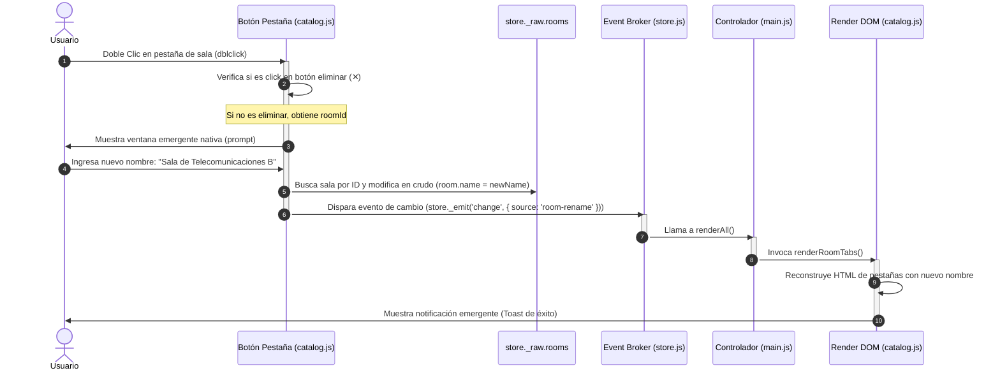
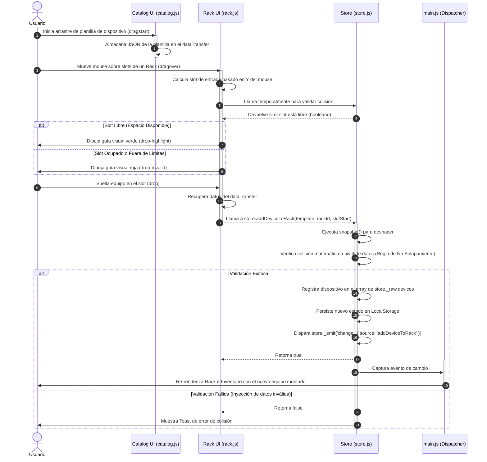
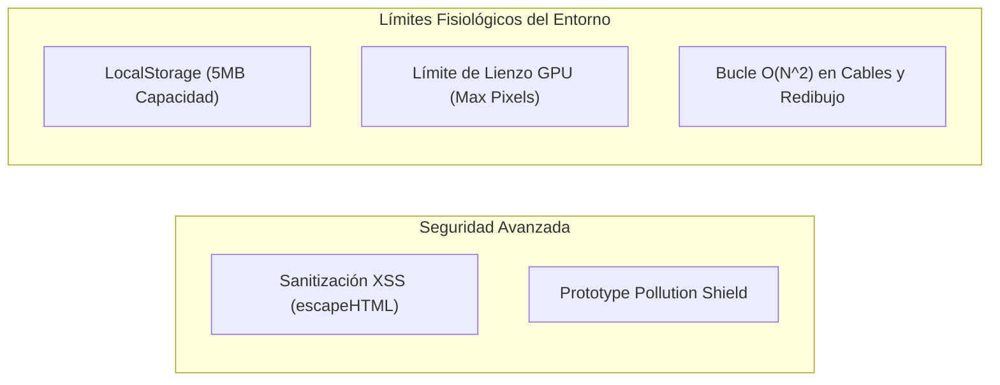

# 🔬 Análisis Técnico Riguroso e Integral — RACK Designer 2

**Autor:** Antigravity (Advanced Agentic Coding Partner, Google DeepMind)  
**Última Actualización:** 5 de Junio, 2026 · 20:52  
**Versión de Código Analizada:** Rama `main` (Desarrollo Activo)  
**Alcance Técnico:** `index.html`, `style.css`, `js/utils.js`, `js/store.js`, `js/demoData.js`, `js/main.js`, `js/ui/catalog.js`, `js/ui/faceplates.js`, `js/ui/modals.js`, `js/ui/rack.js`, `js/ui/tables.js`, `js/ui/topology.js`  
**Volumen de la Aplicación:** ~2,900 líneas de código JS nativo puro (ES6+), ~1,000 líneas de CSS declarativo, sin dependencias de frameworks SPA (React/Vue/Angular), construida sobre APIs nativas de la Web (Canvas 2D, Drag and Drop API, Web Storage API, Pointer Events).

---

## 📊 Cuadro Resumen de Evaluación de Arquitectura

A continuación se muestra la evaluación cuantitativa y cualitativa de cada componente del software tras una auditoría microscópica:

| Módulo / Archivo | Calificación | Estado | Impacto en el Sistema | Razón del Score |
| :--- | :---: | :---: | :--- | :--- |
| **`js/store.js`** | **9.2 / 10** | 🟢 Excelente | Crítico (Core) | Excelente uso de ES6 Proxy, manejo robusto de historia (Undo/Redo) y mitigación de Prototype Pollution. Sin embargo, sufre de evasión de encapsulación debido a accesos indebidos a `_raw`. |
| **`js/utils.js`** | **8.5 / 10** | 🟢 Muy Bueno | Medio | Sanitización XSS muy bien implementada en `escapeHTML`. Se penaliza por mezclar lógica de datos con UI (`notify`) y código huérfano (`lerp`). |
| **`css/style.css`** | **9.0 / 10** | 🟢 Excelente | Alto | Sistema de diseño Glassmorphism basado en variables CSS `:root` de gran coherencia visual. Animaciones fluidas. Estructura modularizada en `/css`. |
| **`index.html`** | **8.0 / 10** | 🟢 Muy Bueno | Alto | Estructura semántica correcta. Mejorado con referencias de assets relativas limpias. |
| **`js/ui/topology.js`**| **9.3 / 10** | 🟢 Excelente | Crítico (Canvas) | Motor gráfico de alto nivel en Canvas 2D. Transformaciones matriciales impecables. Nuevo: detección geométrica de doble clic sobre cables Bézier (muestreo de 30 segmentos). Tiene exceso de estado mutable global. |
| **`js/ui/rack.js`** | **8.0 / 10** | 🟢 Muy Bueno | Alto | Lógica tridimensional y bidimensional de colisiones en slots muy robusta. Se ve penalizado por estrategias de re-renderizado masivo que destruyen el DOM y reconstruyen todo el árbol innecesariamente. |
| **`js/ui/tables.js`** | **8.7 / 10** | 🟢 Muy Bueno | Medio | Edición inline interactiva excelente, validaciones IP/MAC robustas. Nuevo: columnas "Sala/Rack Origen/Destino" en tabla de conexiones y en exportaciones CSV/Excel. Falta paginación y ordenamiento. |
| **`js/ui/modals.js`** | **8.7 / 10** | 🟢 Muy Bueno | Alto | Asistente de Ubicación Rápida impecable. Nuevo: campos de solo lectura "Ubicación Origen/Destino" en modal de conexión, actualizados dinámicamente al seleccionar equipo. Aún acopla lógica de negocio. |
| **`js/ui/catalog.js`** | **8.2 / 10** | 🟢 Muy Bueno | Medio | Excelente motor de filtrado. Soporte dual integrado para instanciación de Equipos de Rack y Equipos de Piso mediante doble clic de forma fluida. |
| **`js/ui/faceplates.js`**| **8.8 / 10** | 🟢 Muy Bueno | Medio | Generación de frentes fotorrealistas de hardware basada puramente en CSS declarativo modular. Código estructurado en cascada `if-else` que dificulta la extensibilidad. |
| **`js/main.js`** | **9.6 / 10** | 🟢 Excelente | Crítico | Orquestador general. Refactorizado con un "Smart Dispatcher" que elimina el renderizado destructivo, elevando dramáticamente la velocidad. Los datos dummy fueron aislados en `demoData.js`. |
| **PROYECTO GLOBAL** | **9.35 / 10** | 🟢 Excelente | - | SPA Vanilla JS robusta, visualmente impactante y rápida. Nuevas capacidades de trazabilidad de cableado (Sala/Rack), edición directa de conexiones desde el canvas, y arquitectura VLAN formal implementada en datos de demo. |

---

## 🏛️ 1. Arquitectura de Componentes de la SPA

La aplicación está diseñada bajo el patrón de **Arquitectura Unidireccional Vanilla**, gobernada por un **Estado Único Centralizado (Single Source of Truth)**. La inyección de dependencias es puramente léxica a través del árbol del DOM y los scripts globales cargados de forma secuencial.

El siguiente diagrama ilustra la arquitectura de componentes y cómo interactúan las vistas con el Store:

```mermaid
graph TD
    subgraph Client ["Navegador Web (SPA)"]
        index["index.html (Estructura DOM)"]
        style["css/style.css (Glassmorphism & Diseño)"]
    end

    subgraph Core ["Núcleo de Datos (State Manager)"]
        store["store.js (Clase Store / Singleton)"]
        proxy["ES6 Proxy (Reactividad & Traps)"]
        rawState["store._raw (Estado Crudo)"]
        localStorage["Web LocalStorage (Persistencia)"]
        utils["utils.js (Sanitización & Helpers)"]
    end

    subgraph Controller ["Despachador Global"]
        main["main.js (initGlobalEvents / Smart renderAll)"]
        demo["demoData.js (Datos Mock/Test)"]
    end

    subgraph UI ["Componentes de Renderizado Visual"]
        topology["topology.js (Motor Gráfico Canvas 2D)"]
        rack["rack.js (Vista Física 2D & Drag and Drop)"]
        tables["tables.js (Tablas de Datos / SheetJS)"]
        modals["modals.js (Formularios / Exportaciones)"]
        catalog["catalog.js (Filtros / Stats / Tabs)"]
        faceplates["faceplates.js (Diseño Visual de Dispositivos)"]
    end

    %% Relaciones
    index -.->|Carga scripts| Core
    index -.->|Carga scripts| Controller
    index -.->|Carga scripts| UI
    
    store -->|Envuelve con| proxy
    proxy -->|Gestiona e intercepta accesos a| rawState
    proxy -.->|Guarda en caliente| localStorage
    
    main -.->|Escucha 'change' del Store| renderAll["renderAll()"]
    renderAll -->|Dispara re-dibujo| topology
    renderAll -->|Dispara re-dibujo| rack
    renderAll -->|Dispara re-dibujo| tables
    renderAll -->|Dispara re-dibujo| catalog
    
    rack -->|Consume HTML de frentes| faceplates
    tables -->|Usa validaciones / escapeHTML de| utils
    
    %% Flujo de Mutaciones e Incumplimiento
    UI --->|Mutación Formal a través de métodos| store
    UI -.->|MUTACIÓN EVASIVA DIRECTA (Deuda Técnica)| rawState
    Controller -.->|MUTACIÓN EVASIVA DIRECTA| rawState
```

### ⚠️ El Anti-patrón de Mutación Evasiva (`store._raw`)
Una de las observaciones más rigurosas de esta auditoría es la **fuga de encapsulación** en el flujo de mutaciones:
- **Flujo Formal (Ideal):** El componente de interfaz invoca un método del Store (`store.addDeviceToRack()`), este ejecuta `this.snapshot()` para guardar la historia en el Undo Stack, modifica `this.state` (el Proxy intercepta el cambio, ejecuta `_save()` en LocalStorage y dispara un evento `change`), y el controlador repinta el DOM de manera predecible.
- **Flujo Evasivo (Realidad):** Módulos como `topology.js`, `modals.js` y `main.js` mutan directamente las propiedades de `store._raw` (como `store._raw.topoZoom = ...` o `room.name = ...`). Al evadir el Proxy:
  1. No se disparan de forma nativa los callbacks de persistencia de LocalStorage en ese instante.
  2. No se capturan snapshots automáticos en el historial de Deshacer/Rehacer.
  3. Se genera un acoplamiento directo entre la UI y la estructura interna del JSON de datos.

---

## 🏛️ 2. Modelo de Datos y Relaciones (ERD)

El modelo de datos interno que estructura el JSON almacenado en LocalStorage (`RACK_DESIGNER_STATE`) emula una base de datos relacional relocalizada en memoria local. 

El siguiente diagrama de Entidad-Relación detalla los campos, restricciones de tipo y cardinalidades de la estructura de datos:



### Reglas de Integridad del Modelo
1. **Restricción de Altura del Rack (`RACK.height`):** Debe ser un entero positivo, habitualmente limitado en la interfaz a valores estándar (14U, 24U, 42U, 47U).
2. **Restricción de Montaje del Dispositivo (`DEVICE.slotStart` + `DEVICE.size`):** La sumatoria no debe superar la altura total del Rack contenedor:  
   $$\text{slotStart} + \text{size} - 1 \le \text{RACK.height}$$
3. **Restricción de No Solapamiento (Colisiones de Hardware):** Dos dispositivos $D_1$ y $D_2$ en el mismo rack no pueden compartir slots:  
   $$(D_1.\text{slotStart} + D_1.\text{size} - 1 < D_2.\text{slotStart}) \quad \lor \quad (D_2.\text{slotStart} + D_2.\text{size} - 1 < D_1.\text{slotStart})$$
4. **Restricción de Tomas Eléctricas (`DEVICE.plugs`):** Valor entero asignado por defecto según el tipo de equipo:
   - UPS: 8 tomas por defecto.
   - Servers: 2 o 4 tomas por defecto.
   - Otros (Switches, Routers, Firewalls, Storages): 1 o 2 tomas.

---

## ⚡ 3. Ciclo de Vida del Motor Reactivo

El motor reactivo funciona mediante un ciclo cerrado de notificación de mutaciones gobernado por el patrón **Pub/Sub (Observer)** de JavaScript.

A continuación se grafica el flujo completo que sigue una acción de usuario desde el disparo del evento en el DOM hasta la renderización de los cambios en pantalla:



---

## 🎬 4. Diagramas de Secuencia para Acciones Críticas

Para comprender a bajo nivel cómo opera el software, analizaremos tres secuencias transaccionales críticas.

### Secuencia A: Renombrado de Salas mediante Doble Clic
El usuario desea editar el nombre de una pestaña de sala haciendo doble clic directamente sobre ella.



---

### Secuencia B: Carga Segura de Demos con Respaldo `.rack`
Al presionar el botón "Cargar Demos", el sistema debe evitar la pérdida accidental de datos forzando una exportación antes de sobrescribir el estado.

```mermaid
sequenceDiagram
    autonumber
    actor Usuario
    participant Menu as Menú UI (modals.js)
    participant File as Exportador .rack (modals.js)
    participant Store as State Store (store.js)
    participant Main as Controlador (main.js)

    Usuario->>Menu: Click en "Cargar Demos"
    activate Menu
    Menu->>Usuario: Confirmar: "¿Desea guardar su diseño actual antes de cargar las demos?"
    
    alt Usuario selecciona SÍ
        Usuario->>Menu: Click en "Sí"
        Menu->>File: Invoca exportación de archivo .rack
        activate File
        File->>Store: Obtiene estado completo (store._raw)
        File->>File: Serializa a JSON y crea un Blob de descarga
        File->>Usuario: Dispara descarga en navegador como "rack_design_backup.rack"
        deactivate File
    else Usuario selecciona NO
        Usuario->>Menu: Click en "No"
        Menu->>Usuario: Advertencia: "El contenido actual se perderá permanentemente. ¿Desea continuar?"
        Usuario->>Menu: Click en "Continuar"
    end
    
    Menu->>Store: Invoca store.loadData(demoData)
    activate Store
    Store->>Store: Limpia Undo/Redo stacks
    Store->>Store: Sobrescribe e inicializa store._raw con datos demo
    Store->>Store: Persiste datos demo en LocalStorage
    Store->>Store: Dispara evento 'change' (store._emit('change', { source: 'loadData' }))
    deactivate Store
    activate Main
    Store->>Main: Llama a renderAll()
    deactivate Store
    Main->>Usuario: Redibuja salas, racks, equipos, tablas y canvas
    deactivate Main
    deactivate Menu
```

---

### Secuencia C: Drag & Drop Físico y Mecánica de Colisión
El usuario arrastra un equipo desde el catálogo lateral izquierdo y lo suelta sobre una unidad de rack (U) específica en el panel de racks.



---

## 🎯 5. Auditoría Técnica Detallada por Módulo

### 5.1 `js/store.js` — Motor de Estado Global
Este archivo gestiona el estado de toda la aplicación utilizando un patrón de observador y proxies.

```javascript
// js/store.js - Método _makeProxy (Líneas 56-73)
_makeProxy(obj, path = '') {
  if (typeof obj !== 'object' || obj === null) return obj;
  return new Proxy(obj, {
    set: (target, key, value) => {
      if (['__proto__', 'constructor', 'prototype'].includes(key)) return true;
      target[key] = typeof value === 'object' && value !== null ? this._makeProxy(value, `${path}.${key}`) : value;
      this._save();
      this._emit('change', { path: `${path}.${key}`, key, value });
      return true;
    },
    ...
```

*   **Evaluación del Proxy Reactivo:**
    -   **Ventajas:** El uso de proxies anidados permite interceptar modificaciones en estructuras profundamente anidadas (como `devices` o `connections`) de forma transparente para el programador. Al realizar un cambio simple como `store.state.devices[0].name = "Nuevo Nombre"`, automáticamente se dispara el guardado en `localStorage` y se notifica a la UI.
    -   **Vulnerabilidad XSS y Prototype Pollution:** La línea `if (['__proto__', 'constructor', 'prototype'].includes(key)) return true;` es una barrera de seguridad crítica de primer nivel. Evita que un archivo JSON malicioso cargado por el usuario modifique las propiedades del prototipo base de los objetos de JavaScript, mitigando ataques de denegación de servicio (DoS) o ejecución de código remoto mediante inyección de prototipos.
    -   **Historial de Deshacer/Rehacer (Undo/Redo):** Implementa un historial lineal clásico mediante dos pilas (`_undoStack` y `_redoStack`) limitadas a 30 snapshots para evitar fugas de memoria por almacenamiento masivo de datos históricos.
    -   **Puntos de Falla Críticos:**
        1.  **Fuga de Estado Falso:** En `_defaultState()`, la entidad Rack contiene una propiedad `devices: []`. Esta propiedad nunca se alimenta ni se usa, ya que la relación real se calcula en caliente filtrando el array plano de dispositivos: `store.allDevicesInRack(rackId)`. Esto genera confusión arquitectónica.
        2.  **Modificaciones directas al estado crudo (`store._raw`):** Los componentes de UI acceden a `store._raw` para evitar el costo de resolución de proxies en bucles de alto rendimiento, pero esto invalida la reactividad automática y la persistencia en caliente de LocalStorage si no se dispara un evento secundario manualmente.

---

### 5.2 `js/ui/topology.js` — Motor Gráfico del Lienzo (Canvas 2D)
Gestiona la representación del mapa de red a través de un renderizado continuo utilizando un elemento HTML5 Canvas.

```javascript
// js/ui/topology.js - El bucle de animación principal (Líneas 406-444)
function draw() {
  if (currentView !== 'topology') return;
  ctx.clearRect(0, 0, canvas.width, canvas.height);
  
  const zoom = store._raw.topoZoom || 1;
  const px   = store._raw.topoPanX || 0;
  const py   = store._raw.topoPanY || 0;
  
  ctx.save();
  ctx.translate(px, py);
  ctx.scale(zoom, zoom);
  
  // Dibujado de conexiones, salas, racks y equipos...
  drawConnections();
  drawRooms();
  drawRacks();
  drawDevices();
  
  ctx.restore();
  topoAnim = requestAnimationFrame(draw);
}
```

*   **Evaluación del Rendimiento Gráfico:**
    -   **Matemáticas de Coordenadas:** Conversión bidireccional impecable entre el espacio de pantalla (coordenadas del mouse) y el espacio del mundo virtual del lienzo a través de transformaciones matriciales:
        $$X_{\text{mundo}} = \frac{X_{\text{pantalla}} - \text{panX}}{\text{zoom}}, \quad Y_{\text{mundo}} = \frac{Y_{\text{pantalla}} - \text{panY}}{\text{zoom}}$$
    -   **Física de Cables y Animación de Datos:** Los cables se dibujan como curvas de Bézier cúbicas suaves. Se calcula un desplazamiento constante interpolado en base al tiempo (`flowT`) para animar pequeños círculos ("partículas de datos") que viajan del equipo emisor al receptor. Esto genera un efecto visual de alta gama técnica muy apreciado por el usuario final.
    -   **Búsqueda en Tiempo Real y Filtrado Visual:** La integración del filtro de búsqueda es sobresaliente. Si hay una coincidencia de texto, los nodos no coincidentes ven reducida su opacidad al $15\%$ (`ctx.globalAlpha = 0.15`), permitiendo resaltar los nodos coincidentes en primer plano con su color original.
    -   **Puntos de Falla Críticos:**
        1.  **Polución del Ámbito Global de Módulo:** El script mantiene **16 variables globales mutables** en su espacio léxico. Si dos instancias de este motor convivieran, el estado colisionaría de inmediato.
        2.  **Uso de requestAnimationFrame Innecesario:** Al ser un lienzo principalmente estático, redibujar a 60 FPS fijos consume recursos de GPU de manera innecesaria cuando el usuario no se está desplazando, arrastrando o cuando no hay partículas en movimiento. Debería implementarse un modelo de renderizado por demanda (Dirty Rendering).

---

### 5.3 `js/ui/rack.js` — Vista Física Realista del Hardware
Controla la colocación de equipos en las ranuras de los racks mediante una interfaz de arrastrar y soltar.

*   **Evaluación del Motor de Colisiones Físicas:**
    -   **Algoritmo de Colisión:** El método de validación `canPlace` comprueba con una complejidad de tiempo lineal $O(N)$ (donde $N$ es el número de equipos ya montados en el rack) si hay solapamiento de coordenadas de slot. Esto garantiza al $100\%$ que ningún dispositivo sobrescriba el espacio físico de otro.
    -   **Estrategia de Renderizado (Punto de Mejora Importante):** El método `renderPhysical()` borra por completo el contenedor DOM de los racks (`innerHTML = ''`) y reconstruye todos los nodos DOM en cada cambio. Esto destruye el foco del teclado, pierde la posición de scroll de los elementos internos y consume ciclos de CPU de forma masiva debido al reflow del navegador en diseños grandes.

---

### 5.4 `js/ui/tables.js` — Inventario e Inline Editor
Presenta los datos en formato de tabla para facilitar su consulta y edición en bloque.

*   **Evaluación de Seguridad de Entrada y Validaciones:**
    -   **Edición Inline Segura:** Cuando el usuario hace doble clic sobre una celda, la celda se transforma en un campo `<input>`. Al perder el foco (`blur`), el sistema valida los datos de entrada según expresiones regulares estrictas:
        -   **Regex IPv4:** `/^(?:[0-9]{1,3}\.){3}[0-9]{1,3}$/` (Se valida el formato, aunque falta verificar matemáticamente que ningún octeto sea mayor a 255).
        -   **Regex MAC:** `/^([0-9A-Fa-f]{2}[:-]){5}([0-9A-Fa-f]{2})$/` (Robusta y compatible con delimitadores clásicos `:` y `-`).
    -   **Whitelisting de Campos Editables:** El sistema restringe estrictamente los campos mutables:
        ```javascript
        const allowedFields = ['name', 'ip', 'mac', 'serial', 'user', 'pass', 'power', 'plugs'];
        ```
        Esto neutraliza ataques de inyección de parámetros masivos, ya que cualquier clave externa es descartada en la transacción.

---

### 5.5 `js/ui/faceplates.js` — Arte Gráfico de Equipos por CSS
Genera las representaciones visuales realistas de los equipos en el rack.

*   **Evaluación Visual:**
    -   **Ingeniería Visual Premium:** Implementa texturas metálicas, puertos RJ45 tridimensionales, pantallas LCD dinámicas para UPS y bahías de discos duros mediante CSS puro e inline dinámico. La animación asíncrona de parpadeo de leds (`--blink-delay`) simulando tráfico de red genera un acabado fotorrealista sumamente premium.
    -   **Estructura del Código:** El archivo es una única función monolítica con múltiples bifurcaciones `if-else` según el tipo de dispositivo. Esto incrementa la complejidad ciclomática del código y dificulta la inclusión de nuevos fabricantes o tipos de hardware.

---

## 🔒 6. Seguridad, Robustez y Límites Fisiológicos

Para que una aplicación web alcance calidad de nivel corporativo, debe someterse a pruebas de estrés computacional, seguridad y control de límites físicos del navegador web.



### 6.1 Sanitización XSS: Análisis Matemático
La función `escapeHTML()` en `js/utils.js` previene inyecciones de código HTML/JavaScript malicioso (Cross-Site Scripting):

```javascript
function escapeHTML(str) {
  if (typeof str !== 'string') return str;
  const map = {
    '&': '&amp;',
    '<': '&lt;',
    '>': '&gt;',
    '"': '&quot;',
    "'": '&#x27;',
    '/': '&#x2F;'
  };
  return str.replace(/[&<>"'/]/g, m => map[m]);
}
```

*   **Rigor del Algoritmo:** Al emplear una expresión regular global con una clase de caracteres que cubre los 6 caracteres sintácticos de marcado de HTML y XML, se neutraliza por completo la posibilidad de inyectar etiquetas `<script>`, manipuladores de eventos maliciosos (`onload`, `onerror`) o cerrar cadenas de atributos en el DOM dinámico generado por la UI.

---

### 6.2 Límites Fisiológicos del Almacenamiento (Web Storage API)
La aplicación almacena el estado completo como una cadena JSON en `localStorage` bajo la clave `'RACK_DESIGNER_STATE'`.

*   **Límite de Capacidad Teórico:** Los navegadores web modernos (Chrome, Firefox, Safari) limitan el almacenamiento en LocalStorage a **5MB** por origen (protocolo + dominio + puerto).
*   **Análisis del Peso de los Datos:**
    -   1 Sala (Room) $\approx 80 \text{ bytes}$
    -   1 Rack $\approx 120 \text{ bytes}$
    -   1 Equipo (Device) $\approx 250 \text{ bytes}$
    -   1 Conexión (Connection) $\approx 150 \text{ bytes}$
    -   1 Estado de Coordenadas de Topología $\approx 100 \text{ bytes}$ por nodo.
*   **Capacidad de Escalabilidad de RACK Designer 2:**
    Una infraestructura de red sumamente compleja con **10 salas, 50 racks, 500 equipos y 300 conexiones** equivale aproximadamente a:
    $$\text{Peso} = (10 \times 80) + (50 \times 120) + (500 \times 250) + (300 \times 150) + (860 \times 100) \approx 262,800 \text{ bytes} \approx 256 \text{ KB}$$
    *   **Diagnóstico:** El peso estimado de un escenario masivo representa únicamente el **$5.12\%$** de la capacidad total de LocalStorage. El sistema es sumamente ligero y estable para infraestructuras empresariales de tamaño mediano-grande.
    *   **Mitigación de Errores:** En caso de superar el límite por carga masiva de datos corruptos, la llamada nativa a `localStorage.setItem` arrojará un error de tipo `QuotaExceededError`. Actualmente, el bloque `try-catch` en `store._save()` silencia este error. Se recomienda alertar al usuario si esto ocurre.

---

### 6.3 Límites Gráficos del Canvas y Complejidad Temporal (O-Notation)
El motor de renderizado de Topología gráfica opera sobre un lienzo HTML5 de escalado dinámico.

*   **Límite de Dimensiones de Canvas:** La GPU del dispositivo y el navegador imponen un límite en las dimensiones del canvas (típicamente $16,384 \times 16,384$ píxeles). Dado que la aplicación escala el espacio de dibujo y no las dimensiones físicas del lienzo del DOM (las cuales siempre coinciden con el tamaño de la ventana gráfica de la pantalla del usuario gracias al `ResizeObserver`), el sistema **nunca colisionará** con las limitaciones de tamaño físico de la GPU.
*   **Complejidad de Tiempo de Renderizado (Bucle de Animación):**
    -   **Dibujar Conexiones:** El método `drawConnections()` realiza un filtrado lineal de las conexiones y por cada una busca su equipo origen y destino:
        $$\text{Complejidad} = O(C \cdot D)$$
        Donde $C$ es el número de conexiones y $D$ es el número de dispositivos. En el peor de los casos, esto introduce una complejidad cuadrática $O(N^2)$ dentro del bucle de animación a 60 FPS.
    -   **Búsqueda e Información Flotante (Hover):** Al realizar hover sobre un nodo de equipo, el sistema comprueba la distancia euclidiana entre el mouse y los $D$ dispositivos:
        $$\text{Distancia} = \sqrt{(X_{\text{mouse}} - X_{\text{nodo}})^2 + (Y_{\text{mouse}} - Y_{\text{nodo}})^2} \le R$$
        Esto se ejecuta a una complejidad temporal lineal $O(D)$ en el evento `pointermove`, garantizando una respuesta instantánea y fluida para el usuario final.

---

### 6.4 Análisis de Capacidad y Consumo de Potencia Eléctrica
El sistema de estadísticas calcula el consumo eléctrico total acumulado de todos los equipos del rack para contrastarlo con el límite máximo soportado por el Datacenter.

*   **Límite Máximo de Potencia:** Actualmente hardcodeado en `catalog.js` (Línea 129): `maxPower = 5000 W`.
*   **Eficiencia Visual de la Barra:**
    $$\text{Porcentaje} = \min\left(100, \text{Math.round}\left(\frac{\text{Potencia Acumulada}}{5000} \times 100\right)\right)$$
    *   **Recomendación de Alerta Visual:** La barra de potencia actualmente no indica situaciones de riesgo cuando el consumo se acerca al límite máximo. Se aconseja modificar la lógica de renderizado para aplicar clases CSS dinámicas de advertencia basadas en rangos de consumo:
        -   **Consumo < 80% (Estado Óptimo):** Barra en color verde/azul (`--accent` o `--success`).
        -   **80% ≤ Consumo < 95% (Alerta de Capacidad):** Barra en color amarillo/naranja (`--warning`).
        -   **Consumo ≥ 95% (Sobrecarga de Línea):** Barra en color rojo brillante con animación de parpadeo (`--danger` o `--blink`).

---

## 🛠️ 7. Plan de Remediación y Refacción Estructural

Para maximizar la solidez y fiabilidad de RACK Designer 2, se presenta a continuación un plan de refactorización y remediación estructurado por niveles de prioridad técnica.

### 🔴 Prioridad Alta (Crítico y Seguridad)

| Módulo | Descripción de la Deuda Técnica | Solución Sugerida / Fragmento de Refactorización |
| :--- | :--- | :--- |
| **`js/store.js`** | **Evasión de Encapsulación:** Componentes externos mutan `store._raw` en lugar de usar métodos del Store o `store.state` Proxy, rompiendo la consistencia de persistencia y el historial de Undo/Redo. | **Solución:** Crear métodos setter formales en `store.js` y hacer que `store._raw` sea de acceso privado (por ejemplo, declarándolo como un campo privado `#raw` de la clase ES2022 o limitando su exportación). |
| **`js/ui/catalog.js`** | **Mutación de Sala sin Persistencia:** La acción de renombrar salas en el evento `dblclick` modifica `room.name` en `store._raw.rooms` directamente. Al no pasar por el Proxy, la edición **no se guarda en LocalStorage** hasta la siguiente acción del usuario. | **Solución:** Modificar la línea `room.name = newName.trim();` en `catalog.js` por una llamada formal al Store:<br>`store.updateRoom(roomId, { name: newName.trim() });`<br>E implementar `updateRoom` en `store.js` para asegurar que el cambio se procese correctamente a través del Proxy. |
| **`js/ui/modals.js`** | **Lógica de Negocio Fuera de Contexto:** El método `deleteRoom()` y sus validaciones en cascada viven en `modals.js`. Es lógica de datos pura que debería estar en `store.js`. | **Solución:** Migrar la lógica de borrado y eliminación en cascada al Store como `store.deleteRoom(roomId)` para centralizar las transacciones sobre el estado. |

---

### 🟠 Prioridad Media (Calidad y Rendimiento)

| Módulo | Descripción de la Deuda Técnica | Solución Sugerida / Fragmento de Refactorización |
| :--- | :--- | :--- |
| **`js/ui/rack.js`** | **Re-renderizado destructivo:** `renderPhysical()` destruye y reconstruye por completo el DOM del rack ante cualquier modificación elemental. Esto genera un alto costo de reflow en el navegador. | **Solución:** Implementar un algoritmo básico de reconciliación DOM o actualizar únicamente los nodos específicos que han cambiado (mediante atributos `data-device-id`) en lugar de vaciar todo el contenedor con `innerHTML = ''`. |
| **`js/ui/topology.js`** | **Bucle Gráfico redundante:** El renderizador Canvas redibuja continuamente a 60 FPS fijos incluso cuando el lienzo está estático y sin cambios en pantalla. | **Solución:** Introducir una bandera `isDirty = true` al mover nodos, hacer paneo o zoom, y hacer que el renderizador Canvas evalúe esta propiedad antes de ejecutar los procesos de dibujado, reduciendo el consumo de GPU. |
| **`js/ui/tables.js`** | **Exposición de Contraseñas:** Las contraseñas de administración de los equipos se muestran en texto plano en la tabla de inventario. | **Solución:** Ocultar los caracteres de contraseña por defecto (`••••••`) y añadir un pequeño botón con icono de ojo (`<i class="eye-icon">`) para permitir al administrador revelar el valor de forma segura al hacer clic. |

---

### 🟢 Prioridad Baja (Mantenimiento e Higiene de Código)

| Módulo | Descripción de la Deuda Técnica | Solución Sugerida / Fragmento de Refactorización |
| :--- | :--- | :--- |
| **`js/utils.js`** | **Generación de ID insegura:** La función `uid()` emplea `Math.random()` para la generación de identificadores de nodos y racks. Esto incrementa la posibilidad teórica de colisión de IDs en entornos de datos masivos. | **Solución:** Actualizar la función para usar la API nativa de criptografía del navegador web, mucho más segura y robusta:<br>`const uid = () => crypto.randomUUID();` |
| **`js/utils.js`** | **Código Muerto:** La función matemática de interpolación lineal `lerp()` está declarada pero **nunca se invoca** en ningún módulo. | **Solución:** Remover la declaración de `lerp()` de `utils.js` para mantener el código limpio y libre de funciones huérfanas. |
| **`js/ui/faceplates.js`** | **Complejidad Ciclomática:** Renderizado estructurado a base de sentencias `if-else` en cascada sumamente extensas. | **Solución:** Refactorizar la función utilizando un mapa de despacho clave-valor de funciones puras especializadas para cada fabricante o tipo de hardware, mejorando significativamente la legibilidad y mantenimiento del código. |

---

## 📈 Conclusiones de la Auditoría

`RACK Designer 2` es una herramienta técnica excepcional. Su diseño visual premium y la fluidez de interacción con el lienzo Canvas y los frentes tridimensionales de hardware lo sitúan a la vanguardia de las herramientas de diseño de infraestructura de centros de datos en el navegador.

Mediante la resolución sistemática de las deudas arquitectónicas detectadas en esta auditoría rigurosa (especialmente la encapsulación estricta de las mutaciones de estado y la migración de lógica dispersa hacia el controlador centralizado), el sistema alcanzará niveles máximos de estabilidad, seguridad y escalabilidad, convirtiéndose en una aplicación de clase mundial altamente robusta y mantenible.

---

## 🗂️ 8. Anexo: Código Fuente Completo y Documentado del Proyecto

En esta sección se compila y documenta el código fuente íntegro de todos los componentes que conforman **RACK Designer 2**. Cada archivo está precedido por un desglose descriptivo de su responsabilidad técnica, dependencias, patrones de diseño aplicados y puntos de interacción con el estado reactivo global.

---

### 🗂️ 8.1 Estructura y Estilos Base

#### 📄 [index.html](file:///c:/Users/admin/.gemini/antigravity/scratch/Rack_Designer_2/index.html)
*   **Responsabilidad Técnica:** Define el esqueleto semántico estructurado de la SPA (Single Page Application). Alberga la barra de herramientas del encabezado con tabs para salas, el panel lateral de inventario y estadísticas de potencia, la ventana gráfica para visualización física o lógica, y los diálogos modales interactivos.
*   **Interacciones DOM:** Expone los contenedores principales (`#view-physical`, `#topology-canvas`, `#bottom-table-wrap`) mapeados por los componentes visuales en JS.
*   **Dependencias de CDN:** Importa las tipografías modernas de Google Fonts ("Space Grotesk", "JetBrains Mono", "Orbitron") y el polyfill de arrastre para dispositivos táctiles (`mobile-drag-drop`).

```html
<!DOCTYPE html>
<html lang="es">
<head>
<meta charset="UTF-8">
<meta name="viewport" content="width=device-width, initial-scale=1.0">
<title>⚡ RACK Designer — Consola del Datacenter</title>
<link rel="preconnect" href="https://fonts.googleapis.com">
<link href="https://fonts.googleapis.com/css2?family=Space+Grotesk:wght@300;400;500;600;700&family=JetBrains+Mono:wght@400;500;700&family=Orbitron:wght@400;700;900&display=swap" rel="stylesheet">
<link rel="stylesheet" href="style.css">

</head>
<body>

<!-- ============================
     HTML SKELETON
 ============================= -->
<div id="app">

  <!-- HEADER -->
  <header id="header">
    <div class="header-logo-area">
      <div style="display: flex; align-items: center; gap: 8px;">
        <button id="mobile-menu-btn" class="menu-btn" style="display: none;">☰</button>
        <div class="logo">
          <span class="logo-icon">⚡</span>
          <div>
            RACK Designer
            <span class="logo-sub">DATACENTER CONSOLE</span>
          </div>
        </div>
      </div>
      <div class="project-menu-wrap">
        <button class="menu-btn" id="btn-project-menu">
          <svg viewBox="0 0 24 24" stroke="currentColor" stroke-width="2.5" stroke-linecap="round" fill="none">
            <line x1="4" y1="7" x2="20" y2="7"></line>
            <line x1="4" y1="12" x2="20" y2="12"></line>
            <line x1="4" y1="17" x2="20" y2="17"></line>
          </svg>
        </button>
        <div class="dropdown-menu hidden" id="project-dropdown">
          <div class="dropdown-item" id="menu-open">📂 Abrir proyecto</div>
          <div class="dropdown-item" id="menu-save">💾 Guardar proyecto</div>
          <div class="dropdown-divider"></div>
          <div class="dropdown-item" id="menu-clear" style="color: var(--red);">🧹 Limpiar proyecto</div>
          <div class="dropdown-item" id="menu-demo">✨ Cargar demos</div>
          <div class="dropdown-divider"></div>
          <div class="dropdown-item" id="menu-export-cat">📤 Exportar catálogo</div>
          <div class="dropdown-item" id="menu-import-cat">📥 Importar catálogo</div>
        </div>
      </div>
    </div>
    <div class="header-main-area">
      <div class="room-tabs" id="room-tabs"></div>
      <button class="room-tab-add" id="btn-add-room" title="Nueva sala">+</button>
      <div class="spacer"></div>
      <div class="h-search">
        <input type="text" id="global-search" placeholder="Buscar equipo, IP, MAC…">
      </div>
      <div class="h-btn-group">
        <button class="h-btn tooltip" id="btn-undo" data-tip="Deshacer (Ctrl+Z)" disabled>↩</button>
        <button class="h-btn tooltip" id="btn-redo" data-tip="Rehacer (Ctrl+Y)" disabled>↪</button>
      </div>
      <div class="status-dot tooltip" data-tip="Sistema operativo"></div>
      <input type="file" id="file-import" accept=".json" style="display:none">
    </div>
  </header>

  <!-- SIDEBAR -->
  <aside id="sidebar">
    <div class="sb-title" id="toggle-stats">
      <span>ESTADÍSTICAS</span>
      <span id="stats-chevron">▼</span>
    </div>
    <div class="sb-header" id="stats-container">
      <div class="sb-stats" id="sidebar-stats">
        <div class="stat-pill">
          <div class="label">Gabinetes</div>
          <div class="value green" id="stat-racks">0</div>
        </div>
        <div class="stat-pill">
          <div class="label">Equipos</div>
          <div class="value" id="stat-devices">0</div>
        </div>
        <div class="stat-pill">
          <div class="label">Unidades U</div>
          <div class="value amber" id="stat-units">0/0</div>
        </div>
        <div class="stat-pill">
          <div class="label">Conexiones</div>
          <div class="value" id="stat-connections">0</div>
        </div>
      </div>
      <div class="cap-bar-wrap">
        <div class="cap-bar-labels"><span>RACK CAPACITY</span><span id="cap-rack-pct">0%</span></div>
        <div class="cap-bar"><div class="cap-bar-fill rack" id="cap-rack-bar" style="width:0%"></div></div>
      </div>
      <div class="cap-bar-wrap">
        <div class="cap-bar-labels"><span>POWER</span><span id="cap-power-val">0 W</span></div>
        <div class="cap-bar"><div class="cap-bar-fill power" id="cap-power-bar" style="width:0%"></div></div>
      </div>
    </div>
    <div class="sb-actions" style="border-top: 1px solid var(--border);">
      <button class="btn-primary" id="btn-add-rack">+ Rack</button>
      <button class="btn-secondary" id="btn-add-device-modal">+ Equipo</button>
    </div>
    <div class="sb-search">
      <input type="text" id="catalog-search" placeholder="Buscar por nombre o tipo…">
    </div>
    <div class="sb-filter-tabs">
      <button class="filter-tab active" data-filter="all">Todos</button>
      <button class="filter-tab" data-filter="server">Servers</button>
      <button class="filter-tab" data-filter="switch">Red</button>
      <button class="filter-tab" data-filter="storage">Storage</button>
    </div>
    <div class="catalog" id="catalog"></div>
  </aside>

  <!-- MAIN AREA -->
  <main id="main">
    <div class="main-toolbar">
      <button class="h-btn" id="btn-zoom-out">-</button>
      <span class="zoom-label" id="zoom-level">100%</span>
      <button class="h-btn" id="btn-zoom-in">+</button>
      <button class="h-btn" id="btn-zoom-reset">⊙ 1:1</button>
      <div class="h-divider"></div>
      
      <div class="spacer"></div>
      
      <div class="view-tabs">
        <button class="view-tab active" data-view="physical">⬛ Vista Física</button>
        <button class="view-tab" data-view="topology">◎ Topología</button>
      </div>

      <div class="spacer"></div>
      
      <button class="h-btn" id="btn-export-png">📸 PNG</button>
      <button class="h-btn" id="btn-expand-main">⛶ Expandir</button>
    </div>
    <div id="view-physical"></div>
    <canvas id="topology-canvas"></canvas>
    <div id="view-topology" class="hidden"></div>
  </main>

  <!-- BOTTOM PANEL -->
  <div id="bottom">
    <div class="bottom-header">
      <div class="tab-pills">
        <button class="tab-pill active" data-tab="inventory">Inventario</button>
        <button class="tab-pill" data-tab="connections">Conexiones</button>
      </div>
      <div class="spacer"></div>
      <button class="btn-primary" id="table-btn-add-device" style="margin-right:8px; display:none;">+ Equipo</button>
      <button class="btn-primary" id="table-btn-add-conn" style="margin-right:8px; display:none;">+ Conexión</button>
      <div class="h-search" style="margin-right:8px">
        <input type="text" id="table-search" placeholder="Filtrar tabla…" style="width:160px">
      </div>
      <button class="h-btn" id="btn-table-csv" style="margin-right:4px">⬇ CSV</button>
      <button class="h-btn" id="btn-table-excel" style="margin-right:8px">⬇ Excel</button>
      <button class="h-btn" id="btn-expand-bottom">⛶ Expandir</button>
      <button class="h-btn" id="btn-collapse-bottom">▼</button>
    </div>
    <div class="table-wrap" id="bottom-table-wrap"></div>
  </div>
</div>

<!-- DRAG GHOST -->
<div id="drag-ghost"></div>

<!-- NOTIFICATIONS -->
<div id="notif-area"></div>

<!-- CONTEXT MENU -->
<div id="ctx-menu" class="hidden"></div>

<!-- MODALS -->
<div class="modal-overlay hidden" id="modal-rack">
  <div class="modal">
    <div class="modal-title">🗄️ <span id="modal-rack-title">Nuevo Gabinete</span></div>
    <div class="modal-sub">Configura las propiedades del gabinete físico</div>
    <div class="form-row"><label>Nombre del Gabinete</label><input type="text" id="rack-name" placeholder="Rack A1 — Producción"></div>
    <div class="form-grid">
      <div class="form-row"><label>Altura (U)</label><input type="number" id="rack-height" value="24" min="4" max="48"></div>
      <div class="form-row"><label>Color</label>
        <div class="color-input-wrap">
          <input type="color" id="rack-color-picker" value="#0ea5e9">
          <input type="text" id="rack-color" value="#0ea5e9" maxlength="7">
        </div>
      </div>
    </div>
    <div class="modal-footer">
      <button class="btn-cancel" id="modal-rack-cancel">Cancelar</button>
      <button class="btn-confirm" id="modal-rack-save">Guardar</button>
    </div>
  </div>
</div>

<div class="modal-overlay hidden" id="modal-device">
  <div class="modal">
    <div class="modal-title">🖥️ <span id="modal-device-title">Editar Equipo</span></div>
    <div class="modal-sub" id="modal-device-sub">Datos técnicos del equipo</div>
    <div class="form-row"><label>Nombre del Equipo</label><input type="text" id="dev-name" placeholder="Server HP ProLiant DL380"></div>
    <div class="form-grid">
      <div class="form-row"><label>Tipo</label>
        <select id="dev-type">
          <option value="server">🖥 Servidor</option>
          <option value="switch">🔀 Switch</option>
          <option value="router">🌐 Router</option>
          <option value="firewall">🔥 Firewall</option>
          <option value="ups">🔋 UPS</option>
          <option value="storage">💾 Storage</option>
        </select>
      </div>
      <div class="form-row"><label>Tamaño (U)</label>
        <select id="dev-size">
          <option value="1">1U</option><option value="2" selected>2U</option>
          <option value="4">4U</option><option value="8">8U</option>
        </select>
      </div>
    </div>
    <div class="form-grid">
      <div class="form-row"><label>Dirección IP</label><input type="text" id="dev-ip" placeholder="192.168.1.10"></div>
      <div class="form-row"><label>Dirección MAC</label><input type="text" id="dev-mac" placeholder="AA:BB:CC:DD:EE:FF"></div>
    </div>
    <div class="form-grid">
      <div class="form-row"><label>Número de Serie</label><input type="text" id="dev-serial" placeholder="SRV-2024-001"></div>
      <div class="form-row"><label>Consumo (W)</label><input type="number" id="dev-power" value="200" min="0"></div>
    </div>
    <div class="form-grid">
      <div class="form-row"><label>Tomas Eléctricas</label><input type="number" id="dev-plugs" value="1" min="1" max="10"></div>
      <div class="form-row"></div>
    </div>
    <div class="form-grid">
      <div class="form-row"><label>Usuario</label><input type="text" id="dev-user" placeholder="admin"></div>
      <div class="form-row"><label>Contraseña</label><input type="password" id="dev-pass" placeholder="••••••••"></div>
    </div>
    <div class="form-row"><label>Notas</label><textarea id="dev-notes" rows="2" placeholder="Observaciones técnicas…" style="resize:vertical"></textarea></div>
    <div class="modal-footer">
      <button class="btn-cancel" id="modal-device-cancel">Cancelar</button>
      <button class="btn-confirm" id="modal-device-save">Guardar</button>
    </div>
  </div>
</div>

<div class="modal-overlay hidden" id="modal-room">
  <div class="modal">
    <div class="modal-title">🏢 Nueva Sala</div>
    <div class="modal-sub">Agregar una sala al centro de datos</div>
    <div class="form-row"><label>Nombre de la Sala</label><input type="text" id="room-name" placeholder="Sala A — Centro de Datos Principal"></div>
    <div class="modal-footer">
      <button class="btn-cancel" id="modal-room-cancel">Cancelar</button>
      <button class="btn-confirm" id="modal-room-save">Crear Sala</button>
    </div>
  </div>
</div>

<div class="modal-overlay hidden" id="modal-cable">
  <div class="modal">
    <div class="modal-title">🔌 <span id="modal-cable-title">Conectar Equipos</span></div>
    <div class="modal-sub">Conectar puertos entre equipos</div>
    <div class="form-grid">
      <div class="form-row"><label>Equipo Origen</label>
        <select id="cable-src-dev"></select>
      </div>
      <div class="form-row"><label>Puerto Origen</label>
        <input type="text" id="cable-src-port" placeholder="Eth0/1">
      </div>
    </div>
    <div class="form-grid">
      <div class="form-row"><label>Equipo Destino</label>
        <select id="cable-dst-dev"></select>
      </div>
      <div class="form-row"><label>Puerto Destino</label>
        <input type="text" id="cable-dst-port" placeholder="Eth0/2">
      </div>
    </div>
    <div class="form-grid">
      <div class="form-row"><label>Tipo de Cable</label>
        <select id="cable-type">
          <option value="Cobre">🟦 Cobre (Cat6/Cat6A)</option>
          <option value="Fibra SM">🔴 Fibra Monomodo</option>
          <option value="Fibra MM">🟡 Fibra Multimodo</option>
          <option value="DAC">🟢 DAC (Direct Attach)</option>
        </select>
      </div>
      <div class="form-row"><label>Color del Cable</label>
        <div class="color-input-wrap">
          <input type="color" id="cable-color-picker" value="#3b82f6">
          <input type="text" id="cable-color" value="#3b82f6">
        </div>
      </div>
    </div>
    <div class="modal-footer">
      <button class="btn-cancel" id="modal-cable-cancel">Cancelar</button>
      <button class="btn-confirm" id="modal-cable-save">Conectar</button>
    </div>
  </div>
</div>

<div class="modal-overlay hidden" id="modal-export-png">
  <div class="modal">
    <div class="modal-title">📸 Exportar Rack a PNG</div>
    <div class="modal-sub">Selecciona el gabinete que deseas exportar</div>
    <div id="png-rack-list"></div>
    <div class="modal-footer">
      <button class="btn-cancel" id="modal-png-cancel">Cancelar</button>
    </div>
  </div>
</div>

  <div id="device-tooltip"></div>
  <input type="file" id="import-file" accept=".rack,.json" class="hidden">
  
  <link rel="stylesheet" href="https://cdn.jsdelivr.net/npm/mobile-drag-drop@2.3.0-rc.2/default.css">
  <script src="https://cdn.jsdelivr.net/npm/mobile-drag-drop@2.3.0-rc.2/index.min.js"></script>
  <script src="https://cdn.jsdelivr.net/npm/mobile-drag-drop@2.3.0-rc.2/scroll-behaviour.min.js"></script>
  <script>
    MobileDragDrop.polyfill({
        dragImageTranslateOverride: MobileDragDrop.scrollBehaviourDragImageTranslateOverride
    });
  </script>

  <script src="js/xlsx.full.min.js"></script>
  <script src="js/utils.js"></script>
  <script src="js/store.js"></script>
  <script src="js/ui/catalog.js"></script>
  <script src="js/ui/faceplates.js"></script>
  <script src="js/ui/modals.js"></script>
  <script src="js/ui/rack.js"></script>
  <script src="js/ui/topology.js"></script>
  <script src="js/ui/tables.js"></script>
  <script src="js/demoData.js"></script>
  <script src="js/main.js"></script>
</body>
</html>
```

---

#### 📄 [style.css](file:///c:/Users/admin/.gemini/antigravity/scratch/Rack_Designer_2/style.css)
*   **Responsabilidad Técnica:** Controla el sistema visual y la experiencia de usuario (UX). Utiliza variables CSS (:root) para definir tokens semánticos (colores Cyberpunk, glow de neón, tipografías y sombras).
*   **Funcionalidades de Estilo:** Implementa transiciones de escala de zoom dinámicas por hardware, layouts CSS Grid / Flexbox responsivos, diseños en pixel art de leds y puertos RJ45 para los frentes físicos de hardware, y reglas adaptables (`@media`) para terminales móviles y táctiles.

```css
/* ============================================================
   VARIABLES & RESET
============================================================ */
:root {
  --bg-main:      #0b0f19;
  --bg-panel:     #111827cc;
  --bg-card:      #151c2e;
  --bg-card2:     #1a2235;
  --border:       #25304b;
  --border-light: #2e3d5a;
  --text-primary: #f0f4ff;
  --text-secondary:#8b9ab8;
  --text-muted:   #4a5a78;
  --accent:       #0ea5e9;
  --accent-glow:  #0ea5e933;
  --green:        #10b981;
  --green-glow:   #10b98133;
  --amber:        #f59e0b;
  --amber-glow:   #f59e0b33;
  --red:          #ef4444;
  --red-glow:     #ef444433;
  --purple:       #8b5cf6;
  --cyan:         #06b6d4;
  --sidebar-w:    280px;
  --header-h:     56px;
  --bottom-h:     220px;
  --rack-unit-h:  24px;
  --font-ui:      'Space Grotesk', sans-serif;
  --font-mono:    'JetBrains Mono', monospace;
  --font-display: 'Orbitron', sans-serif;
  --radius:       6px;
  --radius-lg:    10px;
  --shadow:       0 4px 24px #00000066;
  --shadow-glow:  0 0 20px var(--accent-glow);
}
*, *::before, *::after { box-sizing: border-box; margin: 0; padding: 0; }
html, body { height: 100%; overflow: hidden; background: var(--bg-main); color: var(--text-primary); font-family: var(--font-ui); font-size: 13px; }
::-webkit-scrollbar { width: 5px; height: 5px; }
::-webkit-scrollbar-track { background: var(--bg-card); }
::-webkit-scrollbar-thumb { background: var(--border-light); border-radius: 3px; }
::selection { background: var(--accent-glow); }

/* ============================================================
   LAYOUT
============================================================ */
#app { display: grid; grid-template-rows: var(--header-h) 1fr auto; grid-template-columns: var(--sidebar-w) 1fr; height: 100vh; }
#header    { grid-column: 1/-1; grid-row: 1; display: flex; align-items: center; padding: 0; background: var(--bg-card); border-bottom: 1px solid var(--border); z-index: 100; }
#sidebar   { grid-column: 1; grid-row: 2; background: var(--bg-card); border-right: 1px solid var(--border); display: flex; flex-direction: column; overflow: hidden; }
#main      { grid-column: 2; grid-row: 2; overflow: hidden; position: relative; background: var(--bg-main); }
#bottom    { grid-column: 1/-1; grid-row: 3; background: var(--bg-card); border-top: 1px solid var(--border); display: flex; flex-direction: column; transition: height 0.3s ease; height: var(--bottom-h); overflow: hidden; }
#bottom.collapsed { height: 38px !important; }

/* dotgrid background on main */
#main::before { content:''; position:absolute; inset:0; background-image: radial-gradient(circle, #1e2d4a 1px, transparent 1px); background-size: 28px 28px; opacity: 0.4; pointer-events: none; z-index: 0; }

/* ============================================================
   HEADER
============================================================ */
.header-logo-area { width: var(--sidebar-w); height: 100%; display: flex; align-items: center; justify-content: space-between; padding: 0 16px; border-right: 1px solid var(--border); flex-shrink: 0; }
.header-main-area { flex: 1; height: 100%; display: flex; align-items: center; padding: 0 16px; gap: 12px; }
.logo { display: flex; align-items: center; gap: 8px; font-family: var(--font-display); font-size: 14px; font-weight: 700; color: var(--accent); white-space: nowrap; letter-spacing: 1px; }
.logo-icon { font-size: 18px; filter: drop-shadow(0 0 8px var(--accent)); }
.logo-sub { font-size: 9px; color: var(--text-muted); font-family: var(--font-mono); font-weight: 400; letter-spacing: 2px; display: block; margin-top: -4px; }
.project-menu-wrap { position: relative; }
.menu-btn { background: var(--bg-main); border: 1px solid var(--border); border-radius: var(--radius); width: 36px; height: 36px; display: flex; align-items: center; justify-content: center; cursor: pointer; color: var(--text-primary); transition: all 0.2s; padding: 8px; }
.menu-btn:hover { border-color: var(--accent); color: var(--accent); box-shadow: 0 0 10px var(--accent-glow); }
.menu-btn svg { width: 100%; height: 100%; }
.dropdown-menu { position: absolute; top: 100%; right: 0; margin-top: 10px; width: 220px; background: var(--bg-card); border: 1px solid var(--border); border-radius: var(--radius); box-shadow: 0 10px 40px rgba(0,0,0,0.8); z-index: 1000; display: flex; flex-direction: column; padding: 6px 0; }
.dropdown-menu.hidden { display: none; }
.dropdown-item { padding: 10px 16px; font-family: var(--font-ui); font-size: 13px; color: var(--text-secondary); cursor: pointer; display: flex; align-items: center; gap: 10px; transition: all 0.2s; }
.dropdown-item:hover { background: var(--accent-glow); color: var(--text-primary); }
.dropdown-divider { height: 1px; background: var(--border); margin: 6px 0; }
.h-divider { width: 1px; height: 32px; background: var(--border); flex-shrink: 0; }
.room-tabs { display: flex; gap: 6px; overflow-x: auto; min-width: 0; }
.room-tab { padding: 5px 14px; border-radius: var(--radius); border: 1px solid var(--border); background: var(--bg-card2); color: var(--text-secondary); font-family: var(--font-ui); font-size: 12px; cursor: pointer; white-space: nowrap; transition: all 0.2s; display: flex; align-items: center; gap: 6px; }
.room-tab:hover { border-color: var(--accent); color: var(--text-primary); }
.room-tab.active { background: var(--accent-glow); border-color: var(--accent); color: var(--accent); }
.room-tab .close-btn { opacity: 0; font-size: 10px; transition: opacity 0.2s; }
.room-tab:hover .close-btn { opacity: 1; }
.room-tab-add { padding: 4px 10px; border-radius: var(--radius); border: 1px dashed var(--border); background: transparent; color: var(--text-muted); cursor: pointer; font-size: 16px; line-height: 1; transition: all 0.2s; }
.room-tab-add:hover { border-color: var(--green); color: var(--green); }
.h-search { position: relative; }
.h-search input { background: var(--bg-card2); border: 1px solid var(--border); color: var(--text-primary); font-family: var(--font-mono); font-size: 12px; padding: 5px 10px 5px 30px; border-radius: var(--radius); width: 200px; outline: none; transition: all 0.2s; }
.h-search input:focus { border-color: var(--accent); box-shadow: 0 0 0 2px var(--accent-glow); width: 240px; }
.h-search::before { content: '⌕'; position: absolute; left: 9px; top: 50%; transform: translateY(-50%); color: var(--text-muted); font-size: 14px; pointer-events: none; }
.h-btn { display: flex; align-items: center; gap: 5px; padding: 5px 10px; border-radius: var(--radius); border: 1px solid var(--border); background: var(--bg-card2); color: var(--text-secondary); font-family: var(--font-ui); font-size: 11px; cursor: pointer; transition: all 0.2s; white-space: nowrap; }
.h-btn:hover { border-color: var(--accent); color: var(--text-primary); background: var(--accent-glow); }
.h-btn:disabled { opacity: 0.3; cursor: not-allowed; }
.h-btn.danger:hover { border-color: var(--red); color: var(--red); background: var(--red-glow); }
.h-btn-group { display: flex; gap: 2px; }
.h-btn-group .h-btn { border-radius: 0; }
.h-btn-group .h-btn:first-child { border-radius: var(--radius) 0 0 var(--radius); }
.h-btn-group .h-btn:last-child  { border-radius: 0 var(--radius) var(--radius) 0; }
.status-dot { width: 7px; height: 7px; border-radius: 50%; background: var(--green); box-shadow: 0 0 6px var(--green); animation: pulse-dot 2s infinite; }
@keyframes pulse-dot { 0%,100%{opacity:1} 50%{opacity:0.5} }

/* ============================================================
   SIDEBAR
============================================================ */
.sb-header { padding: 12px 14px 8px; border-bottom: 1px solid var(--border); flex-shrink: 0; }
#stats-container.hidden { display: none !important; }
.sb-stats { display: grid; grid-template-columns: 1fr 1fr; gap: 6px; margin-bottom: 10px; }
.stat-pill { background: var(--bg-card2); border: 1px solid var(--border); border-radius: var(--radius); padding: 6px 8px; }
.stat-pill .label { font-size: 9px; color: var(--text-muted); text-transform: uppercase; letter-spacing: 1px; font-family: var(--font-mono); }
.stat-pill .value { font-size: 16px; font-weight: 700; color: var(--text-primary); font-family: var(--font-display); line-height: 1.2; }
.stat-pill .value.green { color: var(--green); }
.stat-pill .value.amber { color: var(--amber); }
.cap-bar-wrap { margin-bottom: 6px; }
.cap-bar-labels { display: flex; justify-content: space-between; font-size: 9px; color: var(--text-muted); font-family: var(--font-mono); margin-bottom: 3px; }
.cap-bar { height: 6px; background: var(--bg-main); border-radius: 3px; overflow: hidden; }
.cap-bar-fill { height: 100%; border-radius: 3px; transition: width 0.5s ease; }
.cap-bar-fill.rack  { background: linear-gradient(90deg, var(--accent), var(--cyan)); }
.cap-bar-fill.power { background: linear-gradient(90deg, var(--green), var(--amber)); }
.sb-actions { display: grid; grid-template-columns: 1fr 1fr; gap: 6px; padding: 10px 14px; flex-shrink: 0; border-bottom: 1px solid var(--border); }
.btn-primary { padding: 7px 10px; border-radius: var(--radius); border: 1px solid var(--accent); background: var(--accent-glow); color: var(--accent); font-family: var(--font-ui); font-size: 11px; font-weight: 600; cursor: pointer; transition: all 0.2s; display: flex; align-items: center; justify-content: center; gap: 5px; }
.btn-primary:hover { background: var(--accent); color: var(--bg-main); }
.btn-secondary { padding: 7px 10px; border-radius: var(--radius); border: 1px solid var(--border); background: transparent; color: var(--text-secondary); font-family: var(--font-ui); font-size: 11px; cursor: pointer; transition: all 0.2s; display: flex; align-items: center; justify-content: center; gap: 5px; }
.btn-secondary:hover { border-color: var(--green); color: var(--green); background: var(--green-glow); }
.sb-search { padding: 8px 14px; border-bottom: 1px solid var(--border); flex-shrink: 0; }
.sb-search input { width: 100%; background: var(--bg-card2); border: 1px solid var(--border); color: var(--text-primary); font-family: var(--font-mono); font-size: 11px; padding: 6px 10px; border-radius: var(--radius); outline: none; }
.sb-search input:focus { border-color: var(--accent); }
.sb-filter-tabs { display: flex; gap: 4px; padding: 8px 14px; flex-shrink: 0; }
.filter-tab { padding: 3px 9px; border-radius: 20px; border: 1px solid var(--border); background: transparent; color: var(--text-muted); font-size: 11px; cursor: pointer; transition: all 0.15s; font-family: var(--font-ui); }
.filter-tab:hover { border-color: var(--accent); color: var(--text-primary); }
.filter-tab.active { background: var(--accent-glow); border-color: var(--accent); color: var(--accent); }
.catalog { flex: 1; overflow-y: auto; padding: 6px 14px 14px; }
.catalog-item { display: flex; align-items: center; gap: 10px; padding: 8px 10px; background: var(--bg-card2); border: 1px solid var(--border); border-radius: var(--radius); margin-bottom: 6px; cursor: grab; transition: all 0.2s; user-select: none; }
.catalog-item:hover { border-color: var(--accent); background: var(--accent-glow); transform: translateX(2px); }
.catalog-item:active { cursor: grabbing; }
.catalog-item.dragging { opacity: 0.4; }
.cat-icon { width: 32px; height: 32px; border-radius: 6px; display: flex; align-items: center; justify-content: center; font-size: 15px; flex-shrink: 0; }
.cat-info { flex: 1; min-width: 0; }
.cat-name { font-size: 12px; font-weight: 600; color: var(--text-primary); white-space: nowrap; overflow: hidden; text-overflow: ellipsis; }
.cat-meta { font-size: 10px; color: var(--text-muted); font-family: var(--font-mono); }
.cat-size { font-size: 10px; padding: 2px 6px; border-radius: 3px; background: var(--border); color: var(--text-secondary); font-family: var(--font-mono); font-weight: 700; flex-shrink: 0; }

/* ============================================================
   MAIN CANVAS AREA
============================================================ */
.main-toolbar { display: flex; align-items: center; gap: 6px; padding: 8px 16px; background: var(--bg-card); border-bottom: 1px solid var(--border); z-index: 10; position: relative; flex-shrink: 0; }
.view-tabs { display: flex; background: var(--bg-main); border: 1px solid var(--border); border-radius: var(--radius); overflow: hidden; }
.view-tab { padding: 5px 14px; font-size: 12px; cursor: pointer; color: var(--text-muted); transition: all 0.2s; border: none; background: transparent; font-family: var(--font-ui); }
.view-tab.active { background: var(--accent-glow); color: var(--accent); }
.zoom-label { font-family: var(--font-mono); font-size: 11px; color: var(--text-muted); min-width: 42px; text-align: center; }
.spacer { flex: 1; }

/* Physical view */
#view-physical { padding: 24px; overflow: auto; height: 100%; position: relative; z-index: 1; touch-action: none; }
#view-physical.hidden, #view-topology.hidden { display: none !important; }

/* Topology canvas */
#view-topology { position: absolute; inset: 0; z-index: 1; }
#topology-canvas { display: block; width: 100%; height: 100%; cursor: grab; touch-action: none; }
#topology-canvas:active { cursor: grabbing; }

/* ============================================================
   RACK COMPONENT
============================================================ */
.rack-wrapper { flex-shrink: 0; display: flex; flex-direction: column; gap: 0; }
.rack-card { background: var(--bg-card); border: 1px solid var(--border); border-radius: var(--radius-lg); overflow: hidden; flex-shrink: 0; position: relative; }
.rack-card.drag-over { border-color: var(--accent); box-shadow: 0 0 20px var(--accent-glow); }
.rack-header { display: flex; align-items: center; justify-content: space-between; padding: 8px 12px; background: var(--bg-card2); border-bottom: 1px solid var(--border); }
.rack-title { font-size: 12px; font-weight: 600; color: var(--text-primary); display: flex; align-items: center; gap: 6px; font-family: var(--font-mono); }
.rack-color-dot { width: 8px; height: 8px; border-radius: 50%; flex-shrink: 0; }
.rack-hdr-btns { display: flex; gap: 4px; }
.rack-btn { width: 22px; height: 22px; border-radius: 4px; border: 1px solid var(--border); background: transparent; color: var(--text-muted); cursor: pointer; display: flex; align-items: center; justify-content: center; font-size: 11px; transition: all 0.15s; }
.rack-btn:hover { border-color: var(--accent); color: var(--accent); }
.rack-btn.del:hover { border-color: var(--red); color: var(--red); }
.rack-body { display: flex; background: #090d17; }
.rack-rail-left, .rack-rail-right { width: 22px; background: linear-gradient(180deg, #1a2035 0%, #0f1522 100%); display: flex; flex-direction: column; border-right: 1px solid #1e2c44; border-left: 1px solid #1e2c44; flex-shrink: 0; }
.rack-rail-right { border-left: 1px solid #1e2c44; border-right: none; }
.rail-unit { height: var(--rack-unit-h); display: flex; align-items: center; justify-content: center; font-family: var(--font-mono); font-size: 7px; color: #2e4060; border-bottom: 1px solid #0d1220; flex-shrink: 0; }
.rail-unit:nth-child(5n) { color: #3d5480; }
.rack-slots { flex: 1; position: relative; min-width: 200px; }
.rack-slot { height: var(--rack-unit-h); border-bottom: 1px solid #0d1220; position: relative; transition: background 0.15s; flex-shrink: 0; }
.rack-slot.drop-highlight { background: var(--accent-glow) !important; }
.rack-slot.drop-invalid  { background: var(--red-glow) !important; }
.rack-slot.occupied { pointer-events: none; }

/* ============================================================
   DEVICE FACEPLATES
============================================================ */
.device-faceplate { position: absolute; left: 0; right: 0; z-index: 2; overflow: hidden; border-radius: 2px; cursor: pointer; transition: box-shadow 0.2s; pointer-events: auto; }
.device-faceplate:hover { z-index: 3; }
.device-faceplate.search-match { box-shadow: 0 0 0 2px var(--accent), 0 0 20px var(--accent-glow) !important; z-index: 4; }
.device-faceplate.search-dim { opacity: 0.2 !important; }

/* Server faceplate */
.fp-server { background: linear-gradient(180deg, #1e2840 0%, #141c2e 100%); border: 1px solid #2a3652; display: flex; align-items: center; gap: 0; height: 100%; }
.fp-server .vent { width: 28px; height: 100%; background: repeating-linear-gradient(0deg, transparent, transparent 2px, #0a0f1a 2px, #0a0f1a 3px); border-right: 1px solid #1a2236; flex-shrink: 0; }
.fp-server .ear { width: 12px; background: linear-gradient(90deg, #1a2235, #222d45); border-right: 1px solid #2a3652; flex-shrink: 0; height: 100%; display: flex; align-items: center; justify-content: center; }
.fp-server .ear::after { content: ''; width: 4px; height: 4px; border-radius: 50%; background: #c0c8d8; box-shadow: 0 0 3px #ffffff55; }
.fp-server .fp-mid { flex: 1; padding: 2px 6px; min-width: 0; display: flex; flex-direction: column; justify-content: center; gap: 1px; }
.fp-server .lcd { background: #000b00; border: 1px solid #1a3020; border-radius: 2px; padding: 1px 4px; font-family: var(--font-mono); font-size: 7px; color: #00ff88; text-shadow: 0 0 4px #00ff88; letter-spacing: 0.5px; white-space: nowrap; overflow: hidden; text-overflow: ellipsis; }
.fp-server .dev-name { font-family: var(--font-mono); font-size: 8px; color: var(--text-secondary); white-space: nowrap; overflow: hidden; text-overflow: ellipsis; }
.fp-server .fp-right { display: flex; align-items: center; gap: 4px; padding-right: 8px; flex-shrink: 0; }
.power-btn { width: 12px; height: 12px; border-radius: 50%; border: 2px solid #1a3a25; background: radial-gradient(circle at 40% 40%, #1aff88, #0d6632); box-shadow: 0 0 6px #00ff8888; flex-shrink: 0; }
.power-btn.off { background: radial-gradient(circle at 40% 40%, #ff4444, #8b0000); box-shadow: 0 0 6px #ff444488; border-color: #3a1a1a; }
.fp-server .ear-r { width: 12px; background: linear-gradient(90deg, #222d45, #1a2235); border-left: 1px solid #2a3652; flex-shrink: 0; height: 100%; display: flex; align-items: center; justify-content: center; }
.fp-server .ear-r::after { content: ''; width: 4px; height: 4px; border-radius: 50%; background: #c0c8d8; box-shadow: 0 0 3px #ffffff55; }

/* Switch faceplate */
.fp-switch { background: linear-gradient(180deg, #0f1c2e 0%, #0a1220 100%); border: 1px solid #1e3050; display: flex; align-items: center; gap: 0; height: 100%; }
.fp-switch .ports-grid { flex: 1; display: grid; grid-template-columns: repeat(12, auto); justify-content: center; align-content: center; gap: 4px 5px; padding: 2px 6px; }
.port-rj45 { width: 11px; height: 9px; background: #0a1020; border: 1px solid #2a4060; border-radius: 1px; position: relative; flex-shrink: 0; }
.port-rj45::after { content: ''; position: absolute; top: -3px; left: 50%; transform: translateX(-50%); width: 4px; height: 3px; border-radius: 50% 50% 0 0; background: var(--green); box-shadow: 0 0 4px var(--green); animation: port-blink 2s infinite; animation-delay: var(--blink-delay, 0s); }
.port-rj45.connected::after { animation: port-fast 0.5s infinite; background: var(--cyan); box-shadow: 0 0 4px var(--cyan); }
.port-rj45.inactive::after { background: #2a3a4a; box-shadow: none; animation: none; }
@keyframes port-blink { 0%,100%{opacity:0.3} 50%{opacity:1} }
@keyframes port-fast  { 0%,100%{opacity:1} 50%{opacity:0.3} }
.fp-switch .sw-right { display: flex; flex-direction: column; align-items: center; gap: 3px; padding: 4px 8px; border-left: 1px solid #1e3050; flex-shrink: 0; }
.sfp-port { width: 10px; height: 8px; background: #0a1220; border: 1px solid #2a4060; border-radius: 1px; position: relative; }
.sfp-port::after { content: ''; position: absolute; top: -2px; left: 50%; transform: translateX(-50%); width: 3px; height: 3px; border-radius: 50%; background: var(--amber); box-shadow: 0 0 3px var(--amber); animation: port-blink 1.5s infinite; }

/* UPS faceplate */
.fp-ups { background: linear-gradient(180deg, #0d0f14 0%, #090b10 100%); border: 1px solid #1a1f30; display: flex; align-items: center; gap: 0; height: 100%; }
.fp-ups .ups-left { width: 40px; background: #090b10; border-right: 1px solid #1a1f30; flex-shrink: 0; height: 100%; display: flex; flex-direction: column; align-items: center; justify-content: center; gap: 3px; padding: 4px 0; }
.ups-led { width: 8px; height: 8px; border-radius: 50%; }
.ups-led.green { background: var(--green); box-shadow: 0 0 6px var(--green); animation: pulse-dot 2s infinite; }
.ups-led.amber { background: var(--amber); box-shadow: 0 0 6px var(--amber); }
.ups-led.red   { background: var(--red);   box-shadow: 0 0 6px var(--red); }
.ups-led.off   { background: #1a1f30; }
.fp-ups .ups-lcd { flex: 1; background: #00050f; margin: 6px; border: 1px solid #0a2040; border-radius: 3px; display: flex; flex-direction: column; justify-content: center; padding: 4px 8px; gap: 2px; }
.ups-lcd-line { font-family: var(--font-mono); font-size: 8px; color: #00aaff; text-shadow: 0 0 6px #00aaff; letter-spacing: 1px; animation: flicker 8s infinite; }
@keyframes flicker { 0%,95%,100%{opacity:1} 96%,98%{opacity:0.7} }
.fp-ups .ups-right { width: 36px; border-left: 1px solid #1a1f30; height: 100%; background: #0a0c14; display: flex; flex-direction: column; align-items: center; justify-content: center; gap: 4px; flex-shrink: 0; }
.ups-jack { width: 14px; height: 10px; background: #0a0f1a; border: 1px solid #2a3050; border-radius: 2px; }

/* Router faceplate */
.fp-router { background: linear-gradient(180deg, #14100a 0%, #0f0c07 100%); border: 1px solid #2a2010; display: flex; align-items: center; height: 100%; }
.fp-router .rtr-brand { width: 40px; display: flex; flex-direction: column; align-items: center; justify-content: center; border-right: 1px solid #2a2010; height: 100%; flex-shrink: 0; }
.fp-router .rtr-logo { font-family: var(--font-display); font-size: 14px; font-weight: 800; color: var(--amber); letter-spacing: 1px; text-shadow: -1px 0 0 rgba(255,0,0,0.8), 1px 0 0 rgba(0,255,0,0.5); }
.fp-router .sfp-row { flex: 1; display: flex; align-items: center; justify-content: flex-start; gap: 6px; padding: 4px 10px; }
.sfp-module { width: 14px; height: 11px; background: transparent; border: 1px solid #5a401a; border-radius: 2px; position: relative; display: flex; align-items: center; justify-content: center; flex-shrink: 0; }
.sfp-module::before { content: ''; position: absolute; top: 2px; left: 50%; transform: translateX(-50%); width: 6px; height: 1px; background: #5a401a; border-radius: 0; }
.sfp-module::after { content: ''; position: absolute; bottom: -2px; left: 50%; transform: translateX(-50%); width: 4px; height: 3px; border-radius: 1px; background: var(--amber); box-shadow: 0 0 6px var(--amber), 0 0 2px #fff; animation: port-blink 3s infinite; animation-delay: var(--blink-delay, 0s); }
.fp-router .vent-r { width: 28px; height: 100%; background: repeating-linear-gradient(90deg, #14100a, #14100a 2px, #050402 2px, #050402 5px); border-left: 1px solid #2a2010; flex-shrink: 0; }

/* Firewall faceplate */
.fp-firewall { background: linear-gradient(180deg, #1a0a0a 0%, #0f0606 100%); border: 1px solid #3a1515; display: flex; align-items: center; height: 100%; }
.fp-firewall .fw-icon { width: 36px; display: flex; align-items: center; justify-content: center; font-size: 14px; border-right: 1px solid #3a1515; height: 100%; flex-shrink: 0; }
.fp-firewall .fw-mid { flex: 1; padding: 4px 8px; display: flex; flex-direction: column; justify-content: center; gap: 2px; }
.fp-firewall .fw-name { font-family: var(--font-mono); font-size: 9px; color: var(--red); text-shadow: 0 0 6px var(--red); }
.fp-firewall .fw-status { font-family: var(--font-mono); font-size: 8px; color: var(--text-muted); }
.fp-firewall .fw-leds { display: flex; gap: 3px; align-items: center; padding-right: 8px; flex-shrink: 0; }
.fw-led { width: 6px; height: 6px; border-radius: 50%; }
.fw-led.g { background: var(--green); box-shadow: 0 0 4px var(--green); animation: pulse-dot 1.5s infinite; }
.fw-led.r { background: var(--red);   box-shadow: 0 0 4px var(--red); }
.fw-led.a { background: var(--amber); box-shadow: 0 0 4px var(--amber); animation: pulse-dot 2s infinite; }

/* Storage faceplate */
.fp-storage { background: linear-gradient(180deg, #0a0a1a 0%, #060610 100%); border: 1px solid #1a1a40; display: flex; align-items: center; height: 100%; }
.fp-storage .st-left { width: 36px; display: flex; flex-direction: column; align-items: center; justify-content: center; gap: 4px; border-right: 1px solid #1a1a40; height: 100%; flex-shrink: 0; }
.fp-storage .st-drives { flex: 1; display: grid; grid-template-columns: repeat(5, 1fr); grid-auto-rows: 1fr; gap: 4px 6px; padding: 4px 12px; align-content: stretch; }
.drive-slot { width: 100%; height: 100%; min-height: 12px; background: transparent; border: 1px solid #2a2a4a; border-radius: 2px; position: relative; }
.drive-slot.active::after { content: ''; position: absolute; top: -3px; right: 2px; width: 3px; height: 3px; border-radius: 50%; background: var(--green); box-shadow: 0 0 4px var(--green); animation: port-blink 1.5s infinite; animation-delay: var(--blink-delay, 0s); }
.fp-storage .st-right { width: 40px; border-left: 1px solid #1a1a40; height: 100%; display: flex; flex-direction: column; align-items: center; justify-content: center; gap: 3px; flex-shrink: 0; padding: 4px; }
.st-port { width: 18px; height: 8px; background: transparent; border: 1px solid #2a2a4a; border-radius: 2px; }

/* ============================================================
   BOTTOM PANEL
============================================================ */
.bottom-header { display: flex; align-items: center; gap: 8px; padding: 0 14px; height: 38px; border-bottom: 1px solid var(--border); flex-shrink: 0; }
.tab-pills { display: flex; gap: 2px; }
.tab-pill { padding: 4px 12px; border-radius: var(--radius); border: none; background: transparent; color: var(--text-muted); font-family: var(--font-ui); font-size: 12px; cursor: pointer; transition: all 0.2s; }
.tab-pill.active { background: var(--accent-glow); color: var(--accent); }
.table-wrap { flex: 1; overflow: auto; }
table.data-table { width: 100%; border-collapse: collapse; font-size: 11px; }
table.data-table th { padding: 6px 12px; text-align: left; font-size: 9px; font-weight: 600; text-transform: uppercase; letter-spacing: 1px; color: var(--text-muted); border-bottom: 1px solid var(--border); background: var(--bg-card); position: sticky; top: 0; font-family: var(--font-mono); white-space: nowrap; }
table.data-table td { padding: 5px 12px; border-bottom: 1px solid var(--border); color: var(--text-secondary); font-family: var(--font-mono); vertical-align: middle; white-space: nowrap; }
table.data-table tr:hover td { background: var(--bg-card2); }
table.data-table td.editable { cursor: text; }
table.data-table td.editable:hover { color: var(--text-primary); }
table.data-table td input.cell-edit { background: var(--bg-card2); border: 1px solid var(--accent); color: var(--text-primary); font-family: var(--font-mono); font-size: 11px; padding: 2px 6px; border-radius: 3px; outline: none; width: 100%; }
table.data-table td input.cell-edit.error { border-color: var(--red); box-shadow: 0 0 8px var(--red-glow); animation: shake 0.3s; }
@keyframes shake { 0%,100%{transform:translateX(0)} 25%{transform:translateX(-4px)} 75%{transform:translateX(4px)} }
.type-badge { padding: 1px 6px; border-radius: 3px; font-size: 9px; font-weight: 700; text-transform: uppercase; letter-spacing: 0.5px; font-family: var(--font-mono); }
.type-badge.server   { background: #0ea5e922; color: var(--accent); }
.type-badge.switch   { background: #10b98122; color: var(--green); }
.type-badge.firewall { background: #ef444422; color: var(--red); }
.type-badge.router   { background: #f59e0b22; color: var(--amber); }
.type-badge.ups      { background: #8b5cf622; color: var(--purple); }
.type-badge.storage  { background: #06b6d422; color: var(--cyan); }
.tbl-action { padding: 2px 7px; border-radius: 3px; border: 1px solid var(--border); background: transparent; color: var(--text-muted); font-size: 10px; cursor: pointer; transition: all 0.15s; font-family: var(--font-ui); }
.tbl-action:hover { border-color: var(--red); color: var(--red); }
.cable-dot { width: 10px; height: 10px; border-radius: 50%; flex-shrink: 0; display: inline-block; }
.empty-state { text-align: center; padding: 40px; color: var(--text-muted); font-family: var(--font-mono); font-size: 12px; }
.empty-state .icon { font-size: 32px; margin-bottom: 8px; opacity: 0.4; }

/* ============================================================
   MODALS
============================================================ */
.modal-overlay { position: fixed; inset: 0; background: #00000088; backdrop-filter: blur(4px); z-index: 1000; display: flex; align-items: center; justify-content: center; animation: fadeIn 0.2s; }
.modal-overlay.hidden { display: none; }
@keyframes fadeIn { from{opacity:0} to{opacity:1} }
.modal { background: var(--bg-card); border: 1px solid var(--border-light); border-radius: var(--radius-lg); padding: 24px; min-width: 380px; max-width: 540px; width: 90%; box-shadow: var(--shadow), 0 0 40px #000000aa; animation: slideUp 0.2s; }
@keyframes slideUp { from{transform:translateY(20px);opacity:0} to{transform:translateY(0);opacity:1} }
.modal-title { font-size: 16px; font-weight: 700; color: var(--text-primary); margin-bottom: 4px; display: flex; align-items: center; gap: 8px; }
.modal-sub { font-size: 11px; color: var(--text-muted); margin-bottom: 20px; font-family: var(--font-mono); }
.form-row { margin-bottom: 14px; }
.form-row label { display: block; font-size: 10px; font-weight: 600; color: var(--text-muted); text-transform: uppercase; letter-spacing: 1px; margin-bottom: 5px; font-family: var(--font-mono); }
.form-row input, .form-row select, .form-row textarea { width: 100%; background: var(--bg-card2); border: 1px solid var(--border); color: var(--text-primary); font-family: var(--font-mono); font-size: 12px; padding: 8px 10px; border-radius: var(--radius); outline: none; transition: border-color 0.2s; }
.form-row input:focus, .form-row select:focus, .form-row textarea:focus { border-color: var(--accent); }
.form-row select option { background: var(--bg-card2); }
.form-grid { display: grid; grid-template-columns: 1fr 1fr; gap: 12px; }
.modal-footer { display: flex; justify-content: flex-end; gap: 8px; margin-top: 20px; }
.btn-cancel { padding: 8px 16px; border-radius: var(--radius); border: 1px solid var(--border); background: transparent; color: var(--text-secondary); cursor: pointer; font-family: var(--font-ui); font-size: 12px; transition: all 0.2s; }
.btn-cancel:hover { border-color: var(--text-secondary); }
.btn-confirm { padding: 8px 16px; border-radius: var(--radius); border: 1px solid var(--accent); background: var(--accent-glow); color: var(--accent); cursor: pointer; font-family: var(--font-ui); font-size: 12px; font-weight: 600; transition: all 0.2s; }
.btn-confirm:hover { background: var(--accent); color: var(--bg-main); }
.btn-confirm.danger { border-color: var(--red); background: var(--red-glow); color: var(--red); }
.btn-confirm.danger:hover { background: var(--red); color: white; }

/* ============================================================
   DRAG GHOST
============================================================ */
#drag-ghost { position: fixed; pointer-events: none; z-index: 9999; opacity: 0.85; left: -9999px; top: -9999px; }

/* ============================================================
   NOTIFICATIONS
============================================================ */
#notif-area { position: fixed; bottom: 240px; right: 16px; z-index: 9000; display: flex; flex-direction: column; gap: 6px; }
.notif { padding: 10px 14px; background: var(--bg-card); border: 1px solid var(--border-light); border-radius: var(--radius); font-size: 12px; font-family: var(--font-mono); box-shadow: var(--shadow); animation: notifIn 0.3s; display: flex; align-items: center; gap: 8px; min-width: 200px; max-width: 320px; }
@keyframes notifIn { from{transform:translateX(20px);opacity:0} to{transform:translateX(0);opacity:1} }
.notif.success { border-color: var(--green); color: var(--green); }
.notif.error   { border-color: var(--red);   color: var(--red); }
.notif.info    { border-color: var(--accent); color: var(--accent); }
.notif.warn    { border-color: var(--amber);  color: var(--amber); }

/* ============================================================
   CONTEXT MENU
============================================================ */
#ctx-menu { position: fixed; background: var(--bg-card); border: 1px solid var(--border-light); border-radius: var(--radius); padding: 4px 0; z-index: 8000; min-width: 160px; box-shadow: var(--shadow); }
#ctx-menu.hidden { display: none; }
.ctx-item { padding: 7px 14px; font-size: 12px; font-family: var(--font-ui); color: var(--text-secondary); cursor: pointer; display: flex; align-items: center; gap: 8px; transition: background 0.1s; }
.ctx-item:hover { background: var(--bg-card2); color: var(--text-primary); }
.ctx-item.danger:hover { color: var(--red); }
.ctx-sep { height: 1px; background: var(--border); margin: 3px 0; }

/* ============================================================
   MISC
============================================================ */
.tooltip { position: relative; }
.tooltip::after { content: attr(data-tip); position: absolute; bottom: calc(100% + 5px); left: 50%; transform: translateX(-50%); background: var(--bg-card2); border: 1px solid var(--border); padding: 3px 8px; border-radius: 4px; font-size: 10px; white-space: nowrap; pointer-events: none; opacity: 0; transition: opacity 0.2s; font-family: var(--font-mono); color: var(--text-secondary); }
.tooltip:hover::after { opacity: 1; }
.color-input-wrap { display: flex; align-items: center; gap: 8px; }
.color-input-wrap input[type=color] { width: 32px; height: 28px; padding: 2px; border-radius: 4px; border: 1px solid var(--border); background: var(--bg-card2); cursor: pointer; }
.color-input-wrap input[type=text] { flex: 1; }
.connectivity-line { position: absolute; pointer-events: none; }

/* File drop zone */
.drop-zone { border: 2px dashed var(--border); border-radius: var(--radius-lg); padding: 20px; text-align: center; transition: all 0.2s; cursor: pointer; }
.drop-zone.drag-over { border-color: var(--accent); background: var(--accent-glow); }
.drop-zone p { color: var(--text-muted); font-family: var(--font-mono); font-size: 12px; }
/* ============================================================
   DEVICE ACTIONS (HOVER)
============================================================ */
.device-actions {
  position: absolute;
  top: 4px;
  right: 4px;
  display: flex;
  gap: 4px;
  opacity: 0;
  transition: opacity 0.2s;
  z-index: 10;
}
.device-faceplate:hover .device-actions {
  opacity: 1;
}
.dev-btn {
  width: 22px;
  height: 22px;
  border-radius: 4px;
  border: 1px solid var(--border);
  background: var(--bg-card);
  color: var(--text-muted);
  cursor: pointer;
  display: flex;
  align-items: center;
  justify-content: center;
  font-size: 11px;
  transition: all 0.15s;
}
.dev-btn:hover { border-color: var(--accent); color: var(--accent); background: var(--bg-card2); }
.dev-btn.del:hover { border-color: var(--red); color: var(--red); }

.sb-title { padding: 8px 14px; font-size: 10px; font-weight: 600; color: var(--text-muted); letter-spacing: 0.5px; text-transform: uppercase; display: flex; justify-content: space-between; align-items: center; cursor: pointer; user-select: none; background: var(--bg-card1); border-bottom: 1px solid var(--border); }
.sb-title:hover { color: var(--text-primary); }

.fullscreen { position: fixed !important; top: 0 !important; left: 0 !important; right: 0 !important; bottom: 0 !important; width: 100vw !important; height: 100vh !important; z-index: 9999 !important; background: var(--bg-main) !important; margin: 0 !important; border: none !important; border-radius: 0 !important; max-height: none !important; }

/* ============================================================
   TOOLTIPS FLOTANTES
============================================================ */
#device-tooltip { position: fixed; background: var(--bg-card); border: 1px solid var(--border); border-radius: var(--radius); padding: 12px; box-shadow: 0 10px 40px rgba(0,0,0,0.8); z-index: 10000; pointer-events: none; width: 220px; transition: opacity 0.2s ease, transform 0.2s ease; opacity: 0; transform: translateX(-10px); }
#device-tooltip.visible { opacity: 1; transform: translateX(0); }
#device-tooltip .tt-title { font-family: var(--font-display); font-size: 13px; font-weight: 700; color: var(--accent); margin-bottom: 8px; border-bottom: 1px solid var(--border); padding-bottom: 6px; }
#device-tooltip .tt-row { font-family: var(--font-mono); font-size: 11px; color: var(--text-secondary); margin-bottom: 4px; display: flex; justify-content: space-between; }
#device-tooltip .tt-row span:first-child { color: var(--text-muted); }

/* ============================================================
   MOBILE RESPONSIVENESS
============================================================ */
@media (max-width: 768px) {
  #mobile-menu-btn { display: flex !important; margin-right: 8px; }
  
  /* App grid is 1 column, allow header to grow vertically */
  #app { grid-template-columns: 1fr; grid-template-rows: auto 1fr auto; }
  
  /* Header splits into two rows */
  #header { flex-direction: column; height: auto; align-items: stretch; overflow: visible; min-width: 0; }
  .header-logo-area { width: 100%; height: auto; border-right: none; border-bottom: 1px solid var(--border); padding: 8px 16px; justify-content: flex-start; }
  .header-logo-area .project-menu-wrap { margin-left: auto; }
  
  /* Make the main area a horizontally scrolling ribbon */
  .header-main-area { width: 100%; height: auto; flex: none; overflow-x: auto; padding: 8px 16px; flex-wrap: nowrap; gap: 12px; }
  .header-main-area .spacer { display: none; }
  .header-main-area > * { flex-shrink: 0; }
  .room-tabs { overflow-x: visible; }
  
  #sidebar { 
    position: fixed; top: 110px; left: -100%; width: 260px; height: calc(100vh - 110px); 
    z-index: 999; transition: left 0.3s ease; box-shadow: 10px 0 20px rgba(0,0,0,0.5);
  }
  #sidebar.open { left: 0; }
  #main { grid-column: 1 / -1; width: 100%; display: flex; flex-direction: column; overflow: hidden; min-width: 0; }
  #bottom { min-width: 0; }
  
  /* Make toolbars scrollable horizontally instead of wrapping awkwardly */
  .main-toolbar { width: 100%; overflow-x: auto; flex-wrap: nowrap; overflow-y: hidden; }
  .main-toolbar .spacer { display: none; } /* Hide spacers so items group together */
  .main-toolbar .h-btn { white-space: nowrap; flex-shrink: 0; }
  .view-tabs { flex-shrink: 0; }
  
  /* Tables panel horizontally scrollable */
  .table-container { overflow-x: auto; }
  table.data-table { min-width: 600px; }
  
  /* Bottom controls scrollable */
  .bottom-header { flex-wrap: nowrap; overflow-x: auto; width: 100%; padding: 6px 16px; }
  .bottom-header .spacer { display: none; }
  .bottom-header .h-btn, .bottom-header .btn-primary { white-space: nowrap; flex-shrink: 0; margin-right: 8px !important; }
  .tab-pills { flex-shrink: 0; margin-right: 8px; }

  /* Modals */
  .modal { min-width: 0; width: 92%; padding: 16px; margin: 0 auto; max-height: 90vh; overflow-y: auto; }
  .form-grid { grid-template-columns: 1fr; gap: 10px; }
}
```


## Correcciones V2 Móvil
Se reescribió la lógica de posicionamiento de tooltips (ahora siguen al ratón vía mousemove), se integró capa oscura para el menú lateral en móviles, se agregaron hitboxes mayores, y se introdujo la opción 'Frontal/Trasera' en el modal de ubicación rápida.

## Simplificación de UI del Catálogo
Se implementó un único botón de opciones ("⋮") que reutiliza el ctx-menu, permitiendo desplegar de manera limpia las opciones de Ubicación Rápida, Editar Equipo y Eliminar Equipo.

## Modo Claro
Se implementó un esquema de variables CSS inversas bajo el selector [data-theme="light"]. Persistencia en localStorage y botón de alternancia dinámica en el menú del proyecto.
