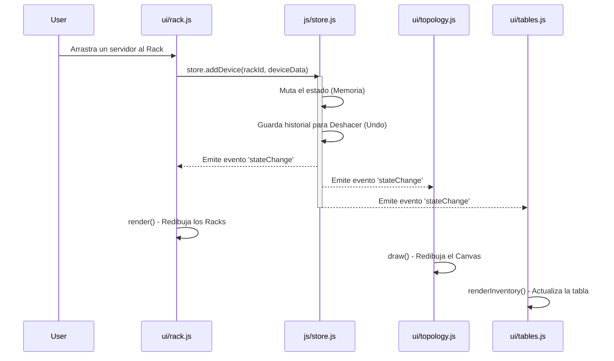
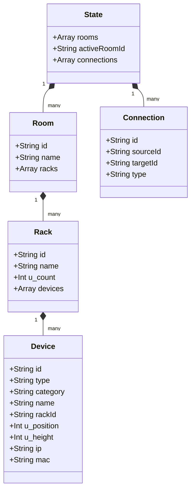

# 🏗️ Arquitectura del Proyecto - RACK Designer

Este documento está dirigido a **Desarrolladores de Software, Arquitectos y Programadores** que necesiten modificar, extender o depurar el código fuente de RACK Designer.

---

## 1. Visión General de la Arquitectura

El proyecto está desarrollado utilizando **Vanilla JavaScript (ES6+)**, sin la utilización de frameworks pesados (como React, Angular o Vue). 

Para evitar el "código espagueti" típico de Vanilla JS, se implementó una arquitectura basada en el patrón **Observer (Pub/Sub)** combinado con un **Estado Centralizado (Single Source of Truth)**. 
Conceptualmente, el proyecto imita cómo funciona `Redux` o `Vuex`, pero programado desde cero de manera ligera.

---

## 2. Estructura de Directorios Explicada

El código está dividido estrictamente por dominios funcionales:

```text
/Rack_Designer_2
├── index.html           # Estructura del DOM. Único archivo HTML (Single Page Application).
├── css/
│   └── style.css        # Todos los estilos. Utiliza variables CSS globales (:root) para colores (Tematización).
└── js/
    ├── main.js          # Bootstrapping: Carga inicial, vinculación de eventos UI estáticos (botones).
    ├── store.js         # El "Cerebro". Contiene la clase `Store`, el estado global y la lógica de mutación.
    ├── utils.js         # Herramientas: Generación de IDs (UUID), constantes, descarga de archivos.
    ├── xlsx.full.min.js # Dependencia (Vendor): SheetJS, utilizada para exportar tablas a Excel.
    └── ui/              # MÓDULOS DE RENDERIZADO VISUAL
        ├── catalog.js   # Maneja la barra lateral izquierda y la instanciación del Drag & Drop.
        ├── faceplates.js# Dibuja (usando Canvas 2D) las interfaces gráficas "frontales" de los servidores/routers.
        ├── modals.js    # Maneja la apertura/cierre e inyección de datos de todas las ventanas modales.
        ├── rack.js      # Lógica de renderizado del DOM de los Racks y eventos de Drag & Drop (Dropzone).
        ├── tables.js    # Genera las tablas HTML dinámicas en el panel inferior y aplica filtros de búsqueda.
        └── topology.js  # Motor de renderizado Canvas 2D completo para los grafos (Nodos y Aristas).
```

---

## 3. El Motor del Estado (`store.js`)

El corazón de la aplicación es la clase `Store`. Ningún módulo de UI (como `rack.js`) modifica el HTML de otro módulo. Todo cambio ocurre a través del `Store`.

### 3.1. Patrón Pub/Sub (Event Bus)



### 3.2. Modelo de Datos Relacional

El estado en memoria (`store.state`) tiene una estructura de árbol plano relacional. Las conexiones no pertenecen a un equipo, pertenecen a un objeto global de conexiones que referencia los IDs de los equipos.



---

## 4. Estrategias de Renderizado

La aplicación utiliza estrategias mixtas de renderizado dependiendo de las necesidades de rendimiento de la vista:

1. **DOM Virtual vs Real (Vista Física):** El archivo `rack.js` reconstruye el HTML (`innerHTML`) de los armarios cada vez que hay un cambio. Como los Racks no suelen tener más de 40 equipos, la recarga del DOM es ultra rápida (menos de 2ms).
2. **HTML5 Canvas (Vista Topológica):** El archivo `topology.js` **no** usa DOM. Utiliza la API nativa de Canvas 2D. Esto permite renderizar miles de cables curvos (Bezier curves) a 60 Fotogramas Por Segundo (FPS) durante las animaciones de Zoom y Paneo sin colapsar la memoria del navegador.
3. **Delegación de Eventos (Event Delegation):** Para no saturar la memoria creando miles de `addEventListener` para cada botón de cada equipo, se asigna un único *listener* al contenedor padre (`#main`) que intercepta el clic y verifica (`e.target.closest`) si proviene de un botón específico.

---

## 5. Guía Práctica: ¿Cómo agregar un nuevo tipo de Equipo?

Si se requiere agregar un nuevo tipo de hardware (Ej: "Sensor de Temperatura"):
1. Abrir `utils.js` e ir a la constante `DEVICE_TYPES`. Agregar el nuevo tipo.
2. Ir a `ui/catalog.js` para asegurar que aparezca en el menú izquierdo.
3. Ir a `ui/faceplates.js` y crear un nuevo método de dibujado `drawSensor(...)` para indicarle al canvas de qué color y con qué patrón de luces parpadeantes se debe pintar el componente cuando se arrastre al Rack.
