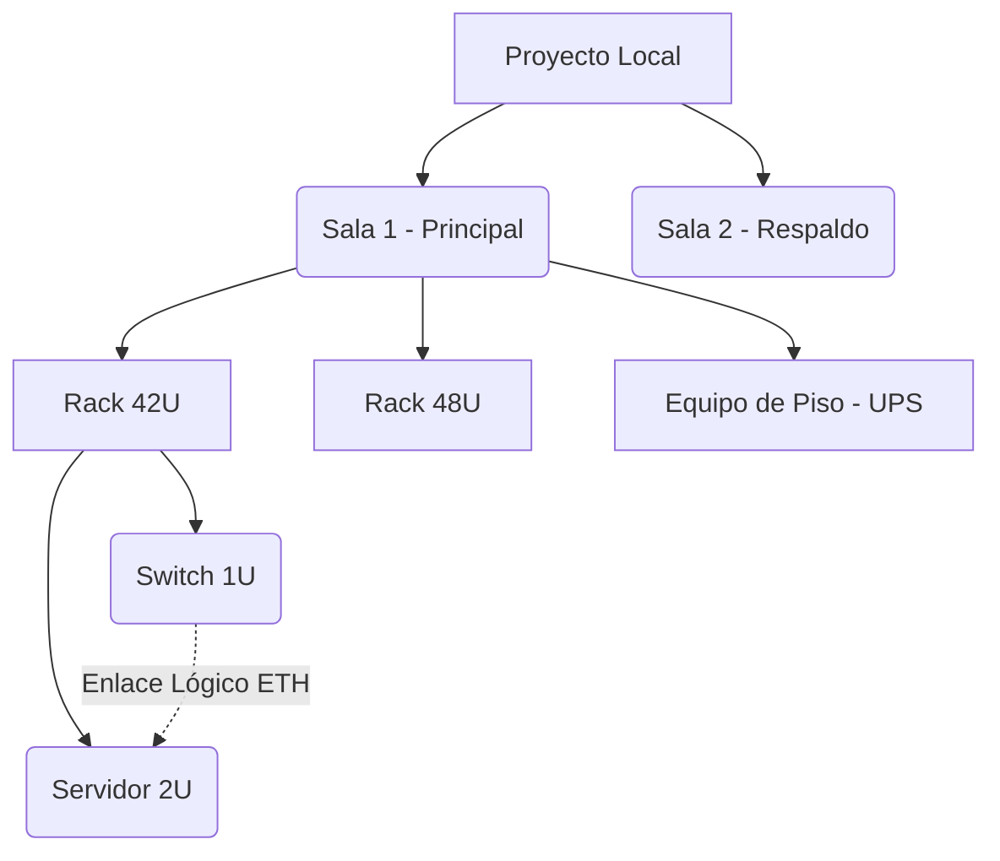

# Manual de Usuario - RACK Designer 2

Bienvenido al manual oficial de **RACK Designer 2**, tu herramienta 100% offline para el diseño, documentación e inventario de Centros de Datos.

Este manual está diseñado en un formato ligero y nativo de Markdown (`.md`), lo que significa que puedes leerlo y visualizar todos sus diagramas sin necesidad de conexión a internet usando tu editor de código o visor Markdown favorito.

---

## 1. Conceptos Básicos

**RACK Designer 2** te permite crear representaciones físicas y lógicas de tu infraestructura de red. La información siempre permanece local en tu navegador y puedes respaldarla en archivos `.json` en tu computadora.

### 1.1 Modos de Visualización
- **Modo Claro / Oscuro:** Cambia la paleta de colores para reducir la fatiga visual. Accesible desde el Menú Principal (☰).
- **Modo Rendimiento:** Al hacer clic en el punto luminoso (verde/rojo) en la cabecera, se detienen las animaciones CSS pesadas. Ideal para computadoras portátiles en modo batería o diagramas masivos.

### 1.2 Roles y Seguridad (RBAC)
El sistema protege tus diseños localmente mediante un sistema de pines:
- 👑 **Administrador:** Control total. Puede cambiar el PIN y activar el "Modo Dios" (ver contraseñas). El PIN por defecto es `rack2024`.
- ✏️ **Editor:** Puede agregar, mover y eliminar equipos, pero no puede ver credenciales sensibles.
- 👁 **Espectador:** Modo de solo lectura para auditorías.

---

## 2. Descripción Detallada de Opciones

### A. Menú Principal (Hamburguesa ☰)
Ubicado en la esquina superior derecha, gestiona la persistencia de datos:
- **Cargar Proyecto:** Importa un archivo `.json` de RACK Designer 2 previamente guardado.
- **Guardar Proyecto:** Exporta todo el diseño (Salas, Gabinetes, Equipos y Enlaces) a un archivo `.json` descargable.
- **Cargar Demo:** Sobrescribe tu lienzo con una infraestructura de ejemplo preconstruida.
- **Modo Dios:** (Requiere Admin) Revela los campos de contraseñas de todos los equipos.
- **Cambiar PIN Admin:** Modifica la contraseña maestra.

### B. Gestión de Salas y Gabinetes (Racks)
Todo en RACK Designer 2 vive dentro de una **Sala**:
- **Nueva Sala:** Haz clic en "Agregar Sala" para crear una zona.
- **Nuevo Gabinete:** Clic derecho dentro de una sala vacía o usar el botón flotante. Define el número de unidades (ej. 42U) y el color.
- **Opciones del Gabinete (⋮):** Cada rack tiene un menú en su cabecera para: Instalar Equipos, Editar, Limpiar (vaciar el rack entero) o Eliminar el gabinete.

### C. Catálogo de Equipos y Panel Inferior
El panel inferior es tu centro de comandos:
- **Catálogo Lateral:** Arrastra (Drag & Drop) servidores, switches, PDUs o routers desde el menú lateral izquierdo hacia una U vacía en tu rack.
- **Filtros de Catálogo:** Usa los botones (Network, Server, Storage, Piso) para filtrar la lista de hardware disponible.
- **Vista de Estadísticas:** Muestra el consumo eléctrico (Watts), Unidades U libres y peso estimado.
- **Tablas de Inventario y Conexiones:** Visualiza todos tus equipos en formato Excel.

### D. Topología y Redes (Vista Lógica)
Alterna entre vista **Física** (los racks de frente) y vista de **Topología** usando los botones centrales superiores.
- **Nodos:** Cada equipo y sala se representa como un círculo interactivo.
- **Conectar Puertos:** Haz *Doble Clic* en un equipo de origen, luego en el equipo de destino. Se abrirá el menú para elegir puertos físicos (Ej. ETH1 a ETH2) y crear el enlace.

---

## 3. Diagrama de Estructura de Datos (Offline)

El siguiente diagrama Mermaid (renderizable offline en tu IDE) muestra cómo se organizan lógicamente los elementos que vas a diseñar:

---

## 4. Flujo de Trabajo (End-to-End)

Sigue este tutorial paso a paso para crear tu primer centro de datos desde cero:

### Fase 1: Preparar el Terreno
1. **Acceso:** Abre `index.html` en tu navegador.
2. **Rol:** Ingresa al Menú (☰) e inicia sesión como Administrador (PIN: `rack2024`).
3. **Sala:** Haz clic en "Nueva Sala" y llámala "MDF Principal".

### Fase 2: Instalar la Infraestructura Física
4. **Rack:** Haz clic derecho en el lienzo azul dentro de tu nueva sala y elige "Nuevo Gabinete". Nómbralo "Rack Core" con un tamaño de 42U.
5. **Hardware:** Abre el catálogo lateral. Arrastra un "Switch de Red 1U" a la Unidad 42 (arriba) y un "Servidor 2U" a la Unidad 10 (abajo).
6. **Propiedades:** Haz *doble clic* sobre el Servidor recién instalado. Llena su dirección IP, Mac Address y consumo (ej. 500W). Guarda los cambios.

### Fase 3: Conectar Lógicamente (Topología)
7. **Cambiar de Vista:** En la barra superior, haz clic en "Topología".
8. **Enlazar:** Haz *doble clic* en el nodo de tu Switch y luego clic en el nodo de tu Servidor.
9. **Puertos:** En el menú emergente, selecciona el puerto "ETH-01" del Switch y el puerto "NIC-1" del Servidor. Aplica el cable azul.

### Fase 4: Auditoría y Respaldo
10. **Tablas:** Abre el panel inferior y ve a la pestaña "Conexiones". Verás tu enlace documentado. Exporta esta tabla a CSV si lo deseas.
11. **Guardar:** Ve al Menú Principal (☰) y haz clic en **Guardar Proyecto**. Se descargará un archivo `rack_backup.json` en tu carpeta de descargas. ¡Has terminado tu primer diseño!

---
> [!TIP]
> **No necesitas modificar código** para añadir equipos visualmente distintos. Puedes reemplazar las imágenes en la carpeta `assets/img/` de tu instalación local usando el mismo nombre de archivo (`.svg` o `.png`).
