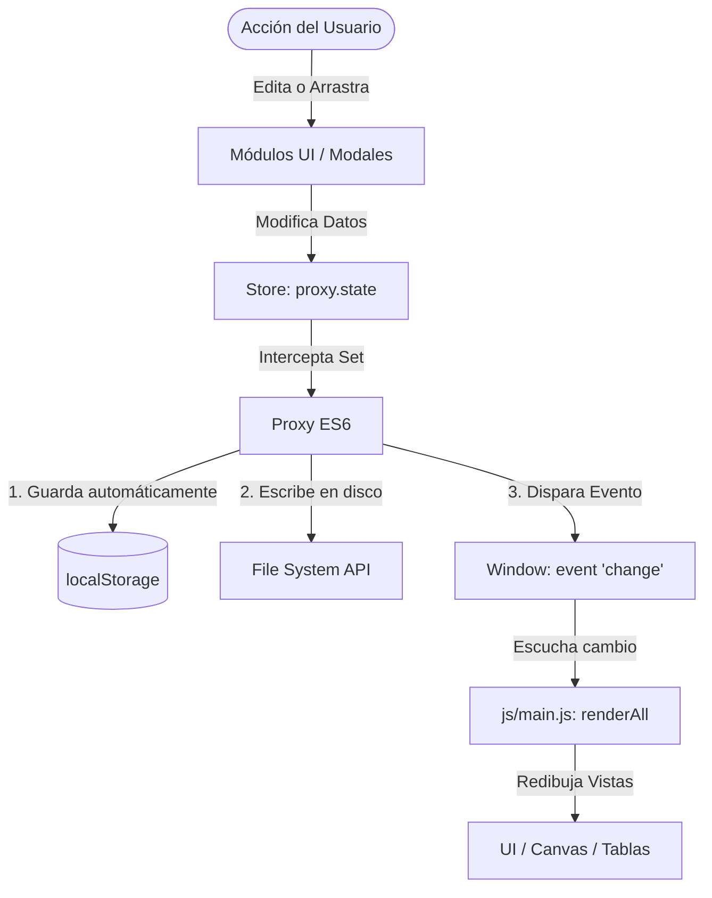

# Mapa de Orientación de la Base de Código (Codebase Orientation Map)

Este documento sirve como guía arquitectónica y técnica para desarrolladores que se incorporan al desarrollo de **RACK Designer 2**. A continuación, se detalla la estructura física, lógica y los flujos de ejecución del sistema basándose estrictamente en el estado actual del código en la rama `backup-local-changes`.

---

## 1. Resumen en Una Línea
**RACK Designer 2** es una consola de simulación y diseño físico-lógico interactiva para salas de servidores (Datacenters) construida en **Vanilla JavaScript (ES6+)**, que utiliza un **Proxy reactivo** nativo para gestionar el estado y sincronizar en tiempo real un lienzo físico de Racks y un Canvas 2D de topología de red.

---

## 2. Explicación de 5 Minutos

### Tareas Primarias en el Código
- **Modelado Físico**: Renderizado interactivo y a escala de chasis de Racks (de 4U a 48U) y montaje fotorrealista/procedimental de equipos (servidores, switches, PDUs) con soporte para lados frontal/trasero y detección de colisiones de ranuras (slots).
- **Modelado Lógico (Topología)**: Motor gráfico en Canvas 2D que distribuye y conecta salas, gabinetes y periféricos de piso como nodos interactivos, con enlaces visuales (cableado) coloreados según tipo de red (Cobre, DAC, Fibra).
- **Gestión de Datos y Archivos**: Guardado y apertura transparentes a través del disco duro local usando la **File System Access API** (con autoguardado de 3s por debounce) y persistencia redundante en `localStorage`.
- **Seguridad y Control de Acceso (RBAC)**: Matriz de permisos client-side (Admin, Editor, Espectador) protegida por PIN criptográfico (Web Crypto SHA-256) y un token de sesión anti-alteraciones en memoria (closure).

### Entradas Primarias
- **Eventos de UI / Drag & Drop**: Interacciones del usuario al arrastrar equipos del catálogo lateral a los racks, mover gabinetes o reposicionar nodos en el lienzo.
- **Formularios de Configuración**: Modales estructurados en acordeones colapsables para parametrizar equipos (IP, MAC, consumo, puertos Ethernet/SFP) y conexiones de cables.
- **Archivos locales**: Carga de plantillas JSON o archivos `.rack` y backups del catálogo de inventario.

### Salidas Primarias
- **Renderizado del DOM / Canvas 2D**: Actualizaciones continuas sobre la cabecera, catálogo, panel derecho (Outliner y Estadísticas), chasis físicos y el lienzo dinámico del Canvas.
- **Exportaciones**: Descargas en formatos PNG (fotografías fotorrealistas con front/rear side-by-side de racks), archivos CSV y hojas de cálculo Excel (`xlsx.full.min.js`).
- **Persistencia**: Escritura directa en archivos del disco duro (`showSaveFilePicker` / file handle) y autoguardado en `localStorage` bajo la clave `RACK_DESIGNER_STATE`.

### Archivos Clave
1. [index.html](file:///c:/Users/admin/.gemini/antigravity/scratch/Rack_Designer_2/index.html): Esqueleto base del DOM, importación de scripts modulares y punto de entrada para readers/PWA.
2. [js/store.js](file:///c:/Users/admin/.gemini/antigravity/scratch/Rack_Designer_2/js/store.js): El cerebro del estado global. Define el Proxy reactivo, el autoguardado y el historial (Undo/Redo).
3. [js/main.js](file:///c:/Users/admin/.gemini/antigravity/scratch/Rack_Designer_2/js/main.js): Inicializador y despachador de eventos globales. Vincula los componentes visuales y la inicialización de autenticación.
4. [js/auth/roles.js](file:///c:/Users/admin/.gemini/antigravity/scratch/Rack_Designer_2/js/auth/roles.js): Implementación de la criptografía SHA-256 y la verificación de permisos por rol.
5. [js/ui/rack.js](file:///c:/Users/admin/.gemini/antigravity/scratch/Rack_Designer_2/js/ui/rack.js): Controlador del renderizado físico de los racks y la detección de inserción rápida o drag-and-drop.
6. [js/ui/outliner.js](file:///c:/Users/admin/.gemini/antigravity/scratch/Rack_Designer_2/js/ui/outliner.js): Genera el árbol jerárquico (Salas > Racks > Equipos) e interactúa con el estado de selección.
7. [js/ui/inspector.js](file:///c:/Users/admin/.gemini/antigravity/scratch/Rack_Designer_2/js/ui/inspector.js): Controlador del panel central derecho que lee el estado de selección y pinta una tarjeta de lectura rápida con las propiedades del objeto.
8. [js/ui/topology/TopologyLayout.js](file:///c:/Users/admin/.gemini/antigravity/scratch/Rack_Designer_2/js/ui/topology/TopologyLayout.js): Motor de posicionamiento del Canvas de Topología. Expone `_computeLayout()` (función interna compartida), `initTopoPositions()` (primera carga), `autoOrderTopo()` (botón ⚡) y `recalcTopoSpacing()` (slider). Usa dimensiones reales de tarjeta (`CARD_W=160, CARD_H=60`) para garantizar que no haya colisiones visuales.
9. [js/ui/topology/TopologyOrchestrator.js](file:///c:/Users/admin/.gemini/antigravity/scratch/Rack_Designer_2/js/ui/topology/TopologyOrchestrator.js): Coordinador principal de la vista de red (Canvas 2D), inicializando render loops y manejadores de interacción.

### Flujo Principal de Código

---

## 3. Análisis Profundo (Deep Dive)

### Tipo de Aplicación
- **Arquitectura**: Aplicación Web Progresiva (PWA) de una sola página (SPA) 100% Offline-First sin backend obligatorio.
- **Entorno de ejecución**: Navegador moderno (compatible con Web Crypto API, ES6 Modules, Canvas 2D, File System Access API y Service Workers).

### Puntos de Entrada
- [index.html](file:///c:/Users/admin/.gemini/antigravity/scratch/Rack_Designer_2/index.html): Carga los scripts necesarios secuencialmente al final del cuerpo.
- [js/main.js](file:///c:/Users/admin/.gemini/antigravity/scratch/Rack_Designer_2/js/main.js): Invoca `init()` que orquesta la inicialización de la topología, los modales, los eventos globales, la sesión del usuario (roles) y el service worker.

---

## 4. Estructura de Directorios Detallada

| Ruta | Propósito | Notas |
|:---|:---|:---|
| `.agents/` | Directivas internas de comportamiento y diseño para agentes de IA | Ignorado por Git. Contiene especificaciones de UI/UX, arquitectura y seguridad. |
| `.py/` | Scripts auxiliares en Python | Lógica aislada para parsing y refactorización automatizada de documentación. |
| `assets/icons/` | Iconos monocromáticos en formato SVG | Dividido por categoría de hardware. Se colorean dinámicamente mediante `mask-image` en CSS. |
| `assets/img/` | Diseños detallados y fotorrealistas de faceplates SVG/PNG | Se usan para el chasis físico del rack. Soporta fallback automático a CSS. |
| `css/` | Sistema modular de diseño (Vanilla CSS) | Separado por componentes (modales, racks, paneles, variables y estructura global). |
| `doc/doc_md/` | Documentación técnica y funcional para desarrolladores y usuarios | Contiene el manual de usuario, análisis del proyecto y este mapa. |
| `doc/log/` | Registros históricos de cambios en desarrollo | `CHANGELOG.md` es el diario oficial de control de cambios. |
| `js/api/` | Módulo de comunicación externa | Preparado para futura integración con backends mediante REST APIs. |
| `js/auth/` | Sistema de Control de Acceso Basado en Roles (RBAC) | Criptografía cliente con SHA-256 nativa. |
| `js/core/` | Lógica algorítmica pesada sin dependencias de UI | Centraliza operaciones pesadas como conversiones de datos. |
| `js/models/` | Modelos de Dominio puros (Lógica de Negocio) | Clases instanciables (`Rack`, `Device`, `Cable`). |
| `js/ui/` | Capa de Presentación (Controladores del DOM) | Modula por vistas: racks, tablas, diálogo de modales y topología. |
| `scripts/` | Herramientas de automatización en node.js | Scripts de compilación del manual y generación de assets. |
| `tests/` | Suite de pruebas unitarias | Configurado para Jest/TDD. |

---

## 5. Límites y Capas de la Aplicación

### A. Capa de Presentación (Presentation Layer)
Formada por los archivos bajo `js/ui/` e `index.html`. 
- **Responsabilidad**: Escuchar el evento `'change'` del `store`, leer el estado actual y reconstruir los nodos DOM correspondientes. 
- **Aislamiento**: Ningún archivo de UI modifica directamente el estado interno (`_raw`) de forma manual, todo se hace a través de la interfaz del `store.state`.

### B. Capa de Dominio (Domain Layer)
Ubicada en `js/models/`.
- **Responsabilidad**: Define las entidades básicas independientes del framework o la interfaz del navegador.
- **Aislamiento**: Son clases puras de ES6 (`Rack.js`, `Device.js`, `Cable.js`) que validan dimensiones, tipos de puerto y enrutamiento lógico.

### C. Capa de Persistencia y E/S (Persistence & I/O Layer)
Gestionada por [js/store.js](file:///c:/Users/admin/.gemini/antigravity/scratch/Rack_Designer_2/js/store.js) and [js/ui/fileManager.js](file:///c:/Users/admin/.gemini/antigravity/scratch/Rack_Designer_2/js/ui/fileManager.js).
- **Responsabilidad**: Persistir los datos del datacenter.
- **Comportamiento**: `store.js` autoguarda en `localStorage` tras cada mutación detectada por el Proxy. `fileManager.js` controla el flujo asíncrono con la API del Sistema de Archivos local para reescribir de forma transparente el archivo físico abierto por el usuario.

---

## 6. Flujos de Ejecución Clave

### Flujo de Inicialización de la Aplicación
1. El navegador carga `index.html`.
2. Se ejecuta el script en `<head>` para cargar de forma síncrona el tema visual (Modo Claro/Oscuro) desde `localStorage`, previniendo parpadeos de luz (FOUC).
3. Se cargan los módulos JS del cuerpo y se ejecuta [js/main.js](file:///c:/Users/admin/.gemini/antigravity/scratch/Rack_Designer_2/js/main.js#L616-L656):
   - Se configuran los orquestadores de topología y modales.
   - Se comprueba la sesión activa en `sessionStorage` mediante [js/auth/roles.js](file:///c:/Users/admin/.gemini/antigravity/scratch/Rack_Designer_2/js/auth/roles.js#L47-L63).
   - Si no existe sesión, se abre el modal de login (`#modal-login`) suspendiendo las interacciones en el fondo.
   - Si existe sesión, se reconstruye el entorno visual llamando a `renderAll()`.
   - Se registra el Service Worker para habilitar el funcionamiento offline.

### Flujo de Autoguardado Asíncrono (Debounce)
1. Un cambio ocurre en la UI (por ejemplo, arrastrar un Switch de un catálogo a un slot de un Rack).
2. [js/ui/rack.js](file:///c:/Users/admin/.gemini/antigravity/scratch/Rack_Designer_2/js/ui/rack.js) responde al evento `drop` llamando a `store.addDeviceToRack(...)`.
3. El `store` realiza un `snapshot()` de historial, empuja el equipo al array interno, y el Proxy detecta la mutación llamando a `this._save()`.
4. El Proxy dispara el evento `'change'` al que está suscrito `js/main.js`.
5. `js/main.js` intercepta el cambio, ejecuta `renderAll()` para pintar el equipo en el rack físico e invoca asíncronamente a `fileManager.autoSave()`.
6. `fileManager.autoSave()` aplica un retraso de 3 segundos (debounce). Si no ocurren nuevos cambios en este lapso, escribe directamente los datos serializados en el archivo físico en disco utilizando el `fileHandle` persistido en memoria.
