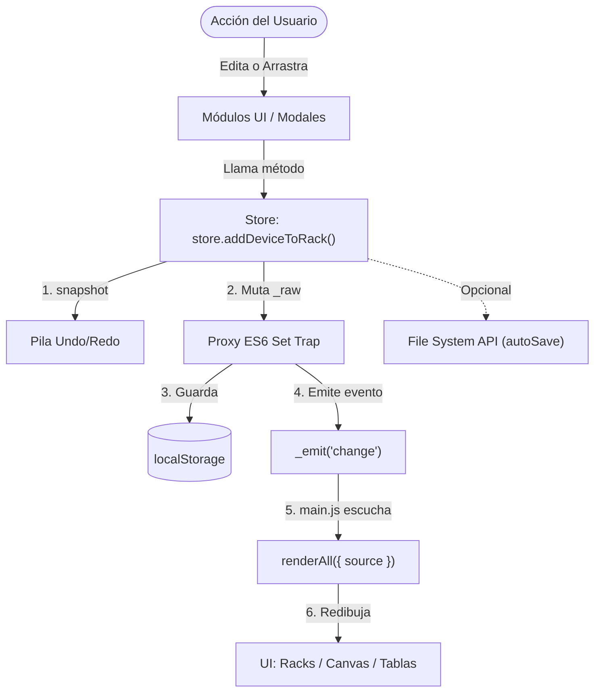

# Mapa de Orientación de la Base de Código (Codebase Orientation Map)

> **Propósito:** Este documento es la guía definitiva para desarrolladores que se incorporan al desarrollo de **RACK Designer Next**. Cada sección responde preguntas como: *"¿Qué archivo debo tocar?"*, *"¿Cómo funciona por dentro?"* y *"¿Qué errores típicos debo evitar?"*.

---

## Tabla de Contenidos

1. [¿Qué es este proyecto?](#1-qué-es-este-proyecto)
2. [Reglas de Oro (LÉELO PRIMERO)](#2-reglas-de-oro)
3. [Cómo ejecutar el proyecto](#3-cómo-ejecutar-el-proyecto)
4. [Arquitectura General](#4-arquitectura-general)
5. [Estructura de Directorios](#5-estructura-de-directorios)
6. [Tabla de Archivos JavaScript](#6-tabla-de-archivos-javascript)
7. [El Store: Cerebro de la Aplicación](#7-el-store-cerebro-de-la-aplicación)
8. [El Ciclo de Renderizado](#8-el-ciclo-de-renderizado)
9. [Estructura CSS](#9-estructura-css)
10. [El Layout de la Interfaz (CSS Grid)](#10-el-layout-de-la-interfaz)
11. [Capas de la Aplicación](#11-capas-de-la-aplicación)
12. [Flujos de Ejecución Clave](#12-flujos-de-ejecución-clave)
13. [Recetas: "¿Qué toco si quiero…?"](#13-recetas-qué-toco-si-quiero)
14. [Convenciones de Nombres y Código](#14-convenciones-de-nombres-y-código)
15. [Errores Frecuentes de Novatos](#15-errores-frecuentes-de-novatos)
16. [Glosario Técnico](#16-glosario-técnico)
17. [Diagramas SVG del Proyecto](#17-diagramas-svg-del-proyecto)

---

## 1. ¿Qué es este proyecto?

**RACK Designer Next** es una aplicación web (PWA) interactiva para diseñar y administrar centros de datos. Permite:

- Crear **salas** (*rooms*) que representan habitaciones de un datacenter.
- Crear **gabinetes** (*racks*) dentro de esas salas con alturas configurables (4U–48U).
- Colocar **equipos** (servidores, switches, routers, firewalls, UPS, etc.) dentro de los gabinetes o como equipos de piso.
- **Conectar** equipos entre sí con cables (cobre, fibra óptica, DAC).
- Visualizar todo en dos vistas: **Vista Física** (cómo se ve el rack) y **Vista Topología** (diagrama de red en Canvas 2D).
- **Exportar** a PNG, CSV, Excel y guardar/cargar proyectos como archivos `.rack`.

**Dato clave:** Es una PWA 100% offline. Toda la información vive en el navegador del usuario (`localStorage`) o en archivos locales (File System Access API). **No hay backend ni base de datos remota.**

---

## 2. Reglas de Oro

> ⚠️ **Lee esto antes de tocar una sola línea de código. Romper estas reglas causará bugs difíciles de encontrar.**

### NUNCA hagas esto:

| ❌ Acción prohibida | 💡 Lo que debes hacer en su lugar |
|---|---|
| Modificar el DOM directamente para reflejar datos | Actualizar `store.state` y dejar que el Proxy dispare el redibujado |
| Usar `npm` o `yarn` | Usar **solo `pnpm`** |
| Importar archivos JS como `import/export` ES Modules en el navegador | Los scripts se cargan con etiquetas `<script>` en `index.html` (scope global) |
| Hacer `git commit` automáticamente | Esperar a que el usuario diga explícitamente "respalda" o "haz commit" |
| Usar frameworks (React, Vue, Angular, Tailwind) | Todo es **Vanilla JS, HTML5 y CSS3 puro** |
| Olvidar `store.snapshot()` antes de mutar datos | Siempre llamar a `snapshot()` para que Undo/Redo funcione |

### SIEMPRE haz esto:

| ✅ Acción obligatoria | Razón |
|---|---|
| Actualizar `doc/log/CHANGELOG.md` después de cada cambio | Es el diario oficial del proyecto |
| Agregar `<script>` en `index.html` si creas un nuevo archivo `.js` | Los archivos no se auto-descubren, hay que cargarlos explícitamente |
| Colocar scripts Python en `.py/` | Convención de organización del proyecto |
| Guardar archivos de agentes/diseño en `.agents/` | No mezclar con la documentación para usuarios |
| Probar que Undo/Redo funcione después de cambios en el Store | `snapshot()` debe llamarse antes de las mutaciones |

---

## 3. Cómo ejecutar el proyecto

No necesitas compilar nada. Solo abre `index.html` con un servidor HTTP estático:

```bash
# Opción 1: VS Code con Live Server (recomendado)
# Click derecho en index.html → "Open with Live Server"

# Opción 2: Servidor estático con npx
npx serve .

# Opción 3: Python
python -m http.server 8000
```

> ⚠️ **No** uses `npm start`, `pnpm dev`, ni `webpack serve`. Este proyecto no tiene paso de compilación.

---

## 4. Arquitectura General

El proyecto utiliza un patrón llamado **"Reactive Proxy Pattern"** que emula el comportamiento de React/Redux pero con JavaScript nativo:

```
USUARIO hace algo (click, drag, formulario)
    ↓
EVENT HANDLER en un módulo UI
    ↓
STORE METHOD (ej: store.addDeviceToRack())
    ↓
snapshot() → crea copia profunda para Undo/Redo
    ↓
MUTACIÓN en this._raw (push, assign, splice)
    ↓
PROXY SET TRAP detecta el cambio
    ↓
_save() → localStorage.setItem('RACK_DESIGNER_NEXT_STATE', ...)
    ↓
_emit('change', { source: 'addDeviceToRack' })
    ↓
main.js escucha el evento → renderAll({ source })
    ↓
Se redibujan SOLO las vistas afectadas según el "source"
```

### Diagrama Mermaid del Flujo Principal



---

## 5. Estructura de Directorios

```
Rack_Designer_2/
│
├── index.html                    ← Punto de entrada. Contiene TODO el HTML y los <script>
├── service-worker.js             ← PWA: cache offline (el que se registra)
├── package.json                  ← Solo para pnpm. Única dependencia: "marked"
├── mejoras.md                    ← Lista de mejoras pendientes del proyecto
│
├── js/                           ← ★ TODA la lógica de la aplicación
│   ├── store.js                  ← CEREBRO: Estado global + Proxy reactivo + Undo/Redo
│   ├── main.js                   ← ORQUESTADOR: Init, eventos globales, renderAll()
│   ├── utils.js                  ← Utilidades: uid(), deepClone(), notify(), escapeHTML()
│   ├── icons.js                  ← Definiciones SVG inline para iconos de la app
│   ├── demoData.js               ← Datos de demostración (se carga bajo demanda)
│   │
│   ├── auth/
│   │   └── roles.js              ← RBAC: Login, SHA-256, permisos (window.RackAuth)
│   │
│   ├── ui/                       ← ★ CAPA DE VISTA (cada archivo = un componente visual)
│   │   ├── catalog.js            ← Sidebar: catálogo de equipos (CATALOG array)
│   │   ├── rack.js               ← Vista física: renderizado de racks + cables SVG
│   │   ├── faceplates.js         ← Plantillas DOM de equipos dentro de racks
│   │   ├── tables.js             ← Panel inferior: tablas de inventario/conexiones
│   │   ├── outliner.js           ← Panel derecho: árbol jerárquico Sala > Rack > Equipo
│   │   ├── inspector.js          ← Panel derecho: tarjeta de propiedades del seleccionado
│   │   ├── fileManager.js        ← Abrir/Guardar/AutoSave con File System Access API
│   │   ├── modals.js             ← Orquestador de inicialización de modales
│   │   │
│   │   ├── modals/               ← ★ VENTANAS MODALES (una por archivo)
│   │   │   ├── DeviceModal.js    ← Modal: Agregar/Editar equipo (formulario completo)
│   │   │   ├── CableModal.js     ← Modal: Crear/Editar conexión de cable
│   │   │   ├── RackModal.js      ← Modal: Agregar/Editar gabinete
│   │   │   ├── RoomModal.js      ← Modal: Agregar/Renombrar sala
│   │   │   ├── PlacementModal.js ← Modal: Colocación rápida (Quick Placement)
│   │   │   ├── ExportModal.js    ← Modal: Exportación PNG/Excel/CSV/Topología
│   │   │   └── Globals.js        ← Variables globales compartidas entre modales
│   │   │
│   │   └── topology/             ← ★ MOTOR DE RED EN CANVAS 2D (patrón MVC)
│   │       ├── TopologyState.js      ← Modelo: Estado del canvas (hover, dragging)
│   │       ├── TopologyLayout.js     ← Controlador: Algoritmo de layout automático
│   │       ├── TopologyRenderer.js   ← Vista: Dibujado en Canvas 2D
│   │       ├── TopologyEvents.js     ← Controlador: Interacciones (drag, zoom, click)
│   │       └── TopologyOrchestrator.js ← Lifecycle: init/start/stop del canvas
│   │
│   ├── xlsx.full.min.js          ← SheetJS (exportar a Excel) — vendor
│   ├── mobile-drag-drop.min.js   ← Polyfill touch drag-and-drop — vendor
│   └── mobile-drag-drop-scroll.min.js  ← Polyfill scroll durante drag — vendor
│
├── css/                          ← ★ ESTILOS MODULARES
│   ├── style.css                 ← Archivo raíz (solo @imports, no estilos directos)
│   ├── variables.css             ← Variables CSS (colores, tamaños, fuentes, temas)
│   ├── layout.css                ← Layout principal (CSS Grid, header, paneles)
│   ├── mobile-drag-drop.css      ← Estilos del polyfill de drag-and-drop
│   ├── components/               ← Componentes CSS individuales
│   │   ├── panels.css            ← Estilos de paneles laterales y bottom
│   │   ├── rack.css              ← Estilos de chasis de racks y unidades (U)
│   │   ├── faceplates.css        ← Estilos de los equipos dentro del rack
│   │   ├── modals.css            ← Estilos de ventanas modales
│   │   └── misc.css              ← Notificaciones, tooltips, animaciones, utilidades
│   └── templates/                ← (Vacío actualmente — reservado para plantillas futuras)
│
├── assets/
│   ├── icons/                    ← Iconos SVG monocromáticos por categoría de hardware
│   ├── img/                      ← Imágenes estáticas (logos, fondos)
│   └── svg/                      ← Diseños SVG detallados de faceplates
│
├── doc/
│   ├── doc_md/                   ← Documentación técnica en Markdown (ESTE ARCHIVO)
│   ├── doc_img/                  ← Imágenes y diagramas SVG de la documentación
│   ├── log/                      ← CHANGELOG.md (diario de cambios)
│   └── temp/                     ← Archivos temporales de documentación
│
├── scripts/                      ← Scripts Node.js para compilación y generación
│   ├── build_standalone_manual.cjs  ← Genera manual HTML standalone
│   └── generate_svgs.cjs           ← Genera diagramas SVG de la documentación
│
├── .agents/                      ← Instrucciones y reglas para agentes IA
├── .py/                          ← Scripts Python utilitarios (patch, fix, vectorize)
├── memory-bank/                  ← Archivos de contexto persistente para agentes IA
├── json/                         ← Archivos JSON auxiliares
└── tests/                        ← Suite de pruebas (actualmente deshabilitada)
```

---

## 6. Tabla de Archivos JavaScript

Cada archivo, qué hace, y cuándo necesitas tocarlo:

### Archivos Core (js/)

| Archivo | Tamaño | Responsabilidad | ¿Cuándo lo toco? |
|:---|:---|:---|:---|
| [store.js](file:///c:/Users/admin/.gemini/antigravity/scratch/Rack_Designer_2/js/store.js) | ~14 KB | Estado global, Proxy reactivo, Undo/Redo, persistencia localStorage, todos los métodos CRUD (addRoom, addRack, addDeviceToRack, etc.) | Cuando agregas un nuevo tipo de dato al estado o un nuevo método de mutación |
| [main.js](file:///c:/Users/admin/.gemini/antigravity/scratch/Rack_Designer_2/js/main.js) | ~29 KB | Inicialización (`init()`), despacho de eventos globales, `renderAll()`, cambio de vistas, menú principal, autenticación | Cuando conectas un nuevo botón del UI, cambias la lógica de renderizado, o agregas una nueva vista |
| [utils.js](file:///c:/Users/admin/.gemini/antigravity/scratch/Rack_Designer_2/js/utils.js) | ~4 KB | Utilidades puras: `uid()`, `deepClone()`, `notify()`, `escapeHTML()`, `downloadJSON()`, `customConfirm()`, `getDeviceLocation()` | Cuando necesitas una función utilitaria nueva que no pertenece a ningún componente |
| [icons.js](file:///c:/Users/admin/.gemini/antigravity/scratch/Rack_Designer_2/js/icons.js) | ~15 KB | Objeto `SVG_ICONS` con iconos SVG inline como strings | Cuando agregas un nuevo tipo de equipo que necesita su propio icono |
| [demoData.js](file:///c:/Users/admin/.gemini/antigravity/scratch/Rack_Designer_2/js/demoData.js) | ~13 KB | Función `loadDemoData()` que carga un proyecto de demostración pre-diseñado | Cuando quieres actualizar los datos de la demo incluida |

### Archivos de Autenticación (js/auth/)

| Archivo | Responsabilidad | ¿Cuándo lo toco? |
|:---|:---|:---|
| [roles.js](file:///c:/Users/admin/.gemini/antigravity/scratch/Rack_Designer_2/js/auth/roles.js) | RBAC completo: hasheo SHA-256, login por PIN, 3 roles (Admin/Editor/Viewer), permisos con `RackAuth.can('acción')`, sesión en sessionStorage | Cuando necesitas agregar un nuevo permiso o rol |

### Archivos de Interfaz (js/ui/)

| Archivo | Tamaño | Responsabilidad | ¿Cuándo lo toco? |
|:---|:---|:---|:---|
| [catalog.js](file:///c:/Users/admin/.gemini/antigravity/scratch/Rack_Designer_2/js/ui/catalog.js) | ~15 KB | Define el array `CATALOG` (21 plantillas de equipos), renderiza la barra lateral con iconos de categorías, filtrado y búsqueda | Cuando agregas nuevos tipos de equipos al catálogo o modificas la sidebar |
| [rack.js](file:///c:/Users/admin/.gemini/antigravity/scratch/Rack_Designer_2/js/ui/rack.js) | ~32 KB | Renderizado de la vista física: chasis de racks, slots, drag-and-drop, cables SVG, zoom/pan físico | Cuando modificas la apariencia del rack, la lógica de inserción, o el enrutamiento visual de cables |
| [faceplates.js](file:///c:/Users/admin/.gemini/antigravity/scratch/Rack_Designer_2/js/ui/faceplates.js) | ~11 KB | Plantillas HTML de los equipos dentro del rack (cómo se "ven" los servidores, switches, etc.), anclajes `data-port` para cables | Cuando quieres cambiar la apariencia visual de un tipo de equipo en el rack |
| [tables.js](file:///c:/Users/admin/.gemini/antigravity/scratch/Rack_Designer_2/js/ui/tables.js) | ~13 KB | Panel inferior: tablas de inventario de equipos y conexiones, pestañas, búsqueda, exportación a Excel/CSV | Cuando modificas las columnas de las tablas o agregas nuevas pestañas de datos |
| [outliner.js](file:///c:/Users/admin/.gemini/antigravity/scratch/Rack_Designer_2/js/ui/outliner.js) | ~7 KB | Panel derecho: árbol jerárquico (Sala > Rack > Equipo), selección y navegación | Cuando cambias la estructura jerárquica o agregas acciones al árbol |
| [inspector.js](file:///c:/Users/admin/.gemini/antigravity/scratch/Rack_Designer_2/js/ui/inspector.js) | ~11 KB | Panel derecho: tarjeta de lectura rápida con propiedades del elemento seleccionado | Cuando agregas nuevos campos a los equipos que deben mostrarse |
| [fileManager.js](file:///c:/Users/admin/.gemini/antigravity/scratch/Rack_Designer_2/js/ui/fileManager.js) | ~6 KB | Abrir/Guardar proyectos con File System Access API, autoguardado con debounce de 3 segundos | Cuando modificas la lógica de persistencia en disco |
| [modals.js](file:///c:/Users/admin/.gemini/antigravity/scratch/Rack_Designer_2/js/ui/modals.js) | ~0.2 KB | Inicializador central de todos los modales (`initModals()`) | Cuando agregas un nuevo modal y necesitas inicializarlo |

### Archivos de Modales (js/ui/modals/)

| Archivo | Responsabilidad | ¿Cuándo lo toco? |
|:---|:---|:---|
| [DeviceModal.js](file:///c:/Users/admin/.gemini/antigravity/scratch/Rack_Designer_2/js/ui/modals/DeviceModal.js) | Formulario completo para agregar/editar equipos con acordeones colapsables (red, auth, energía, puertos, notas, skin) | Cuando agregas campos nuevos al formulario de equipos |
| [CableModal.js](file:///c:/Users/admin/.gemini/antigravity/scratch/Rack_Designer_2/js/ui/modals/CableModal.js) | Formulario para crear/editar conexiones de cables entre equipos, con selectores agrupados por sala/rack | Cuando cambias la lógica de conexión o agregas tipos de cable |
| [RackModal.js](file:///c:/Users/admin/.gemini/antigravity/scratch/Rack_Designer_2/js/ui/modals/RackModal.js) | Formulario para agregar/editar gabinetes (nombre, altura, color) | Cuando agregas propiedades nuevas a los racks |
| [RoomModal.js](file:///c:/Users/admin/.gemini/antigravity/scratch/Rack_Designer_2/js/ui/modals/RoomModal.js) | Formulario para agregar/renombrar salas | Cuando modificas las propiedades de las salas |
| [PlacementModal.js](file:///c:/Users/admin/.gemini/antigravity/scratch/Rack_Designer_2/js/ui/modals/PlacementModal.js) | Colocación rápida: permite asignar un equipo a un rack y slot específico de manera rápida | Cuando cambias el flujo de colocación rápida |
| [ExportModal.js](file:///c:/Users/admin/.gemini/antigravity/scratch/Rack_Designer_2/js/ui/modals/ExportModal.js) | Exportación: PNG de racks, Excel/CSV de inventario y conexiones, PNG de topología | Cuando agregas nuevos formatos de exportación |
| [Globals.js](file:///c:/Users/admin/.gemini/antigravity/scratch/Rack_Designer_2/js/ui/modals/Globals.js) | Variables globales compartidas entre modales (`editingDeviceId`, `editingCatalogId`, `FLOOR_TYPES`) | Cuando necesitas compartir estado entre modales |

### Motor de Topología (js/ui/topology/)

| Archivo | Responsabilidad | ¿Cuándo lo toco? |
|:---|:---|:---|
| [TopologyState.js](file:///c:/Users/admin/.gemini/antigravity/scratch/Rack_Designer_2/js/ui/topology/TopologyState.js) | Estado local del canvas: nodo hover, nodo arrastrado, posición del mouse | Cuando agregas interacciones nuevas al canvas |
| [TopologyLayout.js](file:///c:/Users/admin/.gemini/antigravity/scratch/Rack_Designer_2/js/ui/topology/TopologyLayout.js) | Algoritmo de distribución automática de nodos: `initTopoPositions()`, `autoOrderTopo()`, `recalcTopoSpacing()` | Cuando cambias cómo se posicionan automáticamente los nodos |
| [TopologyRenderer.js](file:///c:/Users/admin/.gemini/antigravity/scratch/Rack_Designer_2/js/ui/topology/TopologyRenderer.js) | Dibujado en Canvas 2D: nodos, enlaces, partículas de animación, fondo | Cuando cambias la apariencia visual de la topología |
| [TopologyEvents.js](file:///c:/Users/admin/.gemini/antigravity/scratch/Rack_Designer_2/js/ui/topology/TopologyEvents.js) | Manejo de eventos del canvas: arrastrar nodos, zoom con rueda, pan, click derecho, hover | Cuando agregas interacciones nuevas al diagrama de red |
| [TopologyOrchestrator.js](file:///c:/Users/admin/.gemini/antigravity/scratch/Rack_Designer_2/js/ui/topology/TopologyOrchestrator.js) | Ciclo de vida del canvas: `initTopology()`, `startTopo()`, `stopTopo()`, `resizeCanvas()` | Cuando cambias cómo se inicializa o destruye la vista de topología |

---

## 7. El Store: Cerebro de la Aplicación

El archivo más importante del proyecto es [store.js](file:///c:/Users/admin/.gemini/antigravity/scratch/Rack_Designer_2/js/store.js). Entiéndelo bien antes de tocar cualquier cosa.

### Estructura del Estado Global

```javascript
// Así se ve el estado completo (this._raw dentro del store):
{
  rooms: [{ id: 'abc123', name: 'Sala Principal' }],
  racks: [{ id: 'def456', roomId: 'abc123', name: 'Rack A1', height: 42, color: '#10b981' }],
  devices: [{ id: 'ghi789', rackId: 'def456', name: 'Server HP', type: 'server', 
               slotStart: 1, size: 2, mountSide: 'front', ip: '', mac: '', ... }],
  connections: [{ id: 'jkl012', sourceDeviceId: 'ghi789', targetDeviceId: '...', 
                   type: 'copper', color: '#10b981', ... }],
  currentRoomId: 'abc123',
  selectedDeviceId: null,
  topology: { nodePositions: {}, rackPositions: {}, rackSizes: {}, roomPositions: {}, roomSizes: {} },
  topoZoom: 1, topoPanX: 0, topoPanY: 0,
  physZoom: 1, physPanX: 0, physPanY: 0
}
```

### Métodos del Store (API Completa)

| Método | Qué hace | Emite source |
|:---|:---|:---|
| `addRoom(name)` | Crea nueva sala y la selecciona | `'addRoom'` |
| `updateRoom(id, props)` | Actualiza propiedades de una sala | `'room-rename'` |
| `deleteRoom(id)` | Elimina sala con cascada (racks, equipos, conexiones, posiciones topo) | `'deleteRoom'` |
| `setCurrentRoom(id)` | Cambia la sala activa | `'changeRoom'` |
| `addRack({ name, height, color })` | Crea un rack en la sala actual | `'addRack'` |
| `updateRack(id, props)` | Actualiza propiedades de un rack | `'updateRack'` |
| `deleteRack(id)` | Elimina rack y sus equipos | `'deleteRack'` |
| `addDeviceToRack(template, rackId, slotStart, mountSide)` | Inserta equipo en un slot, con validación de colisiones | `'addDeviceToRack'` |
| `addFloorDevice(template, roomId, floorX, floorY)` | Crea equipo de piso (sin rack) | `'addFloorDevice'` |
| `moveDevice(deviceId, newRackId, newSlot, newMountSide)` | Mueve equipo a otro rack/slot | `'moveDevice'` |
| `updateDevice(id, props)` | Actualiza propiedades de un equipo | `'updateDevice'` |
| `deleteDevice(id)` | Elimina equipo y sus conexiones | `'deleteDevice'` |
| `addConnection(conn)` | Crea una conexión de cable | `'addConnection'` |
| `updateConnection(id, props)` | Actualiza una conexión | `'updateConnection'` |
| `deleteConnection(id)` | Elimina una conexión | `'deleteConnection'` |
| `setZoom(view, value)` | Cambia el zoom (usa `_saveDebounced`) | `'setZoom'` |
| `setPan(view, x, y)` | Cambia la posición de paneo (usa `_saveDebounced`) | `'setPan'` |
| `saveTopologyState(data)` | Guarda posiciones de nodos en la topología | `'saveTopology'` |
| `loadData(data)` | Carga un proyecto completo (reemplaza todo el estado) | `'loadData'` |
| `snapshot()` | Guarda copia del estado actual en la pila Undo (máx 30) | — |
| `undo()` | Restaura el estado anterior | `'undo'` |
| `redo()` | Reaplica el estado deshecho | `'redo'` |
| `getStats()` | Calcula estadísticas de la sala actual (racks, equipos, U usados, watts) | — |
| `getGlobalStats()` | Calcula estadísticas globales del proyecto | — |

### Helpers de Consulta

| Helper | Qué retorna |
|:---|:---|
| `store.currentRoom` | Objeto de la sala actualmente seleccionada |
| `store.currentRacks` | Array de racks de la sala actual |
| `store.allDevicesInRack(rackId)` | Equipos montados en un rack (excluye floor) |
| `store.allFloorDevicesInRoom(roomId)` | Equipos de piso de una sala |
| `store.deviceById(id)` | Busca un equipo por su ID |
| `store.rackById(id)` | Busca un rack por su ID |

### Cómo funciona el Proxy

```javascript
// El Proxy intercepta CADA escritura en el estado:
_makeProxy(obj, path = '') {
  return new Proxy(obj, {
    set: (target, key, value) => {
      target[key] = value;       // 1. Aplica el cambio
      this._save();              // 2. Guarda en localStorage
      this._emit('change', {     // 3. Notifica a todos los listeners
        path: `${path}.${key}`, 
        key, value 
      });
      return true;
    },
    get: (target, key) => {
      const val = target[key];
      // Si el valor es un objeto, lo envuelve en otro Proxy (recursivo)
      if (typeof val === 'object' && val !== null && !Array.isArray(val)) 
        return this._makeProxy(val, `${path}.${key}`);
      return val;
    }
  });
}
```

> **Nota para novatos:** El `get` trap solo envuelve sub-objetos (no arrays). Esto significa que mutaciones en arrays (como `push`, `splice`) **no disparan el Proxy automáticamente**. Por eso cada método del store llama manualmente a `this._save()` y `this._emit()` después de mutar arrays.

---

## 8. El Ciclo de Renderizado

La función `renderAll()` en [main.js](file:///c:/Users/admin/.gemini/antigravity/scratch/Rack_Designer_2/js/main.js#L159-L210) usa el string `source` del evento para decidir qué vistas redibujar:

| Valor de `source` | Vistas que se redibujan |
|:---|:---|
| `""` (vacío), `loadData`, `undo`, `redo` | **TODAS** las vistas (redibujado completo) |
| Contiene `Room`, o es `room-rename` / `changeRoom` | Room tabs, rack selector, stats, vista física, topología |
| Contiene `Rack` | Rack selector, stats, outliner, vista física |
| Contiene `Device`, `addFloorDevice`, `moveDevice`, `deleteDevice`, `updateDevice`, `addDeviceToRack` | Stats, outliner, vista física, panel inferior |
| Contiene `Connection` | Stats, outliner, panel inferior |
| Contiene `Zoom` o `Pan` | Solo actualiza la etiqueta de zoom (no redibuja) |

### Funciones de Renderizado Disponibles

| Función | Definida en | Qué dibuja |
|:---|:---|:---|
| `renderRoomTabs()` | main.js | Pestañas de salas en la barra de navegación |
| `renderRackSelector()` | main.js | Dropdown de selección de racks |
| `renderStats()` | main.js | Panel de estadísticas (U usados, watts, equipos) |
| `renderCatalog()` | catalog.js | Lista de plantillas de equipos en la sidebar |
| `renderPhysical()` | rack.js | Chasis de racks, slots, equipos montados, cables SVG |
| `renderOutliner()` | outliner.js | Árbol jerárquico en el panel derecho |
| `renderBottomPanel()` | tables.js | Tablas de inventario/conexiones en el panel inferior |
| `updateZoomLabel()` | main.js | Texto indicador de zoom actual |

---

## 9. Estructura CSS

### Cadena de Importación

El archivo raíz [style.css](file:///c:/Users/admin/.gemini/antigravity/scratch/Rack_Designer_2/css/style.css) solo contiene `@import` en este orden:

```
variables.css → layout.css → panels.css → rack.css → faceplates.css → modals.css → misc.css
```

> ⚠️ **El orden importa.** CSS se resuelve en cascada: si `misc.css` y `layout.css` definen la misma regla, gana `misc.css` (se carga después).

### Archivos CSS y sus Responsabilidades

| Archivo | ¿Qué contiene? | ¿Cuándo lo toco? |
|:---|:---|:---|
| [variables.css](file:///c:/Users/admin/.gemini/antigravity/scratch/Rack_Designer_2/css/variables.css) | Variables CSS (`--bg-main`, `--accent`, `--font-ui`, etc.), tema oscuro por defecto + tema claro `[data-theme="light"]` | Cuando cambias colores, fuentes o dimensiones base |
| [layout.css](file:///c:/Users/admin/.gemini/antigravity/scratch/Rack_Designer_2/css/layout.css) | Layout principal (CSS Grid del `#app`), header, sidebar, área principal, scroll, responsive | Cuando cambias la estructura de la interfaz |
| [panels.css](file:///c:/Users/admin/.gemini/antigravity/scratch/Rack_Designer_2/css/components/panels.css) | Estilos de paneles laterales (derecho e inferior) | Cuando modificas la apariencia de outliner/inspector/stats |
| [rack.css](file:///c:/Users/admin/.gemini/antigravity/scratch/Rack_Designer_2/css/components/rack.css) | Estilos del chasis de rack: slots, guías de unidades, colores, animaciones 3D flip | Cuando cambias la apariencia del rack |
| [faceplates.css](file:///c:/Users/admin/.gemini/antigravity/scratch/Rack_Designer_2/css/components/faceplates.css) | Estilos de cada tipo de equipo (server, switch, firewall...) dentro del rack | Cuando creas un nuevo tipo de equipo visual |
| [modals.css](file:///c:/Users/admin/.gemini/antigravity/scratch/Rack_Designer_2/css/components/modals.css) | Estilos de ventanas modales (overlay, animación scale-in, footer, botones) | Cuando creas un nuevo modal o cambias su apariencia |
| [misc.css](file:///c:/Users/admin/.gemini/antigravity/scratch/Rack_Designer_2/css/components/misc.css) | Notificaciones (toast), tooltips, animaciones (shimmer, glow), scrollbar, context menu, utilidades generales | Cuando necesitas estilos que no encajan en otra categoría |

### Variables CSS Clave

| Variable | Valor (oscuro) | Valor (claro) | Uso |
|:---|:---|:---|:---|
| `--bg-main` | `#0b0f19` | `#f0f4f8` | Fondo general de la app |
| `--bg-panel` | `#111827cc` | `#ffffffcc` | Fondo de paneles (semitransparente) |
| `--bg-card` | `#151c2e` | `#ffffff` | Fondo de tarjetas |
| `--accent` | `#0ea5e9` | `#0284c7` | Color de acento principal |
| `--text-primary` | `#f0f4ff` | `#0f172a` | Color de texto principal |
| `--sidebar-w` | `50px` | — | Ancho de la sidebar (colapsado; 260px expandido con flyout) |
| `--right-panel-w` | `300px` | — | Ancho del panel derecho |
| `--header-h` | `56px` | — | Altura del header |
| `--bottom-h` | `220px` | — | Altura del panel inferior |
| `--rack-unit-h` | `24px` | — | Altura de 1 unidad de rack (1U) |
| `--font-ui` | `'Outfit'` | — | Fuente principal de la interfaz |
| `--font-mono` | `'JetBrains Mono'` | — | Fuente monoespaciada (IPs, MACs) |

---

## 10. El Layout de la Interfaz

La interfaz usa CSS Grid con áreas nombradas:

```
┌──────────────────────────────────────────────────┐
│                    HEADER (56px)                  │
├────────┬──────────────────────────┬───────────────┤
│        │                          │               │
│SIDEBAR │         MAIN             │ RIGHT-PANEL   │
│ (50px) │     (1fr flexible)       │   (300px)     │
│        │                          │               │
├────────┴──────────────────────────┴───────────────┤
│                   BOTTOM (220px)                   │
└──────────────────────────────────────────────────┘
```

```css
#app {
  grid-template-areas:
    "header  header        header"
    "sidebar main          right-panel"
    "bottom  bottom        bottom";
}
```

### Qué hay en cada área

| Área | Elemento DOM | Contenido |
|:---|:---|:---|
| **Header** | `#header` | Logo, nombre del proyecto, pestañas de salas, botones de acción (agregar rack/equipo, undo/redo, zoom, exportar), badge de usuario, menú hamburguesa |
| **Sidebar** | `#sidebar` | Iconos de categorías del catálogo, flyout con equipos arrastrables |
| **Main** | `#main` | Vista Física (racks renderizados en DOM) **o** Vista Topología (Canvas 2D) — se alternan con pestañas |
| **Right Panel** | `#right-panel` | Outliner (árbol jerárquico), Inspector (propiedades del seleccionado), Estadísticas (totales de la sala) |
| **Bottom** | `#bottom` | Panel de tablas: inventario de equipos, conexiones de cables, estadísticas globales — con pestañas |

---

## 11. Capas de la Aplicación

### A. Capa de Presentación (Presentation Layer)

Formada por los archivos bajo `js/ui/` e `index.html`.

- **Responsabilidad**: Escuchar el evento `'change'` del `store`, leer el estado actual y reconstruir los nodos DOM correspondientes.
- **Aislamiento**: Ningún archivo de UI modifica directamente `store._raw`. Todo pasa por métodos públicos del store (`store.addRoom()`, `store.updateDevice()`, etc.).

### B. Capa de Estado y Lógica (State & Logic Layer)

Gestionada por [store.js](file:///c:/Users/admin/.gemini/antigravity/scratch/Rack_Designer_2/js/store.js).

- **Responsabilidad**: Mantener la verdad única (*single source of truth*) de todos los datos.
- **Características**: Validación de colisiones (al insertar equipos), eliminación en cascada (al borrar salas), historial Undo/Redo (30 snapshots), persistencia automática.

### C. Capa de Persistencia (Persistence & I/O Layer)

Gestionada por [store.js](file:///c:/Users/admin/.gemini/antigravity/scratch/Rack_Designer_2/js/store.js) (localStorage) y [fileManager.js](file:///c:/Users/admin/.gemini/antigravity/scratch/Rack_Designer_2/js/ui/fileManager.js) (disco).

- **localStorage**: Se guarda en cada mutación bajo la clave `'RACK_DESIGNER_NEXT_STATE'`.
- **File System Access API**: `fileManager.autoSave()` aplica un debounce de 3 segundos. Si el usuario tiene un archivo abierto (`fileHandle`), reescribe ese archivo automáticamente.

### D. Capa de Seguridad (Security Layer)

Gestionada por [roles.js](file:///c:/Users/admin/.gemini/antigravity/scratch/Rack_Designer_2/js/auth/roles.js).

- **Roles**: Admin (todo), Editor (todo excepto cambiar PIN), Viewer (solo lectura).
- **PIN por defecto**: `rack2024` (hash SHA-256 almacenado en localStorage).
- **Sesión**: Se almacena en `sessionStorage` (se pierde al cerrar la pestaña).
- **Verificar permisos**: `RackAuth.can('editDevices')`, `RackAuth.can('clearProject')`, etc.

---

## 12. Flujos de Ejecución Clave

### Flujo de Inicialización

```
1. Navegador carga index.html
2. <head> ejecuta script inline para cargar tema (claro/oscuro) → previene FOUC
3. Se cargan todos los <script> del <body> en orden
4. main.js ejecuta init():
   ├── initTopology()           → Prepara el canvas 2D
   ├── initModals()             → Vincula eventos de todas las ventanas modales
   ├── initGlobalEvents()       → Zoom, pan, menú, tema, atajos de teclado
   ├── renderAll()              → Primer dibujado completo de toda la UI
   └── Autenticación:
       ├── Si existe sesión (F5/recarga) → applyRoleUI()
       └── Si es nueva pestaña → muestra modal de login
```

### Flujo de Agregar un Equipo al Rack (Drag & Drop)

```
1. Usuario arrastra un equipo del catálogo al rack
2. rack.js detecta el evento 'drop' en un slot
3. Calcula el slotStart basado en la posición del drop
4. Llama a store.addDeviceToRack(template, rackId, slotStart, 'front')
5. store.addDeviceToRack():
   ├── Valida que el slot no exceda la altura del rack
   ├── Valida que no haya colisión con otros equipos en el mismo lado
   ├── Llama a this.snapshot() (para Undo)
   ├── Crea el objeto del equipo con uid() y lo pushea a this._raw.devices
   ├── Llama a this._save() → localStorage actualizado
   └── Llama a this._emit('change', { source: 'addDeviceToRack' })
6. main.js recibe el evento → renderAll({ source: 'addDeviceToRack' })
   ├── renderStats()       → Actualiza contadores
   ├── renderOutliner()    → Actualiza el árbol
   ├── renderPhysical()    → Redibuja racks con el nuevo equipo
   └── renderBottomPanel() → Actualiza la tabla de inventario
7. fileManager.autoSave() → Si hay archivo abierto, guarda en disco (3s debounce)
```

### Flujo de Autoguardado Asíncrono (Debounce)

```
1. Cambio en la UI → store.método() → Proxy detecta mutación
2. main.js intercepta 'change'
3. Si la fuente NO es 'loadData'/'undo'/'redo' Y el usuario tiene permisos:
   └── fileManager.autoSave() se invoca
4. autoSave() aplica debounce de 3 segundos:
   └── Si no ocurren más cambios en 3s → escribe en disco via fileHandle
```

### Flujo de Pan/Zoom (Debounce Optimizado)

```
1. Usuario arrastra el canvas o usa la rueda del ratón
2. TopologyEvents.js → store.setPan() o store.setZoom()
3. Estos métodos usan _saveDebounced() en lugar de _save():
   └── requestAnimationFrame agrupa ~60 escrituras/seg en 1 escritura/frame
4. Proxy emite 'change' → main.js actualiza solo la etiqueta de zoom
```

---

## 13. Recetas: "¿Qué toco si quiero…?"

> Esta sección es la más importante para novatos. Busca tu tarea y sigue las instrucciones.

### 🆕 Agregar un nuevo tipo de equipo al catálogo

1. **Archivo:** [catalog.js](file:///c:/Users/admin/.gemini/antigravity/scratch/Rack_Designer_2/js/ui/catalog.js) → Agrega un nuevo objeto al array `CATALOG` (línea ~1-22).
2. **Archivo:** [catalog.js](file:///c:/Users/admin/.gemini/antigravity/scratch/Rack_Designer_2/js/ui/catalog.js) → Agrega el tipo al objeto `TYPE_COLORS` (línea ~25-31).
3. **Archivo:** [icons.js](file:///c:/Users/admin/.gemini/antigravity/scratch/Rack_Designer_2/js/icons.js) → Agrega el SVG inline del nuevo icono.
4. **Archivo:** [faceplates.js](file:///c:/Users/admin/.gemini/antigravity/scratch/Rack_Designer_2/js/ui/faceplates.js) → Crea la plantilla visual del equipo en el rack.
5. **Archivo:** [faceplates.css](file:///c:/Users/admin/.gemini/antigravity/scratch/Rack_Designer_2/css/components/faceplates.css) → Agrega los estilos visuales.
6. **Archivo:** `assets/icons/` → Coloca el archivo SVG del icono.

### 🎨 Cambiar colores o el tema visual

1. **Archivo:** [variables.css](file:///c:/Users/admin/.gemini/antigravity/scratch/Rack_Designer_2/css/variables.css) → Modifica las variables CSS en `:root` (oscuro) o `[data-theme="light"]` (claro).

### 📊 Agregar una nueva columna a la tabla de inventario

1. **Archivo:** [tables.js](file:///c:/Users/admin/.gemini/antigravity/scratch/Rack_Designer_2/js/ui/tables.js) → Busca la función que genera las filas de la tabla y agrega el `<td>` con el dato.
2. Si el dato es nuevo, agrégalo primero al estado en [store.js](file:///c:/Users/admin/.gemini/antigravity/scratch/Rack_Designer_2/js/store.js) y al formulario en [DeviceModal.js](file:///c:/Users/admin/.gemini/antigravity/scratch/Rack_Designer_2/js/ui/modals/DeviceModal.js).

### 🔐 Agregar un nuevo permiso

1. **Archivo:** [roles.js](file:///c:/Users/admin/.gemini/antigravity/scratch/Rack_Designer_2/js/auth/roles.js) → Busca la tabla de permisos (objeto que mapea acciones a roles) y agrega la nueva acción.
2. **Uso:** En cualquier parte del código, checa con `if (RackAuth.can('tuNuevaAccion')) { ... }`.

### 🪟 Crear un nuevo modal

1. **HTML:** En [index.html](file:///c:/Users/admin/.gemini/antigravity/scratch/Rack_Designer_2/index.html) → Agrega el markup del modal (copia la estructura de uno existente como `#modal-device`).
2. **JS:** Crea `js/ui/modals/TuModal.js` con la función `openTuModal()` y la lógica del formulario.
3. **Script:** En [index.html](file:///c:/Users/admin/.gemini/antigravity/scratch/Rack_Designer_2/index.html) → Agrega `<script src="js/ui/modals/TuModal.js"></script>` **antes** de `modals.js`.
4. **Init:** En [modals.js](file:///c:/Users/admin/.gemini/antigravity/scratch/Rack_Designer_2/js/ui/modals.js) → Llama a la inicialización de tu modal dentro de `initModals()`.
5. **CSS:** Agrega estilos específicos en [modals.css](file:///c:/Users/admin/.gemini/antigravity/scratch/Rack_Designer_2/css/components/modals.css).

### 📤 Agregar un nuevo formato de exportación

1. **Archivo:** [ExportModal.js](file:///c:/Users/admin/.gemini/antigravity/scratch/Rack_Designer_2/js/ui/modals/ExportModal.js) → Agrega un nuevo botón y su handler.
2. Si necesitas una librería externa, agrégala como `<script>` en `index.html`.

### 🗂️ Agregar un nuevo campo a los equipos

1. **Estado:** [store.js](file:///c:/Users/admin/.gemini/antigravity/scratch/Rack_Designer_2/js/store.js) → Agrega el campo a `addDeviceToRack()` y `addFloorDevice()`.
2. **Formulario:** [DeviceModal.js](file:///c:/Users/admin/.gemini/antigravity/scratch/Rack_Designer_2/js/ui/modals/DeviceModal.js) → Agrega el input al formulario.
3. **HTML:** [index.html](file:///c:/Users/admin/.gemini/antigravity/scratch/Rack_Designer_2/index.html) → Agrega el campo al markup del modal `#modal-device`.
4. **Inspector:** [inspector.js](file:///c:/Users/admin/.gemini/antigravity/scratch/Rack_Designer_2/js/ui/inspector.js) → Muestra el campo en la tarjeta de propiedades.
5. **Tabla:** [tables.js](file:///c:/Users/admin/.gemini/antigravity/scratch/Rack_Designer_2/js/ui/tables.js) → Agrega la columna a la tabla del panel inferior.

### 🔄 Agregar una nueva fuente de renderizado al Store

1. **Store:** En tu nuevo método del store, emite con `this._emit('change', { source: 'tuNuevoSource' })`.
2. **Main:** En [main.js](file:///c:/Users/admin/.gemini/antigravity/scratch/Rack_Designer_2/js/main.js) → Agrega la condición en `renderAll()` (líneas ~159-210) para que tu fuente redibuje las vistas correctas.

---

## 14. Convenciones de Nombres y Código

### Archivos

| Tipo | Convención | Ejemplo |
|:---|:---|:---|
| Archivos UI | `camelCase.js` | `catalog.js`, `fileManager.js` |
| Modales | `PascalCase.js` | `DeviceModal.js`, `CableModal.js` |
| Topology | `PascalCase.js` | `TopologyRenderer.js`, `TopologyState.js` |
| CSS | `kebab-case.css` | `faceplates.css`, `mobile-drag-drop.css` |

### Funciones

| Tipo | Prefijo/Patrón | Ejemplo |
|:---|:---|:---|
| Función de renderizado | `render` + nombre | `renderPhysical()`, `renderCatalog()` |
| Abrir un modal | `open` + nombre + `Modal` | `openAddDeviceModal()`, `openCableModal()` |
| Método del store | Verbo + sustantivo | `addDeviceToRack()`, `deleteRoom()` |
| Evento global | `init` + nombre | `initGlobalEvents()`, `initTopology()` |

### Variables

| Tipo | Convención | Ejemplo |
|:---|:---|:---|
| IDs generados | 16 caracteres alfanuméricos (via `uid()`) | `'a1b2c3d4e5f67890'` |
| IDs de DOM | kebab-case | `'modal-device'`, `'btn-add-rack'` |
| Variables CSS | `--kebab-case` | `--bg-main`, `--rack-unit-h` |
| Constantes globales | SCREAMING_SNAKE_CASE | `CATALOG`, `TYPE_COLORS`, `FLOOR_TYPES` |

---

## 15. Errores Frecuentes de Novatos

### ❌ Error 1: "Modifiqué el DOM pero los datos no se guardaron"

**Problema:** Cambiaste un `textContent` o `innerHTML` directamente sin pasar por el store.

**Solución:** Siempre modifica datos a través del store. Ejemplo:
```javascript
// ❌ MAL: modificar DOM directamente
document.querySelector('.device-name').textContent = 'Nuevo nombre';

// ✅ BIEN: modificar el store, que redibujará el DOM automáticamente
store.updateDevice(deviceId, { name: 'Nuevo nombre' });
```

### ❌ Error 2: "Creé un archivo .js pero no se ejecuta"

**Problema:** Olvidaste agregar la etiqueta `<script>` en `index.html`.

**Solución:** Agrega `<script src="js/ui/tuArchivo.js"></script>` en el `<body>` de `index.html`, **respetando el orden de carga**.

### ❌ Error 3: "El Undo/Redo no restaura mi cambio"

**Problema:** Olvidaste llamar a `store.snapshot()` antes de mutar el estado.

**Solución:** Siempre llama a `snapshot()` como primera línea de tu método:
```javascript
miNuevoMetodo(id, props) {
  this.snapshot();           // ← ESTO es lo que falta
  // ... mutar this._raw ...
  this._save();
  this._emit('change', { source: 'miNuevoMetodo' });
}
```

### ❌ Error 4: "Mi cambio no se refleja en la interfaz"

**Problema:** Tu método del store emite un `source` que `renderAll()` no reconoce.

**Solución:** Agrega tu nuevo `source` a las condiciones de `renderAll()` en [main.js](file:///c:/Users/admin/.gemini/antigravity/scratch/Rack_Designer_2/js/main.js#L159-L210), o usa un source existente que cubra las vistas que necesitas.

### ❌ Error 5: "Usé import/export y nada funciona"

**Problema:** Este proyecto **no usa módulos ES** en el navegador. Los archivos se cargan como scripts clásicos en el scope global.

**Solución:** Define funciones y variables directamente en el scope global. No uses `import` ni `export`.

### ❌ Error 6: "Instalé algo con npm y se rompió"

**Problema:** El proyecto solo permite `pnpm` como gestor de paquetes.

**Solución:** Usa siempre `pnpm install`, `pnpm add`, etc. Borra `package-lock.json` si existe.

---

## 16. Glosario Técnico

| Término | Significado en este proyecto |
|:---|:---|
| **Store** | Objeto global `store` (instancia de clase `Store`) que contiene todo el estado y los métodos para mutarlo |
| **Proxy** | Mecanismo nativo de ES6 que intercepta lecturas/escrituras en un objeto. Aquí se usa para detectar cambios y disparar guardado + redibujado |
| **Snapshot** | Copia profunda (`deepClone`) del estado antes de una mutación. Permite deshacer (Undo) |
| **Source** | String que identifica qué acción causó un cambio. Usado por `renderAll()` para decidir qué redibujar |
| **Faceplate** | La representación visual (DOM) de un equipo dentro de un rack |
| **Slot** | Posición de montaje en un rack. Un rack de 42U tiene 42 slots. Cada equipo ocupa N slots |
| **Mount Side** | Lado de montaje: `'front'` (frontal) o `'rear'` (trasero) del rack |
| **Floor Device** | Equipo que no va montado en rack (ej: cámara IP, PC, impresora). Tiene `category: 'floor'` |
| **Outliner** | Panel tipo árbol jerárquico (como el de Blender/Unity) que muestra Salas > Racks > Equipos |
| **Inspector** | Panel de propiedades del elemento seleccionado (como en Unity o Figma) |
| **Topology** | Vista de diagrama de red dibujada en Canvas 2D con nodos arrastrables y enlaces |
| **Debounce** | Técnica que agrupa múltiples llamadas rápidas en una sola ejecución (ej: autoguardado espera 3s) |
| **RBAC** | Role-Based Access Control. Sistema de permisos basado en roles (Admin/Editor/Viewer) |
| **PWA** | Progressive Web App. Permite uso offline via Service Worker |
| **FOUC** | Flash Of Unstyled Content. Parpadeo visual al cargar la página antes de aplicar estilos |
| **fileHandle** | Referencia al archivo abierto en disco (File System Access API). Permite reescribir sin pedir permiso cada vez |

---

## 17. Diagramas SVG del Proyecto

Todos los diagramas de arquitectura están en `doc/doc_img/doc_svg/` (33 archivos):

### Diagramas de Layout

| Archivo | Dimensiones | Contenido |
|:---|:---|:---|
| `layout_header.svg` | 1100×140 | Detalle del layout del header |
| `layout_sidebar.svg` | 360×780 | Sidebar con catálogo de equipos |
| `layout_main_canvas.svg` | 720×580 | Área principal con tarjetas de rack |
| `layout_right_panel.svg` | 340×680 | Panel derecho (outliner/inspector/stats) |
| `layout_bottom_panel.svg` | 1100×360 | Panel inferior con tabla de datos |
| `layout_topology.svg` | 1400×700 | Vista de topología (Canvas 2D) |
| `ui_layout_map.svg` | — | Mapa completo del layout UI |

### Diagramas de Arquitectura

| Archivo | Contenido |
|:---|:---|
| `architecture_overview.svg` | Arquitectura completa del proyecto (2400×2800) |
| `architecture_current.svg` | Arquitectura actual con flujos reactivos, RBAC y fallbacks offline |
| `project_flow.svg` | Flujo de datos completo (2000×2600) |
| `file_communication_flow.svg` | Comunicación y llamadas inter-módulo |
| `store_reactivity.svg` | Detalle del patrón reactivo del Store |
| `module_dependencies.svg` | Dependencias entre módulos JS |
| `dependencies_map.svg` | Mapa de dependencias completo |
| `directory_structure.svg` | Estructura de directorios del proyecto |

### Diagramas de Funcionalidades

| Archivo | Contenido |
|:---|:---|
| `drag_drop_flow.svg` | Flujo de drag & drop |
| `topology_engine.svg` | Motor de topología Canvas 2D |
| `modals_accordions.svg` | Sistema de modales con acordeones |
| `roles_permissions.svg` | Matriz de roles y permisos |
| `security_rbac_crypto.svg` | Seguridad: RBAC + SHA-256 |
| `file_manager_api.svg` | File System Access API |
| `autosave_history.svg` | Autoguardado e historial |
| `export_system.svg` | Sistema de exportación |
| `pwa_service_worker.svg` | Service Worker y PWA |
| `theme_switcher.svg` | Sistema de temas claro/oscuro |
| `hybrid_network_ports.svg` | Puertos de red híbridos |

### Diagramas del Manual de Usuario

| Archivo | Contenido |
|:---|:---|
| `manual_rack_anatomy.svg` | Anatomía de un rack |
| `manual_ui_overview.svg` | Mapa de la interfaz para usuarios |
| `manual_action_flow.svg` | Flujo de acciones comunes |

### Diagramas de Mejoras

| Archivo | Contenido |
|:---|:---|
| `mejoras_architecture_final.svg` | Arquitectura final propuesta |
| `mejoras_device_skins_fallback.svg` | Sistema de skins con fallback |

### Otros

| Archivo | Contenido |
|:---|:---|
| `project_areas.svg` | Áreas del proyecto |
| `user_personas.svg` | Perfiles de usuario |

También consulta: [ARCHITECTURE_GUIDE.md](file:///c:/Users/admin/.gemini/antigravity/scratch/Rack_Designer_2/doc/doc_md/ARCHITECTURE_GUIDE.md) para una explicación paso a paso de la arquitectura.
