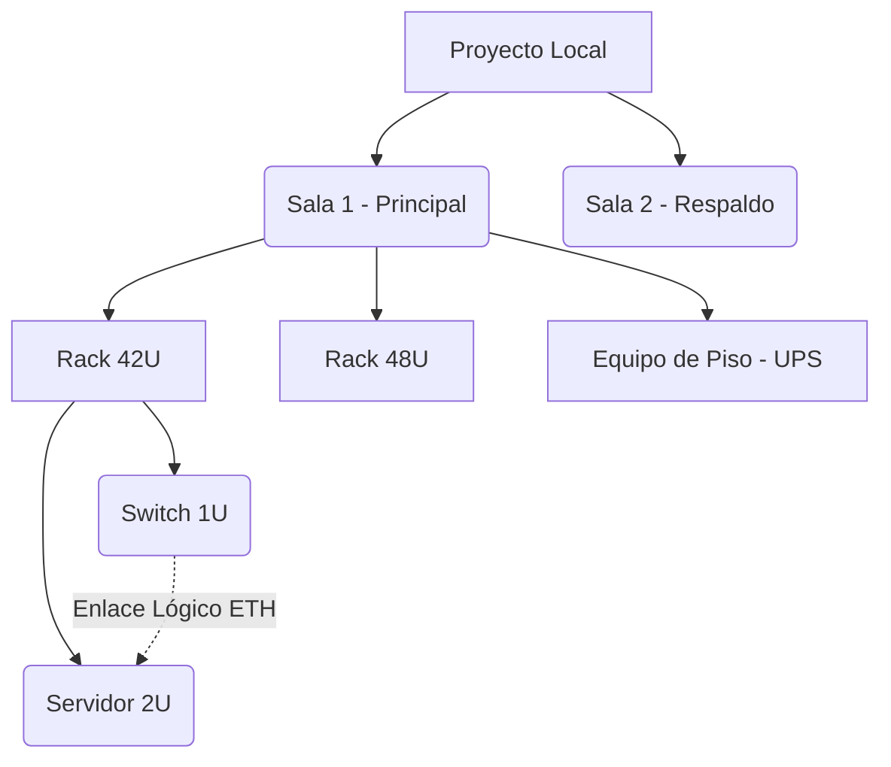

# Manual de Usuario - RACK Designer 2

Bienvenido al manual oficial de **RACK Designer 2**, tu herramienta 100% offline para el diseño, documentación e inventario de Centros de Datos.

Este manual está diseñado en un formato ligero y nativo de Markdown (`.md`), lo que significa que puedes leerlo y visualizar todos sus diagramas sin necesidad de conexión a internet usando tu editor de código o visor Markdown favorito.

---

## 1. Conceptos Básicos

**RACK Designer 2** te permite crear representaciones físicas y lógicas de tu infraestructura de red. La información siempre permanece local en tu navegador y puedes respaldarla en archivos `.json` en tu computadora.

### 1.1 Modos de Visualización
- **Modo Claro / Oscuro:** Cambia la paleta de colores para reducir la fatiga visual. Accesible desde el Menú Principal (☰).
- **Modo Rendimiento:** Al hacer clic en el punto luminoso (verde/rojo) en la cabecera, se detienen las animaciones CSS pesadas. Ideal para computadoras portátiles en modo batería o diagramas masivos.

### 1.2 Roles y Seguridad (RBAC)
El sistema protege tus diseños localmente mediante un sistema de pines:
- 👑 **Administrador:** Control total. Puede cambiar el PIN y activar el "Modo Dios" (ver contraseñas). El PIN por defecto es `rack2024`.
- ✏️ **Editor:** Puede agregar, mover y eliminar equipos, pero no puede ver credenciales sensibles.
- 👁 **Espectador:** Modo de solo lectura para auditorías.

---

## 2. Descripción Detallada de Opciones

### A. Menú Principal (Hamburguesa ☰)
Ubicado en la esquina superior derecha, gestiona la persistencia de datos:
- **Cargar Proyecto:** Importa un archivo `.json` de RACK Designer 2 previamente guardado.
- **Guardar Proyecto:** Exporta todo el diseño (Salas, Gabinetes, Equipos y Enlaces) a un archivo `.json` descargable.
- **Cargar Demo:** Sobrescribe tu lienzo con una infraestructura de ejemplo preconstruida.
- **Modo Dios:** (Requiere Admin) Revela los campos de contraseñas de todos los equipos.
- **Cambiar PIN Admin:** Modifica la contraseña maestra.

### B. Gestión de Salas y Gabinetes (Racks)
Todo en RACK Designer 2 vive dentro de una **Sala**:
- **Nueva Sala:** Haz clic en "Agregar Sala" para crear una zona.
- **Nuevo Gabinete:** Clic derecho dentro de una sala vacía o usar el botón flotante. Define el número de unidades (ej. 42U) y el color.
- **Opciones del Gabinete (⋮):** Cada rack tiene un menú en su cabecera para: Instalar Equipos, Editar, Limpiar (vaciar el rack entero) o Eliminar el gabinete.

### C. Catálogo de Equipos y Panel Inferior
El panel inferior es tu centro de comandos:
- **Catálogo Lateral:** Arrastra (Drag & Drop) servidores, switches, PDUs o routers desde el menú lateral izquierdo hacia una U vacía en tu rack.
- **Filtros de Catálogo:** Usa los botones (Network, Server, Storage, Piso) para filtrar la lista de hardware disponible.
- **Tablas de Inventario y Conexiones:** Visualiza todos tus equipos en formato Excel.

### D. Topología y Redes (Vista Lógica)
Alterna entre vista **Física** (los racks de frente) y vista de **Topología** usando los botones centrales superiores.
- **Nodos:** Cada equipo y sala se representa como un círculo interactivo.
- **Conectar Puertos:** Haz *Doble Clic* en un equipo de origen, luego en el equipo de destino. Se abrirá el menú para elegir puertos físicos (Ej. ETH1 a ETH2) y crear el enlace.

### E. Panel Derecho (Outliner y Estadísticas)
El panel lateral derecho condensa la información global:
- **Outliner (Árbol Jerárquico):** Un explorador en forma de árbol, similar al de herramientas 3D, que lista dinámicamente tus Salas, Gabinetes y Equipos (incluidos los Equipos de Piso). Al dar clic sobre cualquier equipo, se abrirá directamente su ventana de edición.
- **Estadísticas de Capacidad:** En la parte inferior de este panel, se consolida la cantidad de gabinetes, número total de equipos, unidades U ocupadas frente a las totales, y la estimación de consumo de energía.

---

## 3. Diagrama de Estructura de Datos (Offline)

El siguiente diagrama Mermaid (renderizable offline en tu IDE) muestra cómo se organizan lógicamente los elementos que vas a diseñar:

---

## 4. Flujo de Trabajo (End-to-End)

El flujo de trabajo principal ("End-to-End") del usuario final en **RACK Designer 2** está pensado para ser un proceso visual e intuitivo, desde que se abre la aplicación hasta que se documenta y exporta la infraestructura. 

### 1. Preparación del Entorno (Autenticación y Espacio)
- **Acceso:** El usuario abre el archivo `index.html` en su navegador (todo funciona 100% offline, sin instalaciones complejas).
- **Rol y Seguridad:** Accede al menú principal e inicia sesión ingresando su PIN para obtener permisos de edición (o permisos de Administrador para control total y ver contraseñas).
- **Crear Sala:** Crea una nueva "Sala" (Room) para agrupar lógicamente los gabinetes (ej. "Datacenter Principal" o "Site A").

### 2. Diseño Físico (Instalación de Hardware)
- **Crear Gabinetes:** Dentro de la sala, el usuario crea "Racks" virtuales definiendo su capacidad física en unidades de rack (Ej. 42U) y su color.
- **Drag & Drop:** Utilizando el catálogo lateral (sidebar), el usuario arrastra equipos (Switches, Servidores, PDUs, Patch Panels) hacia las ranuras o "U" específicas del rack. El catálogo se puede filtrar fácilmente por tipo de hardware.
- **Configuración de Equipos:** Al hacer doble clic en cualquier equipo insertado, se abre un modal de edición donde el usuario registra sus credenciales, direcciones IP, MAC address, consumo energético en Watts, cantidad de puertos y notas adicionales.

### 3. Diseño Lógico (Topología y Cableado)
- **Cambio de Vista:** Desde el menú superior, el usuario cambia de "Vista Física" a la vista de "Topología".
- **Parcheo Interactivo:** En este lienzo interactivo 2D, el usuario hace doble clic en un nodo origen (ej. un Switch) y luego en el nodo destino (ej. un Servidor) para tender un cable de red.
- **Asignación de Puertos:** Selecciona de forma exacta qué puerto físico conecta con cuál (ej. `ETH-24` conectando con `NIC-1`) y el color del cable para identificar la VLAN o el tipo de enlace.

### 4. Auditoría, Exportación y Respaldo
- **Panel de Control Inferior:** El usuario despliega el panel inferior para ver tablas masivas autogeneradas que consolidan todo el hardware ("Inventario") y todos los cables tendidos ("Conexiones").
- **Reportes:** Con un clic, exporta estas tablas de inventario hacia un archivo de Excel (`.xlsx`) o `.csv` para compartir con gerencia o contabilidad.
- **Autoguardado y Respaldos:** Aunque el sistema va autoguardando todo temporalmente, el usuario finaliza su día yendo al menú principal y haciendo clic en **"Guardar Proyecto"**. Esto genera un archivo `.json` que descarga en su computadora con la copia maestra de todo su diseño, el cual puede volver a cargar el día de mañana.

---
> [!TIP]
> **No necesitas modificar código** para añadir equipos visualmente distintos. Puedes reemplazar las imágenes en la carpeta `assets/img/` de tu instalación local usando el mismo nombre de archivo (`.svg` o `.png`).
