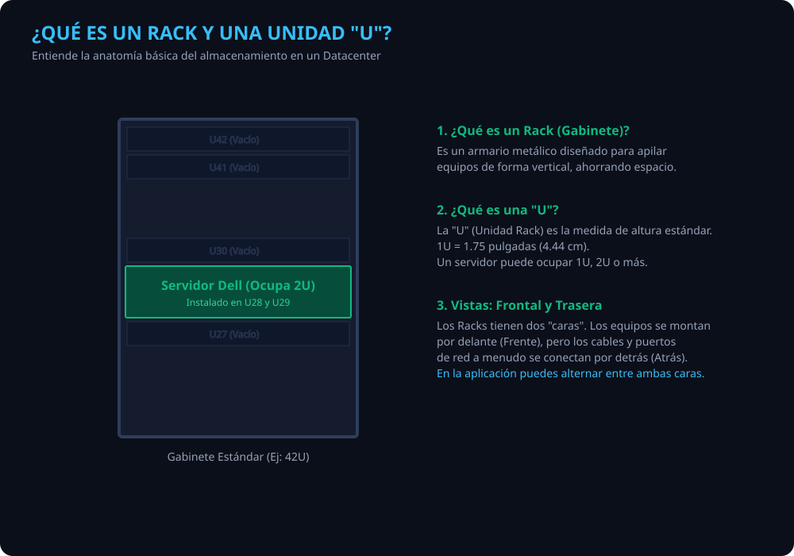
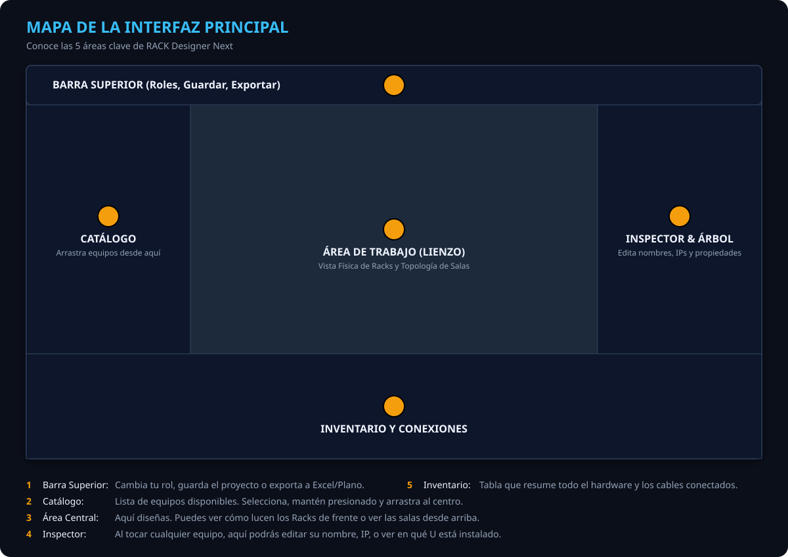
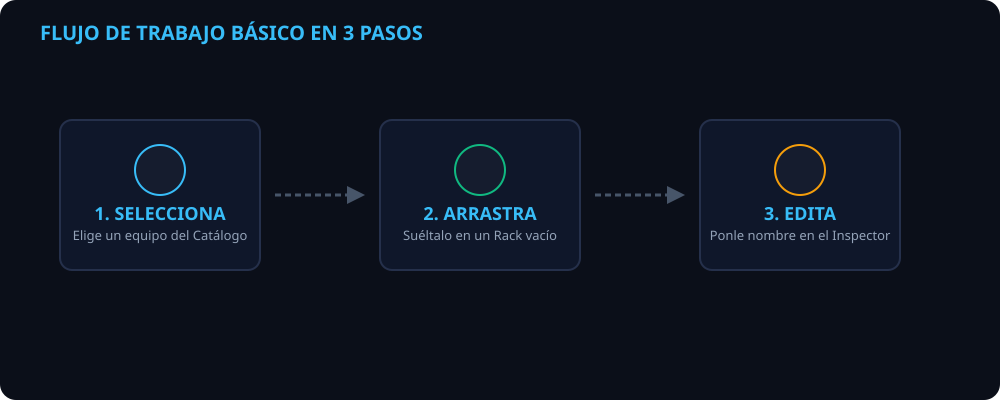

# RACK Designer Next — Manual de Usuario Definitivo

Bienvenido al manual paso a paso de **RACK Designer Next**, tu herramienta definitiva para gestionar salas, racks, equipos de telecomunicaciones y conexiones. Este manual está diseñado asumiendo que **no tienes experiencia previa** con la aplicación, por lo que te guiaremos desde lo más básico hasta que seas capaz de mapear un centro de datos completo.

---

## 📖 Parte 1: Conceptos Básicos (Para Principiantes)

Antes de hacer clic en cualquier botón, es vital entender qué estamos construyendo.

### ¿Qué es un Datacenter o Sala de Equipos?
Es simplemente una habitación física donde se guardan las computadoras centrales (servidores), los aparatos que reparten internet (switches, routers) y los sistemas de energía (baterías, aires acondicionados). En nuestra aplicación, todo empieza por crear una **Sala**.

### ¿Qué es un "Rack" o "Gabinete"?
Imagina un estante metálico, como un librero muy alto y estandarizado. Su propósito es apilar equipos uno encima del otro para ahorrar espacio. 
En nuestra aplicación, los Racks van **adentro de las Salas**.

### ¿Qué es una Unidad "U"?
Como los estantes del "Rack" están vacíos, necesitamos medir la altura de los equipos para saber cuántos caben. Para ello usamos la medida **"U"**.
- Un Rack de tamaño completo suele tener **42U** de espacio de arriba a abajo.
- Un equipo pequeño ocupa **1U**. Un servidor más grande puede ocupar **2U** o **4U**.

> [!TIP]
> **Vistas de un Rack (Frente y Atrás)**
> Los Racks tienen dos puertas. Por delante (Front) sueles ver los botones de encendido y discos duros. Por detrás (Rear) sueles ver los cables de poder y puertos de red. ¡La aplicación te permite girar el Rack para trabajar por ambas caras!

---

## 🗺️ Parte 2: Conociendo la Interfaz

Al abrir RACK Designer Next, verás tu área de trabajo dividida en **5 paneles principales**. 

1. **Barra Superior (Header):** Aquí administras tu "Rol" (para iniciar sesión como Admin y tener permisos para editar), el botón para Exportar tu plano a Excel, y el botón para Guardar el archivo en tu computadora. También encontrarás los **tabs de vista** (Física / Topología), los controles de zoom, y los botones de Deshacer/Rehacer.
2. **Catálogo (Izquierda):** Es tu "tienda" de equipos. Hay categorías representadas por iconos (Servidores, Switches, Routers, Firewalls, APs, Almacenamiento, Gestión, Energía, Accesorios, PCs, Cámaras, etc.). Al hacer **clic en un icono**, se despliega un panel lateral (flyout) con los equipos de esa categoría. Desde aquí **arrastrarás** los equipos al centro.
3. **Área de Trabajo (Centro):** El lienzo principal. Aquí es donde los Racks cobran vida. En la parte superior de esta área (Cabecera), encontrarás los menús desplegables para seleccionar y crear Salas ("Data Center") y Racks, junto con las pestañas unificadas para cambiar entre **Vista Física** y **Topología**.
4. **Inspector y Árbol (Derecha):** Cuando seleccionas un Rack o un servidor, en este panel verás su nombre, dirección IP, número de serie y otros detalles. También puedes cambiarlos. Se divide en tres secciones:
   - **Outliner:** Un árbol jerárquico que muestra Salas → Racks → Equipos
   - **Inspector:** Los detalles del elemento seleccionado
   - **Estadísticas:** Contadores globales (salas, racks, equipos, conexiones)
5. **Inventario (Abajo):** Una gran tabla tipo Excel que lista todos los equipos que has colocado en tu sala, además de listar los cables y puertos conectados. Puedes editar datos directamente en las celdas y exportar a CSV o Excel.

---

## 🔐 Parte 2.5: Roles y Permisos

Al abrir la aplicación por primera vez, verás un modal de inicio de sesión con tres opciones:

| Rol | Acceso | PIN Requerido |
|---|---|---|
| **Administrador** | Acceso total: editar, borrar, cambiar PIN, ver contraseñas | Sí (`rack2024` por defecto) |
| **Editor** | Editar equipos, racks, conexiones, guardar | No |
| **Espectador** | Solo ver datos, sin poder editar | No |

> [!IMPORTANT]
> **El PIN de Admin por defecto es `rack2024`.** Puedes cambiarlo desde el menú del proyecto → "Cambiar PIN Admin". El PIN se almacena como hash SHA-256 en tu navegador.

---

## ⚡ Parte 3: Flujo de Trabajo y Operaciones Comunes

La aplicación fue diseñada para ser tan fácil como un juego de "arrastrar y soltar".

### Cómo moverse y seleccionar
- **Clic Izquierdo:** Selecciona un objeto (Rack, servidor, etc.). Al seleccionarlo, se iluminará y sus datos aparecerán en el panel de la derecha (Inspector).
- **Clic en el Outliner:** Selecciona elementos desde el árbol jerárquico y muestra sus propiedades.
- **Doble Clic en el Outliner:** Abre el modal de edición del elemento.
- **Rueda del Ratón:** Haz scroll para hacer acercar (Zoom In) o alejar (Zoom Out).
- **Arrastrar (Drag & Drop):** Haz clic sostenido en un equipo del catálogo izquierdo, muévelo hasta un hueco vacío en tu Rack, y suelta el botón.
- **Arrastrar el fondo (Vista Física o Topología):** Mueve la vista completa (Pan).

### Guardar y Cargar
La aplicación guarda **automáticamente** los cambios en la memoria temporal de tu navegador cada vez que haces un movimiento. Además, si tienes un archivo `.rack` abierto, se **autoguarda en disco** cada 3 segundos después del último cambio.

**Guardar manualmente:**
1. Ve a la **Barra Superior** → Menú del proyecto (⋮).
2. Haz clic en **"Guardar"** (guarda en el archivo actual) o **"Guardar como..."** (elige un nuevo archivo).
3. Se guardará un archivo con extensión `.rack`. ¡Ese es tu proyecto!

**Abrir un proyecto existente:**
1. Ve a la **Barra Superior** → Menú del proyecto (⋮).
2. Haz clic en **"Abrir"** y selecciona tu archivo `.rack` o `.json`.

### Deshacer y Rehacer
- **Ctrl+Z** o botón ↩ en el header: Deshace la última acción (hasta 30 pasos)
- **Ctrl+Y** o botón ↪ en el header: Rehace la acción deshecha

---

## 🎓 Parte 4: Tutoriales Prácticos Paso a Paso

¡Hora de la práctica! Vamos a crear tres salas distintas desde cero.

### Escenario 1: Datacenter Híbrido (Racks y Piso)
Vamos a crear una sala normal, que contiene 2 Racks con servidores, y adicionalmente un equipo pesado (Aire Acondicionado) que va en el piso, fuera de los racks.

**Paso 1: Crear la Sala y los Racks**
1. En la **Barra Superior (Cabecera)**, verás un menú desplegable que dice "Data Center" y a su lado un botón **"+"**.
2. Haz clic en el menú o selecciona la sala existente. En el panel Derecho (Inspector), cámbiale el nombre a `Mi Datacenter Híbrido`.
3. En la misma barra superior, junto al menú desplegable de "Racks", haz clic en el botón **"+"** para agregar un Rack. Aparecerá un cajón negro en el lienzo central.
4. En el panel Derecho, ponle nombre a ese rack: `RACK-01`.
5. Repite el paso 3 y 4 para crear otro rack llamado `RACK-02`.

**Paso 2: Llenar el RACK-01**
1. Ve al panel Izquierdo (Catálogo) y haz clic en el icono de **Servers** para desplegar el flyout.
2. Haz clic sostenido sobre un "Dell Server (2U)" y arrástralo hacia el `RACK-01` en el lienzo central. Suéltalo en un hueco vacío.
3. Haz clic en el icono de **Network** en la barra de categorías. Arrastra un "Switch 48P (1U)" y suéltalo justo arriba del servidor.

**Paso 3: Añadir el equipo de piso**
1. En el Catálogo, busca la categoría **Floor / Piso** (iconos de PC, cámara, etc.).
2. Arrastra una "Unidad InRow (Aire Acondicionado)". Notarás que el sistema *no te deja* meterlo dentro del Rack. 
3. **¿Cómo lo coloco en el piso?** Muy simple: En la parte inferior del Rack, verás una zona punteada llamada **"Floor Equip (Exterior)"**. Suelta el equipo ahí.
4. Haz clic en el aire acondicionado recién colocado y, en el panel Derecho, llámalo `Aire-Principal`. ¡Felicidades, completaste el escenario 1!

---

### Escenario 2: Sala de Telecomunicaciones (Solo Racks)
Este cuarto más pequeño no tiene equipos en el piso, solo equipos de red y parcheo.

**Paso 1: Crear una Sala nueva**
1. Ve a la **Barra Superior (Cabecera)** y haz clic en el botón **"+"** que está al lado del selector de Salas ("Data Center").
2. En el panel Derecho, llámala `Cuarto de Telecomunicaciones`. Notarás que el lienzo central se vacía (porque entraste a tu nueva sala vacía).

**Paso 2: Montar el Gabinete de Red**
1. En la Barra Superior, haz clic en el botón **"+"** junto al selector de Racks y llámalo `RACK-TELCO` en el panel derecho.
2. Ve al Catálogo → Categoría **Network** (icono de switch).
3. Arrastra un "Patch Panel (1U)" a la parte más alta del rack.
4. Arrastra un "Router Core (4U)" debajo del patch panel.
5. Ve al panel Derecho y en las propiedades del Router escribe en la IP: `192.168.1.1`.

> [!NOTE]
> En este escenario no usamos equipos de piso. Tu vista principal (Topológica o Frontal) mostrará el cuarto ordenado y exclusivamente dedicado a equipos montados.

---

### Escenario 3: Sala de Fuerza / Energía (Solo Equipos de Piso)
En el sótano del edificio, tenemos una sala de baterías gigantes y generadores que no caben en ningún rack.

**Paso 1: Crear la Sala de Energía**
1. En la Barra Superior, haz clic en el botón **"+"** junto al selector de Salas.
2. En el panel Derecho, nómbrala `Cuarto de Baterías`.

**Paso 2: Llenar el cuarto sin usar Racks**
Dado que esta sala no necesita racks metálicos altos, insertaremos los equipos de manera independiente.
1. **NO** hagas clic en el botón "+" de Racks.
2. Ve directamente al Catálogo → Categoría **Floor / Piso**.
3. Arrastra un "Standalone UPS" hacia el lienzo vacío central.
4. Como no hay un Rack, la aplicación creará automáticamente una zona invisible (un chasis contenedor de piso) para alojarlo.
5. Arrastra un "Desk / Escritorio" al lienzo.
6. En el panel Derecho, renombra los equipos a `Batería-Principal` y `Mesa Operador`.

---

## 🔌 Parte 5: Visualización de Conexiones Físicas

¡Ahora también puedes visualizar cómo están conectados los cables en la vida real!

### Crear una conexión
1. Haz **doble clic** en un equipo (en la vista Topología o desde la tabla inferior).
2. Se abrirá el modal de **"Nueva Conexión"**.
3. Selecciona el equipo de origen, el equipo de destino, los puertos, tipo de cable y color.
4. Haz clic en **"Conectar"**.

### Ver cables en la vista física
1. Ve a la **Vista Física** (botón superior central).
2. Haz clic en el interruptor deslizable **"Cables"** de la barra de herramientas.
3. Verás que se dibujan automáticamente los cables desde los puertos, organizados ortogonalmente y agrupándose en los bordes del rack.
4. Usa el botón rotar del rack para ver la parte trasera (Rear View) desde donde nacen las conexiones.

### Ver cables en la vista topológica
1. Cambia a la **Vista Topología** (botón superior central).
2. Las conexiones se muestran como curvas animadas con partículas de flujo.
3. **Pasa el mouse** sobre un nodo para resaltar solo sus conexiones directas.

---

## 🌐 Parte 6: Vista de Topología

La vista de topología es un diagrama de red interactivo donde puedes ver cómo están conectados todos tus equipos.

### Controles
- **Arrastrar nodo:** Mueve un equipo individual dentro de su rack o sala.
- **Arrastrar barra de rack (verde):** Mueve el rack completo con todos sus equipos.
- **Arrastrar barra de sala (naranja):** Mueve la sala completa.
- **Esquina inferior-derecha de sala/rack:** Cambia el tamaño (resize).
- **Rueda del mouse:** Zoom in/out.
- **Arrastrar el fondo:** Pan (mueve toda la vista).
- **Doble clic en un nodo:** Abre modal para crear una conexión.
- **Doble clic en un cable:** Abre modal para editar esa conexión.

### Cambiar estilo de nodos
- Haz clic en el botón **"Estilo"** del header → alterna entre **Card** (tarjetas rectangulares con nombre e IP) y **Circle** (círculos con icono, nombre arriba e IP con badge).

### Ajustar el espaciado
- Usa el **slider de espaciado** en la barra del header para separar o acercar los nodos dentro de los racks.

### Reordenar automáticamente
- Haz clic en **"Auto-Ordenar"** para que la aplicación recalcule automáticamente las posiciones de todos los elementos.

### Exportar como imagen
- Desde el menú de exportación, selecciona **"Exportar Topología PNG"** para descargar una imagen de alta resolución del diagrama.

---

## 📊 Parte 7: Exportación de Datos

Desde el menú del proyecto o la barra inferior, puedes exportar tus datos en varios formatos:

| Formato | Contenido | Cómo |
|---|---|---|
| **PNG (Racks)** | Imagen de la vista física de cada rack | Exportar → Rack a PNG |
| **PNG (Topología)** | Imagen del diagrama de red completo | Exportar → Topología PNG |
| **CSV** | Tabla de inventario de equipos | Botón CSV en la tabla inferior |
| **Excel (.xlsx)** | Inventario + conexiones en hojas separadas | Botón Excel en la tabla inferior |
| **JSON (.rack)** | Proyecto completo (datos + catálogo) | Guardar / Guardar como |

---

## 🎨 Parte 8: Temas y Personalización

### Tema claro / oscuro
- Ve al menú del proyecto (⋮) → **"Cambiar a Modo Claro"** o **"Cambiar a Modo Oscuro"**.
- El tema se guarda en tu navegador y se recuerda en la siguiente visita.

### Modo Dios (solo Admin)
- Ve al menú del proyecto (⋮) → **"Modo Dios: Revelar Claves"**.
- Muestra todas las contraseñas almacenadas en texto plano en la tabla, inspector y topología.
- Solo los administradores pueden activar esta función.

### Pausar animaciones
- Haz clic en el **punto verde** (status dot) de la barra superior para pausar/reanudar las animaciones de las partículas en la topología.

---

¡Has completado tu capacitación básica! Ahora sabes cómo navegar por la aplicación, qué significan los conceptos, cómo arrastrar componentes y cómo estructurar cuartos enteros según tus necesidades del mundo real. 

Si te equivocas, recuerda usar la opción de **Deshacer (Undo)** con Ctrl+Z o simplemente seleccionar el equipo mal colocado y presionar el botón **Eliminar (Trash/Basurero)** en el Inspector (Panel Derecho).
