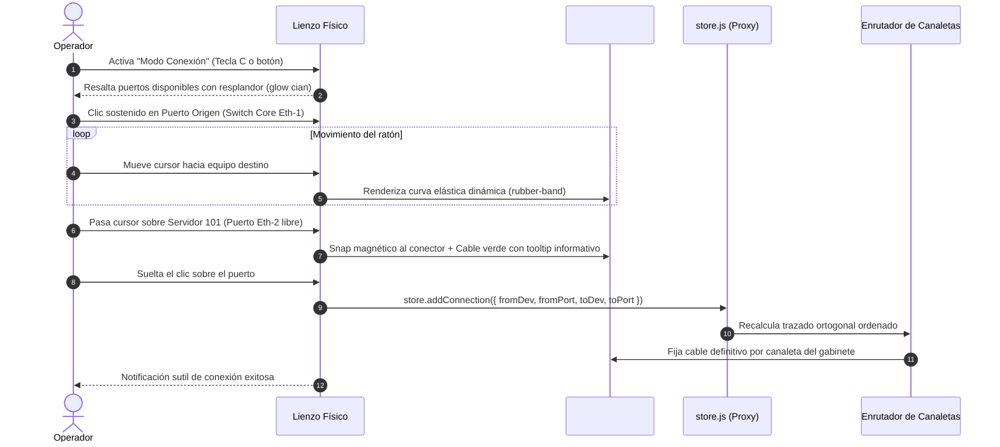
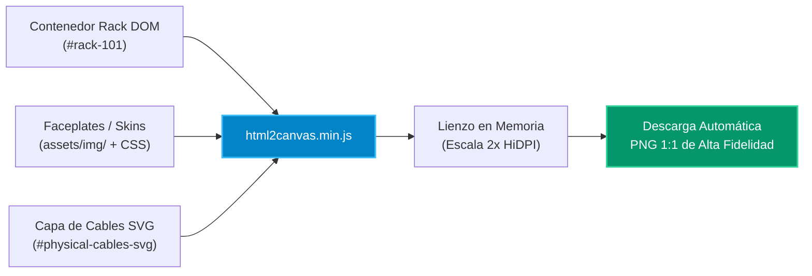

# Informe Estratégico de Mejoras y Hoja de Ruta de Implementación
## RACK Designer Next — Modernización Integral de Arquitectura y Experiencia de Usuario

---

## 1. Resumen Ejecutivo

**RACK Designer Next** es una herramienta PWA de diseño y documentación de infraestructura de centros de datos (DCIM) 100% offline, desarrollada en Vanilla JavaScript con reactividad basada en Proxies ES6.

A partir del análisis exhaustivo documentado en [`mejoras.md`](file:///c:/Users/admin/.gemini/antigravity/scratch/Rack_Designer_2/mejoras.md), se identificaron tanto cuellos de botella críticos de producción (seguridad en almacenamiento, límites de memoria y riesgos de pérdida silenciosa) como oportunidades de evolución que transforman la herramienta de un catálogo estático a un **estudio de diseño interactivo de alta fidelidad**.

Este informe consolida todas las mejoras, analiza su valor transformador mediante diagramas arquitectónicos y establece un **Diagrama de Implementación por Fases**.

---

## 2. Clasificación Integral de Mejoras

```
                     ┌─────────────────────────────────────────────────────────┐
                     │           RACK DESIGNER NEXT — ÁREAS DE MEJORA          │
                     └─────────────────────────────────────────────────────────┘
                                   │
         ┌─────────────────────────┼─────────────────────────┐
         ▼                         ▼                         ▼
  1. CORE Y DATOS           2. UX Y VISTA FÍSICA      3. TOPOLOGÍA AVANZADA
  • QuotaExceededError      • Drag-to-Connect         • Persistencia (X, Y)
  • Puertos & VLANs         • CRUD en Inspector       • Modos de Skin
  • DemoData refactor       • Outliner interactivo    • Árbol Genealógico
  • Seguridad de estado     • Proporción U (240px)    • Temas y transparencias
  • Debounce en snapshots   • Grilla tenue y bordes   • Separación IP / Nombre
                            • Agrupación "Network"
                                   │
         ┌─────────────────────────┴─────────────────────────┐
         ▼                                                   ▼
  4. EXPORTACIÓN Y COLABORACIÓN                       5. RESPONSIVE Y CALIDAD
  • Fidelidad 1:1 (html2canvas)                       • Rediseño Móvil / Tablet
  • Plantilla completa CSV/Excel                      • Gestos táctiles y Bottom Nav
  • Importador masivo con validación                  • Tema Sepia
  • Columnas dinámicas en tablas                      • Suite de pruebas unitarias
```

---

### A. Core, Resiliencia y Seguridad de Datos

| Mejora | Diagnóstico Actual | Solución Propuesta | Beneficio en Producción |
| :--- | :--- | :--- | :--- |
| **Protección contra `QuotaExceededError`** | `localStorage` tiene un tope de 5MB. Si se excede, el `catch` vacío ignora el fallo y deja de guardar silenciosamente. | Capturar la excepción en `store.js`, alertar al usuario en la UI con banner crítico y activar respaldo a archivo `.rack`. | Cero pérdida inadvertida de horas de trabajo en centros de datos grandes. |
| **Gestión Avanzada de Puertos y VLANs** | No hay validación de puertos ocupados; conexiones asignadas a puertos ya en uso son permitidas. | Mapeo individual de puertos (Eth/SFP), filtrado automático de ocupados en selects, asignación de VLAN y actualización de `demoData.js`. | Realismo DCIM estricto: evita errores de diseño y duplicación física de cables. |
| **Resiliencia ante Corrupción de Estado** | Si ocurre un crash durante `_save()`, la sesión siguiente encuentra JSON roto y resetea a estado vacío. | Almacenar una copia espejo (`_backup_state`) antes de escribir en disco local para auto-recuperación ante fallos. | Integridad de datos garantizada ante cortes imprevistos de energía o recargas forzadas. |
| **Optimización de `snapshot()`** | `deepClone` síncrono del estado completo en cada micro-acción satura el hilo principal. | Desacoplar snapshots con clonado estructural eficiente o limitación de profundidad en historial de Undo/Redo. | Eliminación de congelamientos de pantalla (*jank*) al mover nodos o cablear. |

---

### B. Experiencia de Usuario y Vista Física Interactiva

| Mejora | Diagnóstico Actual | Solución Propuesta | Beneficio en Producción |
| :--- | :--- | :--- | :--- |
| **Conexiones Gráficas (*Drag-to-Connect*)** | Conectar requiere abrir `CableModal`, seleccionar equipo y puerto de listas desplegables de texto. | Herramienta de cableado interactivo: arrastrar desde un puerto con cable elástico SVG, atracción magnética (*snap*) a puertos libres y feedback visual verde/rojo. | Cablear un gabinete se vuelve tan natural como tender un latiguillo en la vida real, multiplicando la velocidad de diseño. |
| **CRUD en el Inspector** | El Inspector es pasivo. Para salas y gabinetes no permite edición directa ni eliminación, ni creación rápida. | Añadir controles CRUD completos en el Inspector: edición de propiedades, eliminación con confirmación segura y botones de creación contextual (`+ Crear Rack en esta Sala`, `+ Agregar Equipo`). | Centraliza la gestión en el panel derecho sin dispersión por menús de la cabecera. |
| **Controles y Filtros en el Outliner** | Árbol jerárquico solo de navegación; no permite crear, borrar ni ordenar. | Botones de acción en cada nodo del árbol (editar, borrar), accesos rápidos superiores y ordenamiento por nombre, tipo o posición U. | Búsqueda y reorganización inmediata de equipos en centros de datos con cientos de componentes. |
| **Proporción Realista de Slots (240px)** | El ancho de los slots del rack puede flexibilizarse o deformarse según la resolución. | Fijar el ancho de slots a un múltiplo exacto de 10 veces la unidad U ($10 \times 24\text{px} = 240\text{px}$). | Previene la distorsión visual de los skins y faceplates de servidores montados. |
| **Ergonomía Visual (Grilla y Bordes)** | Fondos planos y bordes finos dificultan distinguir límites entre gabinetes contiguos. | Contorno de rack más grueso y grilla sutil de fondo en el lienzo físico. | Percepción espacial clara para colocar y ordenar racks y equipos de piso. |
| **Agrupación y Búsqueda en Catálogo** | Demasiadas pestañas individuales; no existe categoría que reúna todo. | Unificar Routers, Switches y Firewalls en categoría **"Network"**, añadir pestaña **"Todos"** (lupa) y buscador integrado. | Reduce clics y fatiga de navegación en el catálogo de dispositivos. |

---

### C. Motor Gráfico de Topología

| Mejora | Diagnóstico Actual | Solución Propuesta | Beneficio en Producción |
| :--- | :--- | :--- | :--- |
| **Persistencia de Coordenadas (X, Y)** | Al recargar o recalcular, las posiciones personalizadas de los nodos pueden alterarse. | Registrar las coordenadas editadas de salas, racks y nodos en el estado (`store.js`) y archivarlas en el `.rack`. | El usuario conserva intactos sus esquemas lógicos diseñados a medida. |
| **Sistema Avanzado de Skins** | Solo existe modo Tarjeta rectangular y modo Círculo básico. | Tres modalidades: Nodos circulares compactos, Tarjetas con metadatos e Imágenes personalizadas (logos e iconos de fabricantes). | Diagramas versátiles: desde topologías lógicas abstractas hasta diagramas fotorrealistas para presentaciones. |
| **Layout de Árbol Genealógico** | Disposición automática estándar sin noción de jerarquía de capas de red. | Disposición en árbol (Core en raíz $\rightarrow$ Distribución $\rightarrow$ Acceso) con controles deslizables de separación horizontal y vertical. | Comprensión inmediata de las dependencias lógicas y niveles de redundancia. |
| **Etiquetas Separadas en Modo Nodos** | En modo circular, la IP y el nombre se superponen o saturan el interior del nodo. | Etiqueta de IP ubicada arriba del círculo y nombre del equipo posicionado abajo. | Claridad de lectura en diagramas de red de alta densidad. |
| **Personalización de Temas y Fondos** | Fondos y colores rígidos en el canvas de topología. | Ajustes de transparencia (alfa), patrones de fondo (puntos, cuadrícula, hexágonos) y personalización de contornos. | Adaptación de diagramas a la identidad corporativa y prevención de cables ocultos bajo tarjetas opacas. |

---

### D. Exportación, Importación y Fidelidad Visual

| Mejora | Diagnóstico Actual | Solución Propuesta | Beneficio en Producción |
| :--- | :--- | :--- | :--- |
| **Fidelidad 1:1 en Exportación de Imagen** | El exportador genera un Canvas 2D esquemático con cajas de colores planos, perdiendo carátulas, serigrafía y cables. | Integrar **`html2canvas.min.js`** como vendor estático para capturar directamente el DOM real con cables SVG a resolución escalada (2x / 3x). | Exportación fiel lista para planos ejecutivos y documentación técnica de ingeniería. |
| **Importación Masiva (CSV / Excel)** | Inicializar un datacenter grande requiere arrastrar equipo por equipo manualmente. | Asistente de importación con validación de tipos, detección de colisiones de IP y asignación automática a slots. | Reduce el tiempo de aprovisionamiento inicial de días a un solo clic. |
| **Plantilla Estructurada de Exportación** | La exportación a Excel omite campos esenciales como `notes`, `skin`, `size` o datos de puertos. | Generar una plantilla con el 100% de atributos del modelo de datos y validaciones de celda preconfiguradas. | Garantiza la portabilidad completa y el viaje de ida y vuelta (round-trip) sin pérdida de metadatos. |
| **Columnas Configurables en Tablas** | Desplazamiento horizontal excesivo en tablas inferiores ante muchos campos. | Selector con casillas de verificación para mostrar/ocultar columnas con persistencia en `localStorage`. | Focalización del operador en las columnas críticas de su rol (ej. solo IPs o solo posiciones físicas). |

---

### E. Movilidad, Accesibilidad y Calidad de Código

| Mejora | Diagnóstico Actual | Solución Propuesta | Beneficio en Producción |
| :--- | :--- | :--- | :--- |
| **Soporte Responsivo Móvil / Tablet** | Diseñado exclusivamente para escritorio (paneles fijos que se solapan en pantallas pequeñas). | Barra de navegación inferior (*Bottom Nav*), menús laterales deslizables (*swipe*), inspección táctil y *long-press*. | Técnicos de soporte pueden auditar e interactuar con racks directamente en el piso del centro de datos desde su tablet o móvil. |
| **Tema Sepia y Selector Visible** | Solo existen temas Claro y Oscuro; el alternador de tema tiene visibilidad reducida. | Hacer accesible el botón en la cabecera y agregar un tema "Sepia" cálido de baja luminancia. | Reduce significativamente la fatiga visual en turnos nocturnos o cuartos de control. |
| **Suite de Pruebas Unitarias** | `Rack.test.js` estaba comentado e inutilizable. | Implementada suite automatizada `tests/integrity_check.cjs` (26 pruebas en Node.js) que valida RBAC, persistencia F5, cascada de eliminación de racks, auto-saneamiento y tolerancia a fallos. | ✅ **COMPLETADO:** Blindaje contra regresiones y validación continua en CI/local. |

---

## 3. Diagramas Explicativos del Nuevo Ecosistema

### Diagrama 1: Transformación Arquitectónica (Antes vs. Después)

```mermaid
graph TD
    subgraph ARQUITECTURA_ACTUAL["ARQUITECTURA ACTUAL (Con Limitaciones)"]
        UI1["Interacciones Fragmentadas<br/>(Modal para cablear, prompt para salas)"] --> ST1["Store.js (Proxy)"]
        ST1 --> LS1["localStorage (Sin control de cuota)"]
        UI1 -.-> EXP1["ExportModal (Canvas 2D Sintético)<br/>❌ Cajas planas sin faceplates ni cables"]
    end

    subgraph ARQUITECTURA_PROPUESTA["ARQUITECTURA MEJORADA (Flujo Unificado)"]
        UI2["Interacción Directa<br/>• Drag-to-Connect en lienzo<br/>• CRUD integrado en Inspector<br/>• Outliner con acciones inline"] --> ST2["Store.js Blindado<br/>• Quota Handler<br/>• Snapshots optimizados<br/>• Espejo anti-corrupción"]
        ST2 --> LS2["Persistencia Resiliente<br/>(localStorage + Alerta si >5MB)"]
        
        DOM2["DOM Real Renderizado<br/>• Faceplates fotorrealistas<br/>• Cables SVG en canaletas<br/>• Racks a 240px estandarizados"] --> H2C["html2canvas (Vendor)"]
        H2C --> EXP2["PNG Pixel-Perfect (2x/3x)<br/>✅ Fidelidad idéntica a pantalla"]
    end

    style ARQUITECTURA_ACTUAL fill:#1e1e24,stroke:#ef4444,stroke-width:2px
    style ARQUITECTURA_PROPUESTA fill:#111827,stroke:#0ea5e9,stroke-width:2px
    style H2C fill:#0284c7,stroke:#38bdf8,stroke-width:1px,color:#fff
```



---

### Diagrama 2: Flujo Interactivo de Conexión Física (*Drag-to-Connect*)



---

### Diagrama 3: Pipeline de Exportación Visual de Alta Fidelidad



---

## 4. Diagrama de Implementación y Dependencias (Roadmap)

La ejecución se organiza en **5 Fases Lógicas**, donde cada fase entrega valor operativo sin romper la compatibilidad con proyectos existentes ni con la arquitectura Vanilla JS.

```mermaid
graph TD
    subgraph FASE1["FASE 1: Resiliencia de Datos y Validación de Red"]
        F1_1["1.1 Handler QuotaExceededError<br/>en store.js"]
        F1_2["1.2 Validación de Puertos Ocupados<br/>y modelo de VLANs"]
        F1_3["1.3 Refactor de demoData.js<br/>a nueva estructura"]
        F1_1 --> F1_2 --> F1_3
    end

    subgraph FASE2["FASE 2: Ergonomía de Interfaz y Conexión Física"]
        F2_1["2.1 Estandarización de Racks<br/>(Slots a 240px, default 8U)"]
        F2_2["2.2 Acciones CRUD en Inspector<br/>(Salas y Racks)"]
        F2_3["2.3 Outliner Interactivo<br/>(Acciones inline y orden)"]
        F2_4["2.4 Drag-to-Connect<br/>(Conexión gráfica en vista física)"]
        F2_1 --> F2_2 --> F2_4
        F2_2 --> F2_3
    end

    subgraph FASE3["FASE 3: Motor de Topología Lógica"]
        F3_1["3.1 Persistencia Coordenadas (X,Y)<br/>en estado global"]
        F3_2["3.2 Sistema de Skins<br/>(Nodos, Cards, Imágenes)"]
        F3_3["3.3 Layout Árbol Genealógico<br/>con sliders de espaciado"]
        F3_1 --> F3_2 --> F3_3
    end

    subgraph FASE4["FASE 4: Exportación, Fidelidad e Importación"]
        F4_1["4.1 Integrar html2canvas<br/>(Exportación PNG 1:1)"]
        F4_2["4.2 Plantilla Completa Excel/CSV<br/>con todos los metadatos"]
        F4_3["4.3 Importador Masivo de Equipos<br/>con resolución de conflictos"]
        F4_1 --> F4_2 --> F4_3
    end

    subgraph FASE5["FASE 5: Accesibilidad y Entorno Móvil"]
        F5_1["5.1 Adaptación Responsive<br/>(Bottom Nav, Gestos Swipe)"]
        F5_2["5.2 Tema Sepia y Contraste"]
        F5_3["5.3 Reactivación de Suite de Tests"]
        F5_1 --> F5_2 --> F5_3
    end

    FASE1 ==> FASE2
    FASE2 ==> FASE3
    FASE2 ==> FASE4
    FASE4 ==> FASE5
    FASE3 -.-> FASE5

    style FASE1 fill:#1e293b,stroke:#38bdf8,stroke-width:2px
    style FASE2 fill:#1e293b,stroke:#0ea5e9,stroke-width:2px
    style FASE3 fill:#1e293b,stroke:#818cf8,stroke-width:2px
    style FASE4 fill:#1e293b,stroke:#10b981,stroke-width:2px
    style FASE5 fill:#1e293b,stroke:#f59e0b,stroke-width:2px
```



---

## 5. Matriz de Prioridad y Plan de Ejecución

| Fase | Tarea Principal | Archivos Involucrados | Complejidad | Impacto |
| :---: | :--- | :--- | :---: | :---: |
| **Fase 1** | **Blindaje de Guardado y Puertos:** Control de cuota en `store._save()`, validación estricta de puertos en `CableModal.js` y actualización de `demoData.js`. | `js/store.js`<br/>`js/ui/modals/CableModal.js`<br/>`js/demoData.js` | Media | **Crítico** (Evita pérdida de datos y errores lógicos de red). |
| **Fase 2** | **Ergonomía Física:** Conexión gráfica *Drag-to-Connect* sobre `#physical-cables-svg`, controles CRUD en `inspector.js`, slots a 240px en `rack.css`. | `js/ui/rack.js`<br/>`js/ui/inspector.js`<br/>`js/ui/outliner.js`<br/>`css/components/rack.css` | Alta | **Muy Alto** (Multiplica por 5 la velocidad de diseño del usuario). |
| **Fase 3** | **Topología Inteligente:** Guardado de coordenadas manuales en `store._raw.nodePositions`, modo de visualización en árbol y separación de etiquetas IP/nombre. | `js/ui/topology/TopologyLayout.js`<br/>`js/ui/topology/TopologyRenderer.js`<br/>`js/ui/topology/TopologyState.js` | Media-Alta | **Alto** (Flexibilidad total para documentar redes complejas). |
| **Fase 4** | **Exportación e Importación:** Añadir `html2canvas.min.js` a `index.html`, refactorizar `ExportModal.js` para captura de DOM e implementar importación masiva con `xlsx.full.min.js`. | `index.html`<br/>`js/ui/modals/ExportModal.js`<br/>`js/ui/fileManager.js`<br/>`js/ui/tables.js` | Media | **Alto** (Entregables profesionales e integración masiva de inventarios). |
| **Fase 5** | **Responsive y Ajustes Finales:** Media queries para smartphones/tablets, eventos táctiles, tema Sepia y suite de pruebas. | `css/layout.css`<br/>`css/variables.css`<br/>`tests/Rack.test.js` | Media | **Medio-Alto** (Uso en sitio por personal técnico frente al rack). |

---

## 6. Conclusión y Recomendación

La implementación de este plan posiciona a **RACK Designer Next** al nivel de soluciones comerciales consolidadas de DCIM (*Data Center Infrastructure Management*), preservando su mayor fortaleza competitiva: **ligereza absoluta, 100% offline, sin dependencias de compilación y respetando el estándar del sistema**.

Se recomienda iniciar por la **Fase 1** (Blindaje de datos de guardado y puertos) para asegurar la solidez del motor antes de expandir las capacidades interactivas visuales de la **Fase 2**.
