# Dimensiones y Medidas de la Cabecera (Header Layout)

Este documento detalla el esquema de layout, dimensiones de componentes, cajas CSS y comportamiento responsivo de la cabecera principal (`#header`) de **RACK Designer Next**.

---

## 1. Estructura General y Dimensiones Base

La cabecera funciona como la barra de navegación y control principal de la aplicación. Está posicionada estáticamente en el área de rejilla `header` con un comportamiento flexbox horizontal en pantallas de escritorio:

```css
#header {
  grid-area: header;
  display: flex;
  align-items: center;
  padding: 0;
  background: var(--bg-card); /* Color oscuro translúcido */
  border-bottom: 1px solid var(--border);
  z-index: 100;
  height: var(--header-h); /* 56px */
}
```

### 🧱 División Estructurada

La cabecera se divide horizontalmente en dos contenedores principales:
1.  **Área del Logo (`.header-logo-area`):** Contiene el logotipo, nombre del proyecto, archivo abierto y el menú lateral del proyecto.
2.  **Área Principal de Controles (`.header-main-area`):** Agrupa los selectores de salas/racks, cambio de vista física/topológica, buscador global, historial (deshacer/rehacer) y estados de conexión.

---

## 2. Dimensiones Detalladas de Componentes

### 🏷️ Área del Logo (`.header-logo-area`)
*   **Ancho Fijo:** **`260px`** (`flex-shrink: 0`).
*   **Altura:** `100%` (`56px`).
*   **Margen y Relleno:** `padding: 0 16px`.
*   **Componentes Internos:**
    *   **Botón de Menú Móvil (`#mobile-menu-btn`):** `display: none` en escritorio. Dimensiones normalizadas de `24px` × `24px`.
    *   **Imagen del Logo (`.logo-icon`):** Medida fija de `24px` × `24px` (`object-fit: contain`) con filtro de resplandor (`drop-shadow` de `8px var(--accent)`).
    *   **Texto Subtítulo (`.logo-sub` o `#project-filename`):** Tamaño de fuente `--text-xs` (`10px`), fuente monoespaciada y margen superior de `-4px`.
    *   **Botón del Menú del Proyecto (`#btn-project-menu`):** Dimensiones de `24px` × `24px` con transiciones de color en hover.

### ⚙️ Área Principal (`.header-main-area`)
*   **Ancho:** Flexible (`flex: 1`, `min-width: 0`).
*   **Margen y Relleno:** `padding: 0 16px` con espacio de separación uniforme (`gap: 12px`).
*   **Componentes Internos (Altura Estricta de 24px):**
    *   **Selectores Desplegables (Salas/Racks):**
        *   Ancho mínimo de la etiqueta interna: Ajustable según el texto.
        *   Relleno interno del botón: `0 10px` con iconos de `14px` (origen) y `12px` (flecha de despliegue).
        *   Botón para Añadir (`.nav-btn-add`): Dimensiones fijas de `24px` × `24px`.
    *   **Divisor Horizontal (`.h-divider`):** Ancho de `1px` y altura de **`32px`** (color `--border`).
    *   **Pestañas de Vista (`.view-tabs`):**
        *   Contenedor: Borde de `1px` y bordes redondeados (`var(--radius)` = `6px`).
        *   Botón de Vista (`.view-tab`): Relleno de `5px 14px` en cada pestaña.
    *   **Buscador Global (`.h-search`):**
        *   Ancho en Reposo: **`200px`** (padding de entrada: `4px 10px 4px 30px`).
        *   Ancho en Foco: **`240px`** (transición fluida de `0.2s`).
    *   **Grupo de Historial (`.h-btn-group`):**
        *   Botones individuales (`#btn-undo`, `#btn-redo`): Normalizados a `24px` de alto, con bordes redondeados solo en esquinas exteriores (Izquierdo: `6px 0 0 6px`, Derecho: `0 6px 6px 0`).
    *   **Punto de Estado (`.status-dot`):** Círculo de `7px` × `7px` con animación de pulso y resplandor de color verde (`#10b981`).
    *   **Insignia de Usuario (`#user-badge`):** Relleno de `2px 10px` con bordes completamente redondeados (`10px`).

---

## 3. Comportamiento en Vistas Móviles (`max-width: 768px`)

En pantallas móviles, el espacio horizontal es limitado, por lo que la cabecera reestructura su layout mediante flexbox vertical:

*   **Flex-Direction:** Cambia a `column` con altura automática (`height: auto`) y desborde visible (`overflow: visible`).
*   **Línea 1 (Logo & Menú):**
    *   `.header-logo-area` toma el **`100%`** de ancho.
    *   El botón del menú móvil (`#mobile-menu-btn`) pasa a `display: flex`.
    *   El borde derecho separator se elimina y se añade un borde inferior de `1px`.
*   **Línea 2 (Barra de Navegación):**
    *   `.header-main-area` se convierte en una fila horizontal con scroll (`overflow-x: auto`) sin ajustar líneas (`flex-wrap: nowrap`).
    *   El espaciador central (`.spacer`) se oculta (`display: none`).
    *   Todos los hijos directos se bloquean para evitar el encogimiento (`flex-shrink: 0`).

---

## 4. Diagramas de Cabecera

### 🗺️ Composición Horizontal (Escritorio)

```mermaid
graph LR
    subgraph Header ["#header (Alto: 56px)"]
        direction LR
        subgraph LogoArea [".header-logo-area (Ancho: 260px)"]
            direction LR
            Icon["Logo Icon (24x24)"] --> Title["RACK Designer Next<br/>(Subtítulo: 10px)"]
            Title --> MenuBtn["Menú Proyecto (24x24)"]
        end
        subgraph MainArea [".header-main-area (Flexible: 1fr)"]
            direction LR
            Rooms["Salas / Dropdown"] --> Racks["Racks / Dropdown"]
            Racks --> Div["Divisor (32px alto)"]
            Div --> Tabs["Pestañas de Vista"]
            Tabs --> Sp["Espaciador (Flex: 1)"]
            Sp --> Search["Buscador (200px -> 240px)"]
            Search --> History["Undo/Redo (24px alto)"]
            History --> State["Punto Estado (7x7)"]
        end
        LogoArea --> MainArea
    end

    style Header fill:#111827,stroke:#1f2937,stroke-width:2px,color:#f3f4f6
    style LogoArea fill:#1f2937,stroke:#374151,stroke-width:1px,color:#f3f4f6
    style MainArea fill:#1f2937,stroke:#374151,stroke-width:1px,color:#f3f4f6
    style Div fill:#4b5563,stroke:#4b5563,stroke-width:1px
```



### 📐 Distribución de Píxeles de Cabecera

```text
┌────────────────────────────────────────────────────────────────────────────────────────────────────────────────────────┐ ▲
│  LOGO AREA (Ancho: 260px)       │  MAIN AREA (Ancho: Flexible 1fr)                                                     │ │
│ ├─────────┬──────────────┬─────┤│ ├──────────────┬──────────────┬───┬──────────────┬──────────────┬──────────┬───┬───┤ │ 56px
│ │[icon]   │ RACK         │ [v] ││ │ Salas        │ Racks        │ | │ Vista Física │ Topología    │ Buscar.. │↺ │• │ │
│ │ 24x24px │ Designer     │     ││ │ H: 24px      │ H: 24px      │ | │ H: 24px      │ H: 24px      │ W: 200px │  │7px│ │
│ └─────────┴──────────────┴─────┘│ └──────────────┴──────────────┴───┴──────────────┴──────────────┴──────────┴───┴───┘ │
└─────────────────────────────────┴──────────────────────────────────────────────────────────────────────────────────────┘ ▼
◄───────────── 260px ────────────►◄────────────────────────────────────── 1fr ───────────────────────────────────────────►
```
