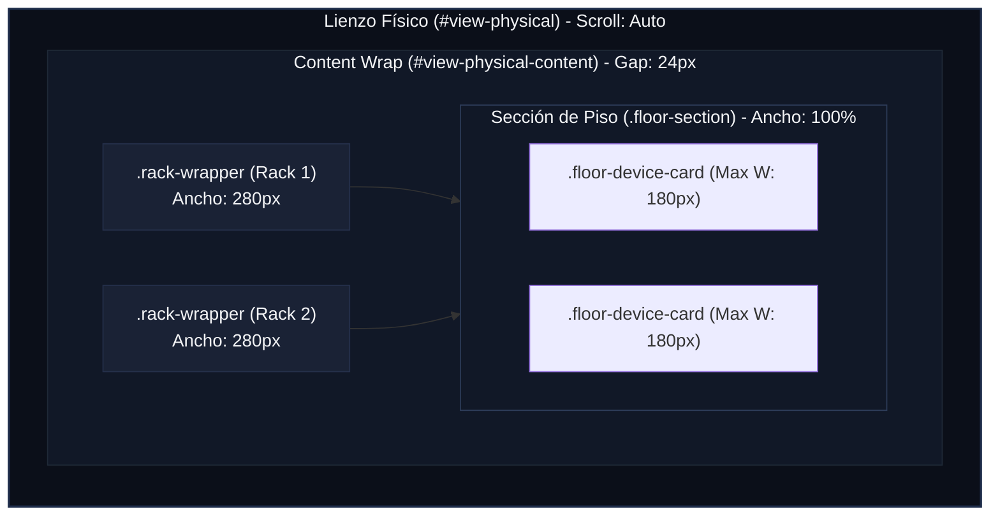

# Dimensiones y Medidas del Lienzo Central (Main Workspace - Vista Física)

Este documento detalla el esquema de layout, dimensiones de los racks, celdas de equipos, vista trasera, equipos de piso y zoom en el lienzo central de la vista física (`#view-physical`) de **RACK Designer Next**.

---

## 1. Contenedor del Lienzo (`#view-physical`)

El lienzo central de la vista física aloja los gabinetes interactivos en 2D y la sección inferior de equipos de piso.

```css
#view-physical {
  padding: 24px; /* Margen interno alrededor del lienzo */
  overflow: auto; /* Scroll bidimensional independiente */
  height: 100%;
  position: relative;
  z-index: 1;
}
```

### 🧱 Contenedor de Contenido (`#view-physical-content`)
Las tarjetas de racks y la sección de piso se organizan mediante Flexbox:
*   **Separación entre Racks:** **`24px`** (espaciado dinámico horizontal y vertical definido mediante Flexbox).
*   **Layout:** Flexbox horizontal (`display: flex`, `flex-wrap: wrap`, `gap: 24px`).
*   **Alineación:** Alineado al inicio vertical (`align-content: flex-start`).
*   **Zoom Origin:** `transform-origin: 0 0;` (punto de anclaje para los cálculos de escala y zoom sin alterar las coordenadas de arrastre).

---

## 2. Dimensiones y Anatomía del Rack

El chasis del gabinete (`.rack-card`) tiene medidas proporcionales fijas para evitar deformaciones en las faceplates de los equipos:

*   **Ancho Total Estimado:** **`280px`**
    *   Rieles laterales (`.rack-rail-left`/`.rack-rail-right`): `20px` cada uno.
    *   Área central útil (`.rack-slots`): Fijo **`240px`** (proporcional: 10 veces el tamaño de la unidad U).
*   **Altura Total:** Ajustable dinámicamente según la cantidad de unidades U configuradas:
    
    $$\text{Altura (px)} = (\text{Cantidad de U} \times 24\text{px}) + 38\text{px (cabecera)}$$

*   **Altura de 1 U:** Fijo **`24px`** (`--rack-unit-h`). Tanto ranuras (`.rack-slot`) como marcadores laterales (`.rail-unit`) tienen esta altura estricta.

---

## 3. Lógica de Rotación 3D (Vista Trasera / Flip)

El sistema soporta rotación en 3D para visualizar la distribución de cables, PDU y conexiones en la parte trasera del rack:

*   **Perspectiva:** `.rack-wrapper` define `perspective: 1200px;`.
*   **Efecto Flip:** Al aplicar la clase `.flipped` en `.rack-flipper`, se realiza una rotación de 180 grados sobre el eje Y: `transform: rotateY(180deg);` con transición de `0.65s cubic-bezier(0.4, 0, 0.2, 1)`.
*   **Caras:**
    *   **Frontal (`.rack-face`):** Visible y activa por defecto.
    *   **Trasera (`.rack-rear`):** Posicionada con `position: absolute` y rotada Y a `180deg`. Desactiva sus eventos del DOM en estado frontal, y los activa únicamente al voltearse.

---

## 4. Medidas Especiales de la Vista Trasera

La vista trasera del rack muestra un panel de control técnico con medidas optimizadas para micro-detalles:

*   **Rieles de Unidades Traseras (`.rear-slot-unit`):** Ancho reducido a **`20px`**.
*   **Ranuras Traseras (`.rear-slot`):** Altura mínima de **`24px`**.
*   **Tomas de Red / RJ45 (`.rear-port-jack`):**
    *   Dimensiones: **`10px` × `7px`** con bordes de `2px`.
    *   Conector Interno Activo (`::after`): Medida de **`4px` × `3px`** en color de cable coincidente.
    *   Etiqueta de Puerto (`.rear-port-label`): Ancho máximo de `24px` y fuente pequeña de `6px`.
*   **Tomas de Corriente PDU (`.rear-outlet`):** Círculo de **`10px` × `10px`**. Al estar conectada (`.used`), cambia su fondo a azul oscuro y su borde a color naranja de advertencia (`#f59e0b`).

---

## 5. Sección de Equipos de Piso (`.floor-section`)

Cuando los dispositivos no están montados en racks (ej. Cámaras, impresoras, APs), se listan en una sección inferior:

*   **Contenedor (`.floor-section`):** Ancho del **`100%`**, margen superior de `32px` y borde dashed de `1px`.
*   **Rejilla de Equipos (`.floor-devices-grid`):**
    *   Layout: Grid con relleno automático (`grid-template-columns: repeat(auto-fill, minmax(140px, 180px));`).
    *   Ancho Máximo del Equipo: Fijo estricto en **`180px`** para prevenir la desproporción.
    *   Espaciado: Relleno de `16px` y separación de `gap: 12px`.
*   **Tarjeta del Dispositivo (`.floor-device-card`):**
    *   Relleno: `12px 14px` con borde izquierdo resaltado de `3px` según el color asignado.
    *   Hover: Efecto de deslizamiento de gradiente (`translateX(100%)`) y elevación de `-2px` (`transform: translateY(-2px)`).
*   **Icono de Piso (`.floor-device-icon`):**
    *   Dimensiones: Caja de **`36px` × `36px`** con bordes de `6px`.
    *   Hover: Escala `1.1x` y rotación sutil de `3°` (`transform: scale(1.1) rotate(3deg)`).

---

## 6. Diagramas de Layout del Workspace Físico

### 🗺️ Jerarquía de Contenedores de Vista Física (Mermaid)



### 📐 Proporciones de Rack y Piso (Pixeles)

```text
  RACK FRONT / REAR VIEW (Width: 280px)
 ◄── 20px ──►◄───────────── 240px ──────────────►◄── 20px ──►
 ┌──────────┬────────────────────────────────────┬──────────┐ ▲ 
 │ Riel Izq │        CABECERA (Alto: 38px)       │ Riel Der │ │ 38px
 ├──────────┼────────────────────────────────────┼──────────┤ ▼ 
 │          │        Slot U1 (Alto: 24px)        │          │ ▲ 
 ├──────────┼────────────────────────────────────┼──────────┤ │  Cuerpo 
 │          │        Slot U2 (Alto: 24px)        │          │ │  (U * 24px)
 ├──────────┼────────────────────────────────────┼──────────┤ │  
 │          │        Slot U3 (Alto: 24px)        │          │ │ 
 └──────────┴────────────────────────────────────┴──────────┘ ▼ 
 
 
  FLOOR DEVICE CARD (Max Width: 180px)
 ◄─────────────────────── Max 180px ───────────────────────►
 ┌───┬──────────────────────────────────────────────────────┐ ▲ 
 █ 3 │  [Icono]    Nombre de Dispositivo                    │ │ 48px
 █ px│  36x36px    IP / Detalles                            │ │ 
 └───┴──────────────────────────────────────────────────────┘ ▼ 
```
