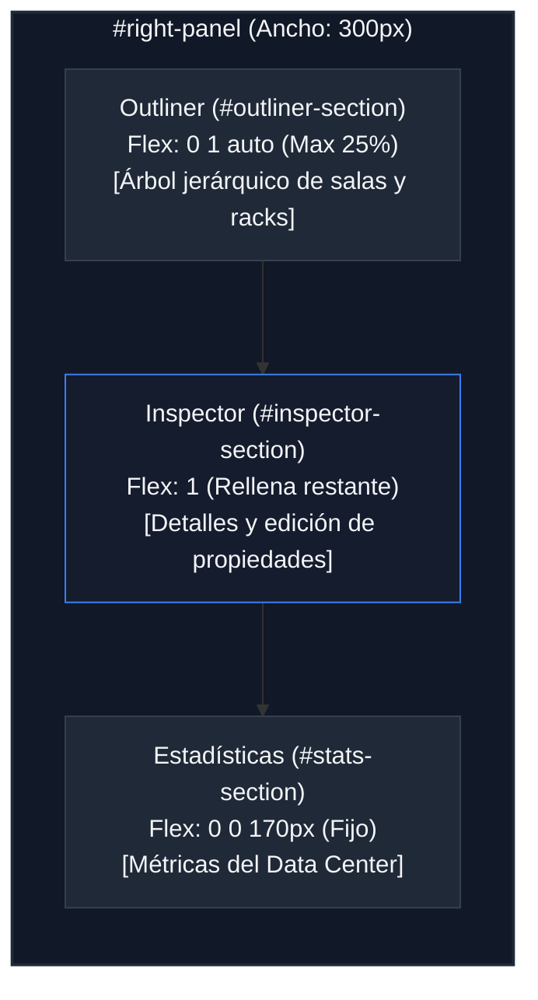

# Dimensiones y Medidas del Panel Derecho (Right Panel Layout)

Este documento detalla el esquema de layout, dimensiones de los componentes, lógica de colapso y comportamiento responsivo del panel lateral derecho (`#right-panel`) de **RACK Designer Next**.

---

## 1. Estructura General y Dimensiones Base

El panel derecho está posicionado en el área de rejilla `right-panel` y funciona como el centro de información contextual del proyecto, organizando de forma vertical tres bloques: el árbol de elementos (Outliner), el inspector de propiedades y las estadísticas globales.

```css
#right-panel {
  grid-area: right-panel;
  display: flex;
  flex-direction: column;
  width: 300px; /* Ancho fijo (var(--right-panel-w)) */
  background: var(--bg-card);
  border-left: 1px solid var(--border);
  z-index: 90;
  overflow: hidden;
}
```

---

## 2. Distribución Interna (Comportamiento Flex)

Los tres paneles internos se distribuyen de forma vertical mediante Flexbox. Cada sección (`.right-panel-section`) tiene una lógica de flexibilidad distinta:

### 🌳 1. Outliner (`#outliner-section`)
*   **Comportamiento Flex:** `flex: 0 1 auto` (no se expande por defecto, pero puede encogerse).
*   **Altura Máxima:** Limitada estrictamente a **`25%`** (`max-height: 25%`) con desborde interno (`overflow-y: auto`) para asegurar que el Inspector tenga espacio suficiente.
*   **Transiciones:** Animación en `max-height` y `flex` de `0.2s ease` al contraer/expandir.

### 🔍 2. Inspector de Propiedades (`#inspector-section`)
*   **Comportamiento Flex:** `flex: 1` (ocupa de forma fluida todo el espacio restante disponible entre el Outliner y las Estadísticas).
*   **Contenido:** Relleno de `padding: 12px` y tamaño de fuente de `13px` (`--text-md`) para etiquetas de propiedades de hardware.

### 📊 3. Estadísticas (`#stats-section`)
*   **Comportamiento Flex:** `flex: 0 0 170px` (altura fija de **`170px`**, no se deforma ni se encoge ante cambios de resolución vertical).
*   **Contenido:** Muestra las métricas globales del proyecto (salas, racks, consumo de energía y conexiones). Relleno interno de `padding: 12px`.

---

## 3. Lógica de Colapso Dinámico

Las secciones del Outliner y Estadísticas permiten contraerse haciendo doble clic o clic en su cabecera para liberar espacio para el Inspector de propiedades:

*   **Clase de Colapso (`.collapsed`):**
    *   **Dimensiones:** El flex se bloquea a tamaño automático mínimo: `flex: 0 0 auto !important;`
    *   **Ocultación de Contenido:** Todos los elementos hijos directos (excepto la cabecera) se ocultan: `display: none !important;`
*   **Icono Indicador (`.toggle-icon`):**
    *   Fila normal: Flecha hacia abajo `▼`.
    *   Fila colapsada: Rota -90 grados convirtiéndose en `▶` (`transform: rotate(-90deg)`).

---

## 4. Medidas de Micro-Interfaz (Outliner Tree)

El árbol de nodos del Outliner sigue una estructura jerárquica con medidas estrictas de alineación:

*   **Cabeceras de Nodos (`.outliner-summary`):**
    *   Relleno: `padding: 4px 4px`.
    *   Bordes: Radio de curvatura de `4px` para el hover.
    *   Fuente: Tamaño `13px` (`--text-md`) y grosor `500` (semibold).
    *   Caret Indicador (`::before`): Ancho fijo de `12px`, tamaño de fuente `9px`. Rota 90 grados al abrir el `<details>` nativo.
*   **Tarjetas de Dispositivos (`.outliner-device`):**
    *   Relleno: `padding: 3px 4px`.
    *   Fuente: Tamaño de letra reducido a `12px` (`--text-base`).
*   **Iconos de Nodos (`.outliner-node-icon`):**
    *   Iconos de Sala/Rack: **`13px` × `13px`** con opacidades del `100%` (sala) y `85%` (rack) y color acentuado (`var(--accent)`).
    *   Icono de Dispositivo: **`11px` × `11px`** con opacidad del `70%`.

---

## 5. Adaptabilidad y Breakpoints

Debido a que los datos contextuales son secundarios respecto al lienzo principal, el panel derecho se descarta en pantallas estrechas:

*   **Vista de Tableta (`max-width: 1024px`):**
    *   El grid del `#app` se reduce a dos columnas: `60px 1fr` (Sidebar e Workspace).
    *   El panel derecho se oculta completamente de la visualización al no estar definido en las columnas y áreas del grid.
*   **Vista de Móvil (`max-width: 768px`):**
    *   El grid cambia a una columna vertical. El área `right-panel` se elimina de la definición `grid-template-areas`, ocultando el panel de forma absoluta.

---

## 6. Diagramas del Panel Derecho

### 🗺️ Distribución Flex Vertical (Escritorio)



### 📐 Esquema de Alturas en Píxeles

```text
┌──────────────────────────────────────────────────┐ ▲ 
│ OUTLINER (.panel-header)              [▼] 38px   │ │  
├──────────────────────────────────────────────────┤ │  Altura Máxima: 25% del total
│   ▶ Sala Principal (13px, bold, blue dot)        │ │  (Aprox: 180px - 220px)
│     ▶ Rack A1 (13px, blue server icon)           │ │  (Overflow con scroll interno)
│       - Switch Core (12px, gray icon)            │ │  
├──────────────────────────────────────────────────┤ ▼ 
│ PROPIEDADES (.panel-header)             38px     │ ▲ 
├──────────────────────────────────────────────────┤ │  
│   Nombre: [ Switch Core 01 ]                     │ │  Flex 1 (Línea de corte fluida)
│   Marca:  [ Cisco          ]                     │ │  (Toma el espacio sobrante)
│   Modelo: [ Nexus 9300     ]                     │ │  
├──────────────────────────────────────────────────┤ ▼ 
│ ESTADÍSTICAS (.panel-header)          [▼] 38px   │ ▲ 
├──────────────────────────────────────────────────┤ │  Altura Fija
│   Salas: [ 3 ]   Racks: [ 8 ]                    │ │  flex: 0 0 170px
│   Equipos: [ 45 ]  Consumo: [ 12.4 kW ]          │ │  (No se encoge)
└──────────────────────────────────────────────────┘ ▼ 
◄──────────────────── 300 px ─────────────────────►
```
