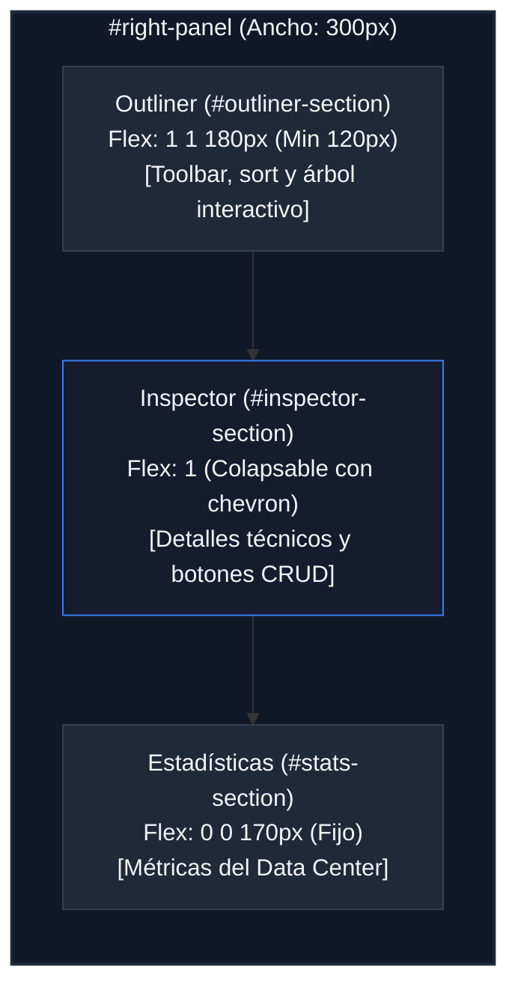

# Dimensiones y Medidas del Panel Derecho (Right Panel Layout)

Este documento detalla el esquema de layout, dimensiones de los componentes, lógica de colapso y comportamiento responsivo del panel lateral derecho (`#right-panel`) de **RACK Designer Next**.

---

## 1. Estructura General y Dimensiones Base

El panel derecho está posicionado en el área de rejilla `right-panel` y funciona como el centro de información contextual del proyecto, organizando de forma vertical tres bloques: el árbol de elementos (Outliner), el inspector de propiedades y las estadísticas globales.

```css
#right-panel {
  grid-area: right-panel;
  display: flex;
  flex-direction: column;
  width: 300px; /* Ancho fijo (var(--right-panel-w)) */
  background: var(--bg-card);
  border-left: 1px solid var(--border);
  z-index: 90;
  overflow: hidden;
}
```

---

## 2. Distribución Interna (Comportamiento Flex)

Los tres paneles internos se distribuyen de forma vertical mediante Flexbox. Cada sección (`.right-panel-section`) tiene una lógica de flexibilidad distinta:

### 🌳 1. Outliner (`#outliner-section`)
*   **Comportamiento Flex:** `flex: 1 1 180px` con altura mínima garantizada de **`min-height: 120px`**.
*   **Expansión Dinámica:** Cuando el Inspector de propiedades está colapsado, el Outliner absorbe todo el espacio vertical sobrante para mostrar salas y gabinetes sin scroll forzado.
*   **Herramientas Integradas:**
    *   Cabecera con acciones rápidas (`.outliner-header-actions`): botones `.outliner-btn-icon` para expandir todo (`+`) y colapsar todo (`-`).
    *   Barra de control (`.outliner-toolbar`): selector `#outliner-sort-select` (orden de inserción, posición U descendente, alfabético por nombre y agrupación por tipo de hardware).
    *   Acciones inline flotantes en hover (`.outliner-node-actions`): botones para inspección inmediata y borrado rápido (`.outliner-action-btn.btn-del`).

### 🔍 2. Inspector de Propiedades (`#inspector-section`)
*   **Comportamiento Flex:** `flex: 1` (rellena el espacio intermedio).
*   **Colapso Interactivo:** Posee su propio chevron de colapso (`.toggle-icon`). Al contraerse (clase `.collapsed`), su flex se ajusta a `flex: 0 0 auto !important`, su contenido se oculta y permite al Outliner maximizarse.
*   **Botones CRUD Integrados (`.inspector-btn-group`):**
    *   Botón Primario (`.btn-inspector-primary`): Guardar y aplicar cambios en tiempo real.
    *   Botón Secundario (`.btn-inspector-secondary`): Descartar cambios y reestablecer valores.
    *   Botón de Peligro (`.btn-inspector-danger`): Desmontar equipo del rack o eliminar periférico de piso.
*   **Estado Vacío (`.inspector-empty-box`):** Contenedor centrado con icono de hardware de **`36px` × `36px`** (`.inspector-empty-icon`) y mensaje orientativo.

### 📊 3. Estadísticas (`#stats-section`)
*   **Comportamiento Flex:** `flex: 0 0 170px` (altura fija de **`170px`**, no se deforma ni se encoge ante cambios de resolución vertical).
*   **Contenido:** Muestra las métricas globales del proyecto (unidades U ocupadas, consumo en W/kW, disipación BTU/h y peso en kg).

---

## 3. Lógica de Colapso Dinámico

Cualquiera de las secciones del panel derecho permite contraerse haciendo clic en su cabecera (`.panel-header`):

*   **Clase de Colapso (`.collapsed`):**
    *   **Dimensiones:** El flex se bloquea a tamaño automático mínimo: `flex: 0 0 auto !important;`
    *   **Ocultación de Contenido:** Todos los elementos hijos directos (excepto la cabecera) se ocultan: `display: none !important;`
*   **Icono Indicador (`.toggle-icon`):**
    *   Fila expandida: Flecha hacia abajo `▼`.
    *   Fila colapsada: Rota -90 grados convirtiéndose en `▶` (`transform: rotate(-90deg)`).
*   **Transiciones:** Animado mediante `transition: flex 0.2s ease` para garantizar suavidad táctil y visual.

---

## 4. Medidas de Micro-Interfaz (Outliner Tree)

El árbol de nodos del Outliner sigue una estructura jerárquica con medidas estrictas de alineación:

*   **Cabeceras de Nodos (`.outliner-summary`):**
    *   Relleno: `padding: 4px 4px`.
    *   Bordes: Radio de curvatura de `4px` para el hover.
    *   Fuente: Tamaño `13px` (`--text-md`) y grosor `500` (semibold).
    *   Caret Indicador (`::before`): Ancho fijo de `12px`, tamaño de fuente `9px`. Rota 90 grados al abrir el `<details>` nativo.
*   **Tarjetas de Dispositivos (`.outliner-device`):**
    *   Relleno: `padding: 3px 4px`.
    *   Fuente: Tamaño de letra reducido a `12px` (`--text-base`).
*   **Iconos de Nodos (`.outliner-node-icon`):**
    *   Iconos de Sala/Rack: **`13px` × `13px`** con opacidades del `100%` (sala) y `85%` (rack) y color acentuado (`var(--accent)`).
    *   Icono de Dispositivo: **`11px` × `11px`** con opacidad del `70%`.

---

## 5. Adaptabilidad y Breakpoints

Debido a que los datos contextuales son secundarios respecto al lienzo principal, el panel derecho se descarta en pantallas estrechas:

*   **Vista de Tableta (`max-width: 1024px`):**
    *   El grid del `#app` se reduce a dos columnas: `60px 1fr` (Sidebar e Workspace).
    *   El panel derecho se oculta completamente de la visualización al no estar definido en las columnas y áreas del grid.
*   **Vista de Móvil (`max-width: 768px`):**
    *   El grid cambia a una columna vertical. El área `right-panel` se elimina de la definición `grid-template-areas`, ocultando el panel de forma absoluta.

---

## 6. Diagramas del Panel Derecho

### 🗺️ Distribución Flex Vertical (Escritorio)



### 📐 Esquema de Alturas en Píxeles

```text
┌──────────────────────────────────────────────────┐ ▲ 
│ OUTLINER (.panel-header)           [+][-][▼] 38px│ │  
├──────────────────────────────────────────────────┤ │  Flex: 1 1 180px (min 120px)
│ [Toolbar: Ordenar por... ▾]          (28px)      │ │  (Expande si Inspector colapsa)
│   ▶ Sala Principal (13px, bold, blue dot)        │ │  (Overflow con scroll interno)
│     ▶ Rack A1 (13px, blue server icon)           │ │  
│       - Switch Acceso 24P [Acciones Hover]       │ │  
├──────────────────────────────────────────────────┤ ▼ 
│ INSPECTOR (.panel-header)                [▼] 38px│ ▲ 
├──────────────────────────────────────────────────┤ │  
│   Nombre: [ Switch Acceso 24P ]                  │ │  Flex: 1 (Colapsable con chevron)
│   IP:     [ 192.168.1.10      ]                  │ │  
│   Consumo:[ 65 W              ]                  │ │  
│   [ Guardar ]  [ Cancelar ]  [ Eliminar ]        │ │  Botones CRUD integrados
├──────────────────────────────────────────────────┤ ▼ 
│ ESTADÍSTICAS (.panel-header)             [▼] 38px│ ▲ 
├──────────────────────────────────────────────────┤ │  Altura Fija
│   Salas: [ 3 ]   Racks: [ 8 ]                    │ │  flex: 0 0 170px
│   Equipos: [ 45 ]  Consumo: [ 12.4 kW ]          │ │  (No se encoge)
└──────────────────────────────────────────────────┘ ▼ 
◄──────────────────── 300 px ─────────────────────►
```
