# Dimensiones y Medidas del Panel Inferior (Bottom Panel Layout)

Este documento detalla el esquema de layout, dimensiones de los componentes, celdas, tipografías y comportamiento responsivo de la sección de tablas inferiores (`#bottom`) de **RACK Designer Next**.

---

## 1. Estructura y Dimensiones Estructurales

El panel inferior actúa como una hoja de datos tipo Excel interactiva que contiene el Inventario global de hardware o las Conexiones físicas del datacenter.

```css
#bottom {
  grid-area: bottom;
  background: var(--bg-card);
  border-top: 1px solid var(--border);
  display: flex;
  flex-direction: column;
  transition: height 0.2s ease;
  height: var(--bottom-h); /* 220px */
  overflow: hidden;
  z-index: 50;
}
```

### 🧱 Estados de Altura Dinámicos

*   **Expandido (Por Defecto):** Altura fija de **`220px`** (`--bottom-h`).
*   **Colapsado (Clase `.collapsed`):** Altura reducida a **`38px`**, ocultando las tablas de datos y mostrando únicamente la cabecera de pestañas.
*   **Pantalla Completa en Móvil (Clase `.fullscreen`):** Toma una altura del **`85vh`** del dispositivo para permitir operar con comodidad las tablas en pantallas reducidas.

---

## 2. Cabecera del Panel (`.bottom-header`)

La cabecera contiene los selectores de pestañas (Inventario y Conexiones), botones de acción rápida, filtros de búsqueda y exportaciones.

*   **Altura Fija:** **`38px`** (`flex-shrink: 0`).
*   **Layout:** Flexbox horizontal (`display: flex`, `align-items: center`, `gap: 8px`) con relleno lateral de `padding: 0 14px`.
*   **Elementos Normalizados a Altura de 24px:**
    *   **Pestañas de Control (`.tab-pill`):** Relleno interno de `5px 14px`. El botón activo tiene fondo iluminado (`var(--accent-glow)`) y texto de color de énfasis (`var(--accent)`).
    *   **Buscador Local (`#table-search`):** Ancho fijo de **`160px`**.
    *   **Botón de Menú de Exportación (`#btn-export-menu`):** Despliega el menú `#export-dropdown` posicionado en `z-index: 9999` con un ancho de **`180px`**.

---

## 3. Contenedor de Tablas (`.table-wrap`)

El contenedor de datos se expande para absorber todo el espacio restante por debajo de la cabecera.

```css
.table-wrap {
  flex: 1;
  overflow: auto; /* Permite scroll vertical y horizontal independiente */
}
```

---

## 4. Estructura de la Tabla de Datos (`table.data-table`)

Las tablas de datos utilizan el modelo de colapso de bordes y tipografías monoespaciadas para la alineación precisa de metadatos (como IPs y números de serie).

*   **Anchura Base:** `100%` (`border-collapse: collapse`).
*   **Encabezados (`th`):**
    *   Relleno: `padding: 6px 12px`.
    *   Fuente: Tamaño `--text-xs` (`10px`), grosor `60px` y tipografía monoespaciada (`var(--font-mono)` = `JetBrains Mono`).
    *   **Cabecera Sticky:** Cuenta con `position: sticky; top: 0;` para mantenerse fija al hacer scroll vertical en la lista de equipos.
    *   Ajuste: `white-space: nowrap` para evitar saltos de línea molestos.
*   **Celdas (`td`):**
    *   Relleno: `padding: 5px 12px`.
    *   Fuente: Tamaño `--text-sm` (`11px`), tipografía monoespaciada y color secundario (`var(--text-secondary)`).
    *   Ajuste: `white-space: nowrap` y alineación vertical media.
*   **Fila en Hover (`tr:hover td`):** El fondo cambia a un color de tarjeta destacado (`var(--bg-card2)`) para mejorar el seguimiento de la fila.

---

## 5. Edición Rápida de Celdas (`input.cell-edit`)

Al hacer doble clic sobre celdas con la clase `.editable`, se inyecta un campo de edición en línea:

*   **Campo de Entrada (`.cell-edit`):**
    *   Dimensiones: `width: 100%`, relleno de `2px 6px` y bordes de `3px`.
    *   Contorno: Destacado con borde `1px solid var(--accent)` y color de texto principal.
*   **Animación de Error (`.error`):**
    *   Contorno: Cambia a rojo (`var(--red)`).
    *   Efecto: Sacudida horizontal (`shake 0.3s`) y sombra de resplandor roja (`var(--red-glow)`).

---

## 6. Micro-Elementos y Badges

*   **Insignias de Tipo (`.type-badge`):**
    *   Relleno: `1px 6px` con bordes redondeados de `3px`.
    *   Fuente: Tamaño `--text-xs` (`10px`), negrita (`700`) y tipografía monoespaciada.
    *   Colores: Fondos atenuados de baja opacidad al `15%` (`rgba(..., 0.15)`) con texto brillante (ej. Servidores en azul celeste, Switches en verde, Routers en ámbar).
*   **Botones de Fila (`.tbl-action`):**
    *   Dimensiones: Relleno de `2px 7px` con bordes de `3px`.
    *   Hover: Cambia su borde y texto a rojo (`var(--red)`) para el botón de eliminar.
*   **Indicador de Cable (`.cable-dot`):** Círculo perfecto de **`10px` × `10px`** (`border-radius: 50%`) pintado dinámicamente con el color hexadecimal del cable.

---

## 7. Adaptabilidad y Breakpoints

*   **Tablet y Móvil (`max-width: 768px`):**
    *   **Ancho Mínimo de Tabla:** Se fuerza a `table.data-table { min-width: 600px; }`. Esto evita la deformación de las columnas, permitiendo al operador realizar un desplazamiento horizontal limpio (`.table-container { overflow-x: auto; }`).
    *   **Desborde de Cabecera:** `.bottom-header` cambia su comportamiento para admitir scroll horizontal (`overflow-x: auto`, `flex-wrap: nowrap`) de forma que sus botones no bajen de fila de forma desordenada en pantallas pequeñas.

---

## 8. Diagramas de Layout del Panel Inferior

### 🗺️ Composición Estructural (Escritorio)

```mermaid
graph TD
    subgraph BottomPanel ["#bottom (Alto: 220px)"]
        direction TB
        Header[".bottom-header (Alto: 38px)"]
        TableWrap[".table-wrap (Flex: 1 | Scroll: Auto)"]
        
        subgraph TableStructure ["Tabla de Datos (.data-table)"]
            TH["Sticky Headers (th) — Alto: 24px | JetBrains Mono"]
            TD["Table Cells (td) — Alto: 24px | JetBrains Mono"]
        end
        
        Header --> TableWrap
        TableWrap --> TableStructure
    end

    style BottomPanel fill:#111827,stroke:#1f2937,stroke-width:2px,color:#f3f4f6
    style Header fill:#1f2937,stroke:#374151,stroke-width:1px,color:#f3f4f6
    style TableWrap fill:#0b0f19,stroke:#1f2937,stroke-width:1px
    style TH fill:#1f2937,stroke:#374151,stroke-width:1px,color:#94a3b8
    style TD fill:#151c2e,stroke:#374151,stroke-width:1px,color:#cbd5e1
```



### 📐 Esquema Visual del Panel Inferior

```text
┌──────────────────────────────────────────────────────────────────────────────────────────────────┐ ▲
│ [Inventario] [Conexiones]                      [+ Equipo]  Buscar.. [Exportar v] [▲] [▼] 38px   │ │  
├──────────────────────────────────────────────────────────────────────────────────────────────────┤ ▼
│ RACK ─── U ─── LADO ─── NOMBRE ─── MARCA ─── TIPO ────── IP ───────── ACCIONES                 │ ▲
│ (Sticky, th, JetBrains Mono, 10px, gray text)                                                   │ │  Cuerpo
├──────────────────────────────────────────────────────────────────────────────────────────────────┤ │  de Tabla
│ A1       12    Frontal  SrvCore01   Dell      [Server]  10.10.10.2   [Editar] [Eliminar]         │ │  (Alto: 182px)
│ A1       10    Frontal  Switch01    Cisco     [Switch]  10.10.10.3   [Editar] [Eliminar]         │ │  (Scroll vertical)
│ -        -     -        CamEntrada  Axis      [Camera]  10.10.60.1   [Editar] [Eliminar]         │ │  
└──────────────────────────────────────────────────────────────────────────────────────────────────┘ ▼
◄───────────────────────────────────────────── 100% ──────────────────────────────────────────────►
```
