# Dimensiones y Medidas del Panel Inferior (Bottom Panel Layout)

Este documento detalla el esquema de layout, dimensiones de los componentes, celdas, tipografías y comportamiento responsivo de la sección de tablas inferiores (`#bottom`) de **RACK Designer Next**.

---

## 1. Estructura y Dimensiones Estructurales

El panel inferior actúa como una hoja de datos tipo Excel interactiva que contiene el Inventario global de hardware o las Conexiones físicas del datacenter.

```css
#bottom {
  grid-area: bottom;
  background: var(--bg-card);
  border-top: 1px solid var(--border);
  display: flex;
  flex-direction: column;
  transition: height 0.2s ease;
  height: var(--bottom-h); /* 220px */
  overflow: hidden;
  z-index: 50;
}
```

### 🧱 Estados de Altura Dinámicos

*   **Expandido (Por Defecto):** Altura fija de **`220px`** (`--bottom-h`).
*   **Colapsado (Clase `.collapsed`):** Altura reducida a **`38px`**, ocultando las tablas de datos y mostrando únicamente la cabecera de pestañas.
*   **Pantalla Completa en Móvil (Clase `.fullscreen`):** Toma una altura del **`85vh`** del dispositivo para permitir operar con comodidad las tablas en pantallas reducidas.

---

## 2. Cabecera del Panel (`.bottom-header`)

La cabecera contiene los selectores de pestañas (Inventario y Conexiones), botones de acción rápida, filtros de búsqueda y exportaciones.

*   **Altura Fija:** **`38px`** (`flex-shrink: 0`).
*   **Layout:** Flexbox horizontal (`display: flex`, `align-items: center`, `gap: 8px`) con relleno lateral de `padding: 0 14px`.
*   **Elementos Normalizados a Altura de 24px:**
    *   **Pestañas de Control (`.tab-pill`):** Relleno interno de `5px 14px`. El botón activo tiene fondo iluminado (`var(--accent-glow)`) y texto de color de énfasis (`var(--accent)`).
    *   **Buscador Local (`#table-search`):** Ancho fijo de **`160px`**.
    *   **Botón de Menú de Exportación (`#btn-export-menu`):** Despliega el menú `#export-dropdown` posicionado en `z-index: 9999` con un ancho de **`180px`**.

---

## 3. Contenedor de Tablas (`.table-wrap`)

El contenedor de datos se expande para absorber todo el espacio restante por debajo de la cabecera.

```css
.table-wrap {
  flex: 1;
  overflow: auto; /* Permite scroll vertical y horizontal independiente */
}
```

---

## 4. Estructura de la Tabla de Datos (`table.data-table`)

Las tablas de datos utilizan el modelo de colapso de bordes y tipografías monoespaciadas para la alineación precisa de metadatos (como IPs y números de serie).

*   **Anchura Base:** `100%` (`border-collapse: collapse`).
*   **Encabezados (`th`):**
    *   Relleno: `padding: 6px 12px`.
    *   Fuente: Tamaño `--text-xs` (`10px`), grosor `600` y tipografía monoespaciada (`var(--font-mono)` = `JetBrains Mono`).
    *   **Cabecera Sticky:** Cuenta con `position: sticky; top: 0;` para mantenerse fija al hacer scroll vertical en la lista de equipos.
    *   Ajuste: `white-space: nowrap` para evitar saltos de línea molestos.
*   **Columnas del Inventario Global (18 Columnas):**
    1.  **Rack:** Identificador del gabinete o etiqueta `<span color="accent">PISO</span>` para periféricos.
    2.  **U:** Posición de unidad inicial o `-`.
    3.  **Lado:** Insignia de montaje (`Frontal` / `Atrás` / `-`).
    4.  **Nombre:** Nombre del equipo (editable).
    5.  **Marca:** Fabricante (editable).
    6.  **Modelo:** Modelo técnico de hardware (editable).
    7.  **Tipo:** Insignia estilizada cromática (`.type-badge`).
    8.  **Tamaño:** Altura en unidades de rack (`1U`, `2U`, etc.) (editable en racks).
    9.  **IP:** Dirección IPv4 validada (editable).
    10. **MAC:** Dirección física de capa 2 validada (editable).
    11. **Serie:** Número de serie asignado (editable).
    12. **Usuario:** Credencial de administración (editable).
    13. **Contraseña:** Mascarilla confidencial de puntos `••••••` (editable al doble clic).
    14. **Consumo (W):** Potencia en vatios (editable).
    15. **Tomas:** Número de tomas eléctricas ocupadas/suministradas (editable).
    16. **Skin:** Variante de carátula SVG aplicada (editable).
    17. **Notas:** Observaciones técnicas con ancho acotado a **`140px`**, elipsis automática (`text-overflow: ellipsis`) y tooltip emergente nativo (editable).
    18. **Acciones:** Botones compactos con iconos SVG para edición en modal o eliminación inmediata.
*   **Celdas (`td`):**
    *   Relleno: `padding: 5px 12px`.
    *   Fuente: Tamaño `--text-sm` (`11px`), tipografía monoespaciada y color secundario (`var(--text-secondary)`).
    *   Ajuste: `white-space: nowrap` y alineación vertical media.
*   **Fila en Hover (`tr:hover td`):** El fondo cambia a un color de tarjeta destacado (`var(--bg-card2)`) para mejorar el seguimiento de la fila.

---

## 5. Edición Rápida de Celdas (`input.cell-edit`)

Al hacer doble clic sobre cualquiera de las 13 columnas editables (`.editable`), se inyecta un campo de edición en línea:

*   **Campos Soportados:** `name`, `brand`, `model`, `ip`, `mac`, `serial`, `user`, `pass`, `power`, `plugs`, `size`, `skin`, `notes`.
*   **Campo de Entrada (`.cell-edit`):**
    *   Dimensiones: `width: 100%`, relleno de `2px 6px` y bordes de `3px`.
    *   Contorno: Destacado con borde `1px solid var(--accent)` y color de texto principal.
    *   Controles de Teclado: `Enter` confirma y guarda; `Escape` revierte el cambio inmediatamente al valor original.
*   **Validaciones en Tiempo Real:**
    *   **IP:** Expresión regular que verifica formato cuádruple de 0 a 255.
    *   **MAC:** Formato hexadecimal de 6 octetos separados por dos puntos o guiones (`XX:XX:XX:XX:XX:XX`).
*   **Animación de Error (`.error`):**
    *   Contorno: Cambia a rojo (`var(--red)`).
    *   Efecto: Sacudida horizontal (`shake 0.3s`) y sombra de resplandor roja (`var(--red-glow)`).

---

## 6. Menú Desplegable de Exportación (`#export-dropdown`)

Ubicado en la cabecera del panel inferior (`#btn-export-menu`), ofrece 5 formatos técnicos:
1.  **JSON del Proyecto:** Volcado completo del estado reactivo del Store para respaldos y clonación.
2.  **CSV de Inventario:** Archivo delimitado por comas legible por cualquier suite ofimática.
3.  **Excel (XLSX):** Libro de cálculo nativo con columnas autoajustadas y encabezados estilizados.
4.  **Captura PNG (Retina 1:1):** Renderizado de alta definición mediante la biblioteca `html2canvas` sin pixelación.
5.  **Plano SVG Físico:** Gráfico vectorial escalable independiente del lienzo de gabinetes.

---

## 7. Micro-Elementos y Badges

*   **Insignias de Tipo (`.type-badge`):**
    *   Relleno: `1px 6px` con bordes redondeados de `3px`.
    *   Fuente: Tamaño `--text-xs` (`10px`), negrita (`700`) y tipografía monoespaciada.
    *   Colores: Fondos atenuados de baja opacidad al `15%` (`rgba(..., 0.15)`) con texto brillante (ej. Servidores en azul celeste, Switches en verde, Routers en ámbar, Cámaras/NVR en carmesí).
*   **Botones de Fila (`.tbl-action`):**
    *   Dimensiones: Relleno de `4px 8px` con bordes de `1px` y esquinas redondeadas de `3px`.
    *   Iconos SVG: Tamaño de **`12px` × `12px`** (`icon-edit` en cyan de acento, `icon-trash` con hover en rojo peligro).
*   **Indicador de Cable (`.cable-dot`):** Círculo de **`10px` × `10px`** (`border-radius: 50%`) pintado con el color hexadecimal del enlace.

---

## 8. Adaptabilidad y Breakpoints

*   **Tablet y Móvil (`max-width: 768px`):**
    *   **Ancho Mínimo de Tabla:** Se fuerza a `table.data-table { min-width: 800px; }`. Esto evita la compresión ilegible de las 18 columnas, permitiendo al operador realizar un desplazamiento horizontal fluido (`.table-wrap { overflow-x: auto; }`).
    *   **Desborde de Cabecera:** `.bottom-header` admite scroll horizontal continuo (`overflow-x: auto`, `flex-wrap: nowrap`) para mantener accesibles los botones y el buscador.

---

## 9. Diagramas de Layout del Panel Inferior

### 🗺️ Composición Estructural (Escritorio)

```mermaid
graph TD
    subgraph BottomPanel ["#bottom (Alto: 220px | Colapsa a 38px)"]
        direction TB
        Header[".bottom-header (Alto: 38px) — Pestañas, Buscador, Exportar"]
        TableWrap[".table-wrap (Flex: 1 | Scroll: Auto Bidireccional)"]
        
        subgraph TableStructure ["Tabla de Inventario (.data-table — 18 Columnas)"]
            TH["Sticky Headers (th) — Alto: 24px | JetBrains Mono"]
            TD["Editable Cells (td.editable) — Doble Clic / Input"]
        end
        
        Header --> TableWrap
        TableWrap --> TableStructure
    end

    style BottomPanel fill:#111827,stroke:#1f2937,stroke-width:2px,color:#f3f4f6
    style Header fill:#1f2937,stroke:#374151,stroke-width:1px,color:#f3f4f6
    style TableWrap fill:#0b0f19,stroke:#1f2937,stroke-width:1px
    style TH fill:#1f2937,stroke:#374151,stroke-width:1px,color:#94a3b8
    style TD fill:#151c2e,stroke:#374151,stroke-width:1px,color:#cbd5e1
```



### 📐 Esquema Visual del Panel Inferior

```text
┌──────────────────────────────────────────────────────────────────────────────────────────────────┐ ▲
│ [Inventario] [Conexiones]              [+ Equipo]  Buscar.. (160px)  [Exportar ▾] [▲] [▼] 38px   │ │  
├──────────────────────────────────────────────────────────────────────────────────────────────────┤ ▼
│ RACK ─ U ─ LADO ─ NOMBRE ─ MARCA ─ MODELO ─ TIPO ─ TAMAÑO ─ IP ─ MAC ─ SERIE ─ USUARIO ─ CLAVE..│ ▲
│ (Sticky, th, JetBrains Mono, 10px, gray text — 18 columnas con scroll horizontal libre)          │ │  Cuerpo
├──────────────────────────────────────────────────────────────────────────────────────────────────┤ │  de Tabla
│ A1     12  Front  Srv-01   Dell    R640     [Server] 1U     10.1.1.2  00:1A:.. 4X89  admin  •••• │ │  (Alto: 182px)
│ A1     10  Front  Sw-Acc   Cisco   9300     [Switch] 1U     10.1.1.3  00:1B:.. 5Y12  admin  •••• │ │  (Scroll)
│ PISO   -   -      Cam-01   Hik     DS-2CD   [Camera] -      10.1.6.10 00:1C:.. 9Z33  admin  •••• │ │  
└──────────────────────────────────────────────────────────────────────────────────────────────────┘ ▼
◄───────────────────────────────────────────── 100% ──────────────────────────────────────────────►
```
