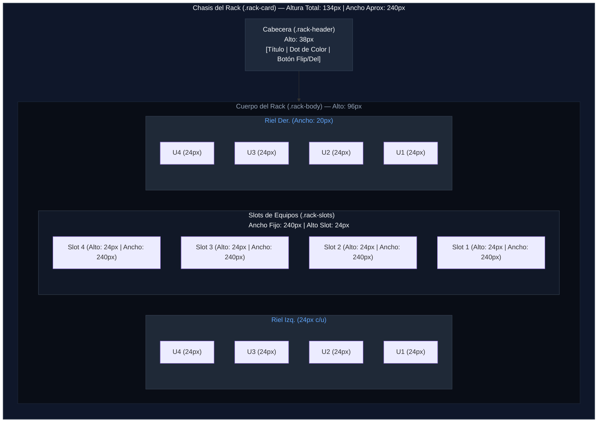

# Dimensiones y Medidas de Racks en la Vista Física

Este documento detalla el esquema de dimensiones, alturas y anchos utilizado para renderizar los gabinetes (Racks) en la interfaz de usuario de **RACK Designer Next**.

---

## 1. Unidad Base de Medida (U)

La altura de los equipos y ranuras dentro del rack se rige por la variable CSS `--rack-unit-h`, definida en [variables.css](file:///c:/Users/admin/.gemini/antigravity/scratch/Rack_Designer_2/css/variables.css):

*   **1 U (Unidad de Rack) = 24px**

Tanto el indicador lateral de unidades (`.rail-unit`) como cada slot interactivo (`.rack-slot`) tienen esta altura fija.

---

## 2. Ancho del Rack (Width)

*   **Área Útil (`.rack-slots`):** Fijo **240px** (proporcional a la realidad: 10 veces la altura de la unidad U, $10 \times 24\text{px} = 240\text{px}$).
*   **Rieles Laterales (`.rack-rail-left` / `.rack-rail-right`):** Miden **20px** de ancho a cada lado.
*   **Ancho Total Estimado:** **280px** ($20\text{px}\text{ riel izq.} + 240\text{px}\text{ slots} + 20\text{px}\text{ riel der.}$).


---

## 3. Altura del Rack (Height)

La altura total de un gabinete se compone de:
1.  **Cabecera (`.rack-header`):** Contiene el nombre del rack, indicador de color y botones de acción (aprox. **38px** de alto).
2.  **Cuerpo del Rack:** Número de Unidades (U) multiplicadas por **24px**.

$$\text{Altura Total (px)} = (\text{Cantidad de U} \times 24\text{px}) + 38\text{px}$$

### 📊 Tabla de Equivalencias de Altura

| Capacidad del Rack (U) | Altura del Cuerpo (px) | Altura Total Aprox. con Cabecera (px) |
| :---: | :---: | :---: |
| **4 U** | 96 px | 134 px |
| **8 U** | 192 px | 230 px |
| **12 U** | 288 px | 326 px |
| **16 U** | 384 px | 422 px |
| **20 U** | 480 px | 518 px |
| **24 U** | 576 px | 614 px |
| **32 U** | 768 px | 806 px |
| **40 U** | 960 px | 998 px |
| **42 U** | 1008 px | 1046 px |
| **48 U** | 1152 px | 1190 px |

---

## 4. Clases CSS Relacionadas

*   `.rack-card`: Contenedor principal del chasis del gabinete.
*   `.rack-header`: Barra superior del rack (38px).
*   `.rack-body`: Estructura interna del rack que aloja los rieles y los slots.
*   `.rail-unit`: Indicadores numerados a los lados del rack (24px por cada U).
*   `.rack-slot`: Cada una de las ranuras donde se pueden arrastrar y soltar equipos (24px de altura).

---

## 5. Diagrama Visual (Estructura de un Rack de 4 U)

El siguiente diagrama detalla la composición vertical y horizontal de un Rack de 4 unidades:



### 📏 Distribución Visual en Píxeles (Perfil)

```text
┌──────────────────────────────────────────────┐ ▲ 
│            CABECERA (.rack-header)           │ │  38 px (Título, botones, etc.)
├──────┬────────────────────────────────┬──────┤ ▼ 
│  U4  │            Slot U4             │  U4  │ ▲ 
│ 20px │      240px (Ancho Fijo)        │ 20px │ │  24 px (Alto de cada Slot/U)
├──────┼────────────────────────────────┼──────┤ ▼ 
│  U3  │            Slot U3             │  U3  │ 
├──────┼────────────────────────────────┼──────┤    Cuerpo del Rack (96 px total)
│  U2  │            Slot U2             │  U2  │    (4 U * 24px)
├──────┼────────────────────────────────┼──────┤ 
│  U1  │            Slot U1             │  U1  │ 
└──────┴────────────────────────────────┴──────┘ 
◄ 20px ►◄────────── 240px ──────────────►◄ 20px ►
◄────────────────── 280px ────────────────────►
```

