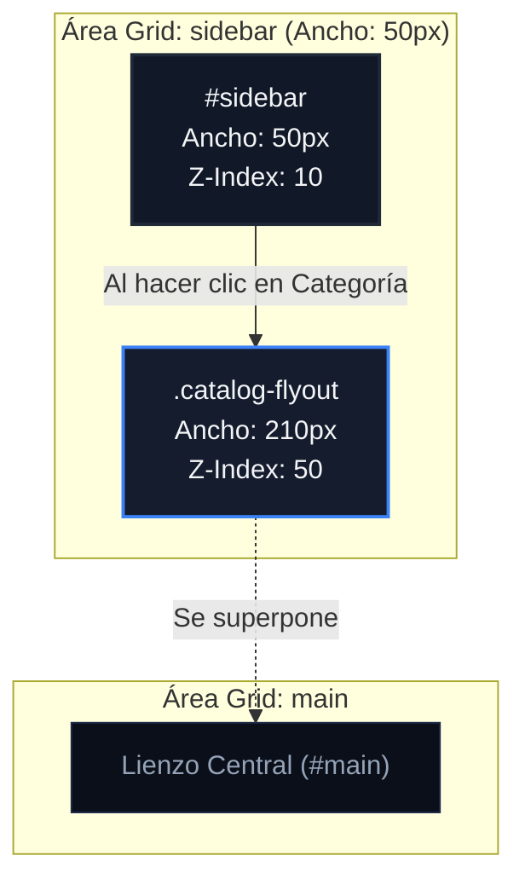

# Dimensiones y Medidas del Sidebar y Catálogo Flotante

Este documento detalla el esquema de layout, dimensiones de los componentes, animaciones y comportamiento responsivo de la barra lateral (`#sidebar`) y el panel del catálogo flotante (`.catalog-flyout`) de **RACK Designer Next**.

---

## 1. Barra Lateral de Iconos (`#sidebar`)

El sidebar es una barra compacta vertical alineada a la izquierda que contiene los accesos rápidos a las distintas categorías del catálogo.

```css
#sidebar {
  display: flex;
  flex-direction: column;
  width: 50px; /* Ancho fijo */
  grid-area: sidebar;
  justify-self: start;
  background: var(--bg-card);
  border-right: 1px solid var(--border);
  z-index: 10;
}
```

### 🧱 Componentes de la Barra Lateral

*   **Contenedor de Iconos (`.sidebar-icons` / `#sidebar-category-icons`):**
    *   Estructura: Flex vertical (`flex-direction: column`) con espaciado de `gap: 6px`.
    *   Espaciado: Relleno vertical de `padding: 10px 0`.
    *   Scroll: Desbordamiento vertical oculto (`overflow-y: auto`), ocultando la barra de scroll nativa del navegador.
*   **Grupos de Categoría (`CATALOG_GROUPS`):**
    *   8 accesos rápidos agrupados por familias funcionales con códigos cromáticos definidos:
        1.  `all` — Todos los Equipos (`#0ea5e9`, icono grid)
        2.  `compute` — Servidores y Cómputo (`#10b981`, icono server)
        3.  `network` — Redes y Comunicaciones (`#38bdf8`, icono network)
        4.  `storage` — Almacenamiento SAN/NAS (`#06b6d4`, icono san)
        5.  `security` — Seguridad y CCTV: NVR, DVR, Decodificadores (`#f43f5e`, icono camera)
        6.  `power` — Energía y Respaldo: UPS, PDUs (`#eab308`, icono ups)
        7.  `accesorios` — Accesorios y Cableado: Patch Panels, ODF, Bandejas (`#94a3b8`, icono tray)
        8.  `floor` — Periféricos de Piso: PCs, APs, Impresoras, Puertas, Teléfonos (`#a855f7`, icono pc)
*   **Botón de Categoría (`.sb-category-btn`):**
    *   Dimensiones: Fijo **`32px` × `32px`** (`flex-shrink: 0`).
    *   Bordes: Radio de curvatura de `6px` (`var(--radius)`).
    *   **Estados:**
        *   **Activo (`.active`):** Fondo `var(--bg-card2)` y contorno destacado (`border-color: var(--accent)`).
        *   **Hover:** Fondo ligeramente translúcido (`rgba(255, 255, 255, 0.05)`) y texto principal en alto contraste.

---

## 2. Catálogo Flotante (`#catalog-flyout`)

El catálogo flotante funciona como una persiana deslizante que se expande hacia la derecha al seleccionar una categoría, solapándose sobre el área de trabajo `#main`.

```css
.catalog-flyout {
  grid-area: sidebar;
  justify-self: end;
  width: 210px; /* Ancho fijo flotante */
  height: 100%;
  background: var(--bg-card);
  border-right: 1px solid var(--border);
  z-index: 50; /* Por encima de #sidebar y #main */
  display: flex;
  flex-direction: column;
}
```

### 🧱 Estructura de Control del Catálogo

*   **Cabecera (`.flyout-header`):** Relleno interno de `12px 14px`, con borde inferior separator. Contiene el título del catálogo y el botón de cierre (cruz normalizada a control de `24px`).
*   **Acciones Rápidas (`.flyout-actions`):**
    *   Layout: Grid de dos columnas (`1fr 1fr`) con espacio de `gap: 6px` y relleno de `10px 14px`.
    *   Botones (`+ Rack` y `+ Equipo`): Altura estricta normalizada a **`24px`**.
*   **Buscador Interno (`.flyout-search` / `#catalog-search`):**
    *   Espaciado: Relleno de `8px 14px` con borde inferior.
    *   Campo de Entrada (`input`): Altura normalizada a **`24px`** y filtrado reactivo instantáneo por nombre, tipo y notas técnicas.

---

## 3. Tarjetas de Equipos (`.catalog-item`)

Las 30 plantillas arquitectónicas estándar y los equipos personalizados del proyecto guardados en el Store (`customCatalog`) se listan como tarjetas arrastrables (drag & drop):

*   **Contenedor Principal (`.catalog-item`):**
    *   Estructura: Flex horizontal (`align-items: center`) con separación de `gap: 6px`.
    *   Dimensiones de Relleno: `padding: 8px 8px`, margen inferior de `6px`.
    *   Bordes: Radio de curvatura de `6px` (`var(--radius)`).
    *   Fondo: Color de tarjeta secundario (`var(--bg-card2)`).
    *   **Estados:**
        *   **Hover:** Borde destacado (`border-color: var(--accent)`), fondo iluminado (`var(--accent-glow)`) y animación de desplazamiento sutil de **`2px` hacia la derecha** (`transform: translateX(2px)`).
        *   **Dragging (`.dragging`):** Opacidad reducida a `0.4` e icono de cursor en `grabbing`.
*   **Icono de Tarjeta (`.cat-icon`):** Dimensiones fijas de **`32px` × `32px`** con bordes redondeados (`6px`) y centrado de icono SVG temático con fondo translúcido coincidente con el color de familia.
*   **Información de Tarjeta (`.cat-info`):** Contenedor flexible (`flex: 1`, `min-width: 0`) para evitar desbordes de texto.
    *   **Nombre (`.cat-name`):** Tamaño de fuente `--text-sm` (`11px`), fuente semibold y límite de dos líneas.
    *   **Insignia de Proyecto (`PROYECTO`):** Badge de `9px` con fondo `rgba(56,189,248,0.2)` y borde cyan que identifica equipos personalizados agregados al catálogo por el usuario.
    *   **Metadatos (`.cat-meta`):** Tamaño `--text-xs` (`10px`), fuente monoespaciada, tipo en mayúsculas y consumo en Wats (`TIPO │ XXW`).
*   **Indicador de Tamaño (`.cat-size`):** Píldora compacta que indica la altura en U (`1U`, `2U`, `4U`) o el valor `Piso` para periféricos de planta.
*   **Menú Contextual de Tarjeta (`.cat-actions`):** Botón `⋮` de `16px` para abrir opciones rápidas (editar plantilla personalizada o eliminar del catálogo).

---

## 4. Adaptabilidad y Breakpoints

### 📱 Vista de Tableta (`max-width: 1024px`)
*   **Barra de Iconos:** El área de la columna de sidebar de `#app` se incrementa a **`60px`** de ancho.
*   **Simplificación Extrema:** Se ocultan las secciones de búsquedas (`.sb-search`), pestañas de filtros (`.sb-filter-tabs`), información textual de tarjetas (`.cat-info`) y etiquetas de tamaño.
*   **Rediseño Visual:** Las tarjetas de catálogo (`.catalog-item`) se centran (`justify-content: center`) y el contenedor del icono (`.cat-icon`) se agranda a **`40px` × `40px`** para facilitar el arrastre táctil en pantallas medianas.

### 📱 Vista de Móvil (`max-width: 768px`)
*   **Rejilla:** El sidebar se extrae de la rejilla de `#app` (que pasa a ser de 1 columna).
*   **Panel Desplegable (Cajón Lateral):**
    *   Se comporta como un panel flotante de pantalla completa (`position: fixed`, `height: 100vh`).
    *   Ancho: **`85%`** de la pantalla, acotado a un máximo de **`320px`**.
    *   Desplazamiento: Se oculta a la izquierda (`left: -100%`) y se desliza mediante animación CSS al añadir la clase `.open` (`left: 0`).
    *   Z-Index: Elevado a **`9999`**, acompañado de un fondo atenuador (`#mobile-overlay`) con z-index `9998` para bloquear interacciones del lienzo trasero.

---

## 5. Diagramas del Layout

### 🗺️ Despliegue del Catálogo Flotante (Escritorio)



### 📐 Distribución de Píxeles (Sidebar y Catálogo Expandido)

```text
┌────┬──────────────────────┬───────────────────────────────────────────────────────┐ ▲
│ SB │    FLYOUT CATALOG    │                       MAIN AREA                       │ │
│    ├──────────────────────┤                                                       │ │
│    │ Título Categoría  [x]│                                                       │ │
│    ├───────────┬──────────┤                                                       │ │
│[C1]│  + Rack   │ + Equipo │                                                       │ │ 100%
│    ├───────────┴──────────┤                       Lienzo                          │ Altura
│[C2]│ Buscar equipo...     │                      de Diseño                        │ (100vh)
│    ├──────────────────────┤                       (#main)                         │ │
│    │ ┌──────────────────┐ │                                                       │ │
│[C3]│ │ Tarjeta Equipo   │ │                                                       │ │
│    │ │ 32x32px [Detalles]│ │                                                       │ │
│    │ └──────────────────┘ │                                                       │ │
└────┴──────────────────────┴───────────────────────────────────────────────────────┘ ▼
◄50px►◄─────── 210px ──────►◄────────────────────── 1fr ────────────────────────────►
◄───────── Solapados ──────►
```
