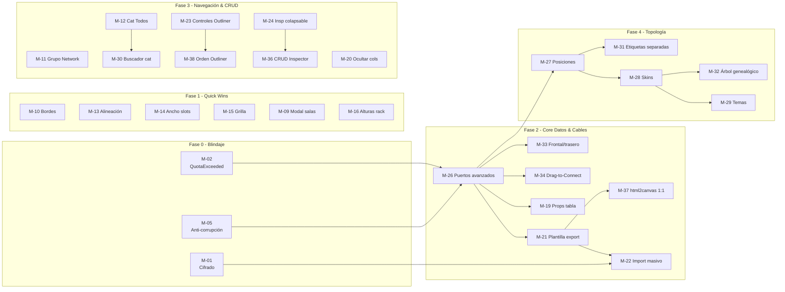

# 🗺️ Mapa de Ruta — RACK Designer Next

> Documento maestro para el equipo de desarrollo. Contiene el análisis de complejidad, la priorización estratégica, las fases de implementación y el diagrama de arquitectura final.
>
> **Fuente de requisitos:** [mejoras.md](file:///c:/Users/admin/.gemini/antigravity/scratch/Rack_Designer_2/mejoras.md)
> **Fecha de creación:** 2026-07-27
> **Última actualización:** 2026-09-18
> **Estado del sistema:** En producción

---

## 📋 Índice

1. [Inventario de Mejoras](#1-inventario-de-mejoras)
2. [Análisis de Complejidad](#2-análisis-de-complejidad)
3. [Análisis de Prioridad](#3-análisis-de-prioridad)
4. [Matriz de Decisión (Complejidad × Prioridad)](#4-matriz-de-decisión)
5. [Fases del Mapa de Ruta](#5-fases-del-mapa-de-ruta)
6. [Diagrama de Arquitectura Final](#6-diagrama-de-arquitectura-final)
7. [Dependencias entre Tareas](#7-dependencias-entre-tareas)
8. [Estimaciones de Esfuerzo](#8-estimaciones-de-esfuerzo)

---

## 1. Inventario de Mejoras

Cada mejora recibe un identificador único (`M-XX`) para trazabilidad.

| ID | Nombre | Categoría |
|---|---|---|
| M-01 | Cifrado de credenciales e IPs en localStorage | 🔒 Seguridad |
| M-02 | Manejo de QuotaExceededError en `_save()` | 💾 Estabilidad |
| M-03 | Optimización de `deepClone` / limitación de historial | ⏳ Rendimiento |
| M-04 | Redibujado selectivo (renderAll optimizado) | 🔄 Rendimiento |
| M-05 | Protección contra corrupción de JSON en `_load()` | ⚡ Estabilidad |
| M-06 | Estrategia de actualización del Service Worker | 📱 PWA |
| M-07 | Resolución de conflictos de importación multiusuario | ⛔ Colaboración |
| M-08 | Suite de pruebas unitarias e integradas | 🧪 Calidad |
| M-09 | Modal unificado para edición de salas | 🚪 UX |
| M-10 | Borde más visible en racks (vista física) | 🖼️ UX |
| M-11 | Agrupación "Network" en el sidebar del catálogo | 🔌 UX |
| M-12 | Categoría "Todos" con lupa en el catálogo | 🔍 UX |
| M-13 | Corrección de desalineación de equipos de piso | 📐 UX |
| M-14 | Ancho fijo proporcional para slots (10× U) | 📏 UX |
| M-15 | Grilla de fondo sutil en vista física | 🏁 UX |
| M-16 | Alturas de rack estandarizadas (select + 8U default) | 📐 UX |
| M-17 | ~~Documento de medidas de interfaz~~ | ✅ COMPLETADO |
| M-18 | Tema Sepia + visibilidad del selector de temas | 🎨 UX |
| M-19 | Propiedades faltantes en tabla de inventario | 📊 Datos |
| M-20 | Ocultar/mostrar columnas en tablas | ⚙️ UX |
| M-21 | Plantilla completa de exportación CSV/Excel | 📋 Datos |
| M-22 | Importación masiva desde CSV/Excel | 📥 Datos |
| M-23 | Controles de edición/creación en el Outliner | 🌳 UX |
| M-24 | Inspector colapsable en panel derecho | 🗂️ UX |
| M-25 | Rediseño responsive para móvil/tablet | 📱 UX |
| M-26 | Gestión avanzada de puertos y validaciones | 🔌 Core |
| M-27 | Persistencia de posiciones en topología | 🕸️ Core |
| M-28 | Sistema de skins visuales en topología | 🖼️ Topología |
| M-29 | Motor de temas y transparencias en topología | 🎨 Topología |
| M-30 | Buscador en catálogo de añadir equipos | 🔍 UX |
| M-31 | Separación de etiquetas en topología (IP arriba / nombre abajo) | 🏷️ Topología |
| M-32 | Layout de árbol genealógico en topología | 🌲 Topología |
| M-33 | Sistema de cableado frontal vs trasero | 🔌 Core |
| M-34 | Creación gráfica e interactiva de conexiones en vista física (Drag-to-Connect) | 🪢 UX |
| M-35 | Eliminación de restricciones de ubicación (Rack vs Piso/Frente) | 🔄 Core |
| M-36 | Creación, edición y eliminación de salas y racks desde el Inspector | 🛠️ UX |
| M-37 | Fidelidad visual 1:1 en exportación de imágenes PNG (html2canvas) | 📸 Datos |
| M-38 | Opciones de ordenamiento en el Outliner | 🔄 UX |

> [!NOTE]
> **M-17** ya fue completado. Total de tareas pendientes: **37**.

---

## 2. Análisis de Complejidad

Cada tarea se evalúa en una escala de **1 a 5** basada en los siguientes criterios:

| Nivel | Etiqueta | Descripción |
|---|---|---|
| 1 | 🟢 Trivial | Cambio CSS o configuración menor. < 1 hora. |
| 2 | 🟡 Baja | Modificación localizada en 1-2 archivos. < 4 horas. |
| 3 | 🟠 Media | Toca 3-5 archivos, requiere lógica nueva. 1-2 días. |
| 4 | 🔴 Alta | Sistema nuevo, toca el store + UI + modales. 3-5 días. |
| 5 | ⚫ Muy Alta | Cambio arquitectónico profundo, riesgo de regresión. 1-2 semanas. |

| ID | Mejora | Complejidad | Justificación |
|---|---|---|---|
| M-01 | Cifrado de credenciales | 🔴 4 | Requiere implementar AES-GCM via Web Crypto API, migrar datos existentes, y gestionar claves de cifrado sin backend. |
| M-02 | QuotaExceededError | 🟡 2 | Agregar `try/catch` en `_save()` de `store.js` y mostrar alerta visual. Cambio localizado. |
| M-03 | Optimización deepClone | 🟠 3 | Limitar el array `_history`, implementar diffs incrementales o usar `structuredClone`. Riesgo en undo/redo. |
| M-04 | Redibujado selectivo | 🔴 4 | Reescribir la lógica de `renderAll()` en `main.js` para actualizar solo nodos DOM afectados. Alto riesgo de regresión. |
| M-05 | Anti-corrupción JSON | 🟠 3 | Implementar doble escritura (backup slot) y validación de integridad en `_load()`. |
| M-06 | Service Worker update | 🟡 2 | Añadir listener `controllerchange` + UI de notificación "Nueva versión disponible". |
| M-07 | Conflictos multiusuario | ⚫ 5 | Requiere algoritmo de merge de objetos JSON profundos, UI de resolución de conflictos, y cambios extensos en `fileManager.js`. |
| M-08 | Suite de pruebas | 🔴 4 | Configurar framework (Vitest o Jest), escribir tests para store, modals, y rendering. Esfuerzo continuo. |
| M-09 | Modal edición de salas | 🟡 2 | Crear `RoomModal.js` completo (ya existe esqueleto de 1.3KB). Patrón idéntico a `RackModal.js`. |
| M-10 | Borde racks más visible | 🟢 1 | Cambio CSS puro en `rack.css` (aumentar `border-width`). |
| M-11 | Grupo "Network" en sidebar | 🟡 2 | Modificar la estructura de categorías en `catalog.js`. |
| M-12 | Categoría "Todos" + lupa | 🟡 2 | Añadir pestaña en `catalog.js` que liste todos los items sin filtro. |
| M-13 | Desalineación equipos piso | 🟢 1 | Ajuste CSS: `min-width: 584px` en el contenedor de floor devices en `rack.js` o `layout.css`. |
| M-14 | Ancho fijo slots (10×U) | 🟢 1 | Cambio CSS: `width: 240px` fijo en `.rack-slots`. |
| M-15 | Grilla de fondo vista física | 🟢 1 | CSS `background-image` con patrón SVG o `repeating-linear-gradient`. |
| M-16 | Alturas rack estándar | 🟡 2 | Reemplazar `<input>` por `<select>` en `RackModal.js` con opciones predefinidas. |
| M-18 | Tema Sepia + selector visible | 🟠 3 | Nuevo conjunto de variables CSS, lógica de toggle en header, persistencia de preferencia. |
| M-19 | Props faltantes en tabla | 🟡 2 | Agregar columnas `notes`, `size`, `skin` en `tables.js`. |
| M-20 | Ocultar columnas en tablas | 🟠 3 | Crear UI de checkboxes, lógica de filtrado de columnas, persistencia en localStorage. |
| M-21 | Plantilla exportación completa | 🟠 3 | Ampliar `ExportModal.js` para incluir todos los campos del modelo, serializar listas. |
| M-22 | Importación masiva CSV/Excel | 🔴 4 | Parsear archivos con XLSX, validar datos, mapear a esquema interno, UI de errores y conflictos. |
| M-23 | Controles en Outliner | 🟠 3 | Añadir botones inline por nodo + íconos de creación en header de `outliner.js`. |
| M-24 | Inspector colapsable | 🟡 2 | Toggle CSS + estado en `inspector.js`, redistribuir espacio vertical del panel derecho. |
| M-25 | Responsive móvil/tablet | ⚫ 5 | Rediseño completo de layout grid, media queries extensivas, gestos táctiles, bottom nav. |
| M-26 | Gestión avanzada de puertos | 🔴 4 | Nuevo modelo de datos para puertos, validaciones en `CableModal.js`, filtrado dinámico, VLAN. Refactor de `demoData.js`. |
| M-27 | Persistencia posiciones topología | 🟠 3 | Extender el modelo de datos en `store.js`, sincronizar con drag events en `TopologyEvents.js`. |
| M-28 | Skins visuales topología | 🔴 4 | 3 modos de renderizado en `TopologyRenderer.js`, carga de imágenes custom (FileReader + canvas), selector UI. |
| M-29 | Motor temas topología | 🔴 4 | Motor de temas con herencia/personalización, controles de transparencia, patrones de fondo en canvas. |
| M-30 | Buscador en catálogo de equipos | 🟡 2 | Campo de filtrado dinámico en tiempo real dentro del modal/catálogo de equipos. |
| M-31 | Separación etiquetas topología | 🟡 2 | Ajuste de dibujo en `TopologyRenderer.js`: IP arriba del círculo y nombre abajo. |
| M-32 | Layout de árbol genealógico | 🟠 3 | Algoritmo de jerarquía multinivel en `TopologyLayout.js` y controles de espaciado X/Y. |
| M-33 | Cableado frontal vs trasero | 🟠 3 | Extensión de lógica de conexiones y puertos distinguiendo la cara de montaje del equipo. |
| M-34 | Drag-to-Connect en vista física | 🔴 4 | Herramienta de cableado interactivo: eventos pointer, cable elástico SVG (rubber-band), snap magnético y popover de puertos. |
| M-35 | Sin restricciones de ubicación | ⚫ 5 | Cambio arquitectónico profundo: reescribir validaciones drag & drop y unificar esquema rack/piso/frente. |
| M-36 | CRUD Salas/Racks en Inspector | 🟠 3 | Soporte completo para crear, editar y eliminar salas y racks directamente desde `inspector.js`. |
| M-37 | Exportación fiel (html2canvas) | 🟡 2 | Integrar script vendor `html2canvas.min.js` y refactorizar captura de DOM en `ExportModal.js`. |
| M-38 | Opciones de orden en Outliner | 🟡 2 | Controles de ordenación (nombre, tipo, posición U) en el árbol jerárquico de `outliner.js`. |

### Resumen de Complejidad

| Nivel | Cantidad | IDs |
|---|---|---|
| 🟢 Trivial (1) | 4 | M-10, M-13, M-14, M-15 |
| 🟡 Baja (2) | 12 | M-02, M-06, M-09, M-11, M-12, M-16, M-19, M-24, M-30, M-31, M-37, M-38 |
| 🟠 Media (3) | 10 | M-03, M-05, M-18, M-20, M-21, M-23, M-27, M-32, M-33, M-36 |
| 🔴 Alta (4) | 8 | M-01, M-04, M-08, M-22, M-26, M-28, M-29, M-34 |
| ⚫ Muy Alta (5) | 3 | M-07, M-25, M-35 |

---

## 3. Análisis de Prioridad

Priorización basada en **impacto en producción** y **riesgo de no implementar**.

| Nivel | Etiqueta | Criterio |
|---|---|---|
| P1 | 🚨 Crítica | Causa pérdida de datos o vulnerabilidad de seguridad activa. |
| P2 | 🔥 Alta | Afecta significativamente la experiencia de usuarios actuales. |
| P3 | ⚡ Media | Mejora la productividad y la calidad del producto. |
| P4 | 💡 Baja | Nice-to-have. Mejora estética o de alcance futuro. |

| ID | Mejora | Prioridad | Justificación |
|---|---|---|---|
| M-01 | Cifrado de credenciales | 🚨 P1 | Datos sensibles (IPs, contraseñas) expuestos en texto plano. Riesgo de seguridad real. |
| M-02 | QuotaExceededError | 🚨 P1 | Pérdida silenciosa de datos del usuario en producción. |
| M-05 | Anti-corrupción JSON | 🚨 P1 | Pérdida total del diseño si el JSON se corrompe al cerrar el navegador. |
| M-03 | Optimización deepClone | 🔥 P2 | Congelamiento de UI en topologías grandes. Degrada la experiencia. |
| M-04 | Redibujado selectivo | 🔥 P2 | Lag visible al interactuar con el inspector o mover dispositivos. |
| M-26 | Gestión avanzada puertos | 🔥 P2 | Funcionalidad core de un DCIM. Sin esto, las conexiones no son fiables. |
| M-09 | Modal edición salas | 🔥 P2 | El `prompt()` nativo rompe la experiencia y bloquea el hilo. |
| M-19 | Props faltantes tabla | 🔥 P2 | Información incompleta = decisiones incorrectas del operador. |
| M-08 | Suite de pruebas | ⚡ P3 | Protección contra regresiones. Crece en importancia con cada cambio. |
| M-06 | Service Worker update | ⚡ P3 | Usuarios atrapados en versiones antiguas con bugs conocidos. |
| M-16 | Alturas rack estándar | ⚡ P3 | Previene errores de configuración de operadores. |
| M-10 | Borde racks visible | ⚡ P3 | Mejora inmediata de legibilidad visual. |
| M-13 | Desalineación piso | ⚡ P3 | Defecto visual que impacta la primera impresión. |
| M-14 | Ancho fijo slots | ⚡ P3 | Consistencia visual de faceplates en distintas pantallas. |
| M-15 | Grilla fondo físico | ⚡ P3 | Mejora la orientación espacial del operador. |
| M-11 | Grupo "Network" | ⚡ P3 | Simplifica la navegación del catálogo. |
| M-12 | Categoría "Todos" | ⚡ P3 | Agiliza la búsqueda de equipos. |
| M-23 | Controles en Outliner | ⚡ P3 | Productividad: acciones directas sin cambiar de panel. |
| M-24 | Inspector colapsable | ⚡ P3 | Mejor uso del espacio en el panel derecho. |
| M-27 | Persistencia posiciones | ⚡ P3 | Evita que los diagramas se desordenen al recargar. |
| M-20 | Ocultar columnas | ⚡ P3 | Ergonomía en pantallas pequeñas. |
| M-21 | Plantilla exportación | ⚡ P3 | Base necesaria para M-22 (importación masiva). |
| M-30 | Buscador catálogo de equipos | ⚡ P3 | Agiliza la localización inmediata de equipos en el modal de catálogo. |
| M-31 | Separación etiquetas topología | ⚡ P3 | Evita el truncado y saturación de texto en nodos circulares densos. |
| M-32 | Layout árbol genealógico | ⚡ P3 | Visualización clara de la jerarquía de red (Core, Distribución, Acceso). |
| M-33 | Cableado frontal vs trasero | ⚡ P3 | Distingue puertos según la cara de montaje físico del equipo. |
| M-38 | Opciones de orden Outliner | ⚡ P3 | Facilita clasificar la jerarquía por nombre, tipo o posición U. |
| M-34 | Drag-to-Connect en vista física | 🔥 P2 | Revoluciona la experiencia de cableado; elimina formularios modales lentos. |
| M-36 | CRUD Salas/Racks en Inspector | 🔥 P2 | Agiliza la administración física directa sin saltar entre paneles. |
| M-37 | Exportación fiel (html2canvas) | 🔥 P2 | Resuelve el reclamo de imágenes exportadas que no coinciden con la pantalla. |
| M-18 | Tema Sepia | 💡 P4 | Mejora estética, no afecta funcionalidad. |
| M-22 | Importación masiva | 💡 P4 | Gran valor, pero depende de M-21 y M-26. |
| M-25 | Responsive móvil | 💡 P4 | Mercado futuro. Requiere esfuerzo masivo. |
| M-07 | Conflictos multiusuario | 💡 P4 | Escenario poco frecuente en uso actual (single-user). |
| M-28 | Skins topología | 💡 P4 | Feature premium, no bloquea ningún flujo actual. |
| M-29 | Motor temas topología | 💡 P4 | Feature premium, pura personalización visual. |
| M-35 | Sin restricciones de ubicación | 💡 P4 | Flexibilidad total, pero requiere reescribir esquemas y drag & drop. |

---

## 4. Matriz de Decisión

> Cruza **Prioridad** (eje Y) con **Complejidad** (eje X) para identificar los "quick wins" y los proyectos que requieren planificación cuidadosa.

```
                    COMPLEJIDAD →
              1-Trivial  2-Baja   3-Media  4-Alta   5-Muy Alta
           ┌──────────┬─────────┬─────────┬─────────┬──────────┐
  P1 🚨    │          │  M-02   │  M-05   │  M-01   │          │
  Crítica  │          │         │         │         │          │
           ├──────────┼─────────┼─────────┼─────────┼──────────┤
  P2 🔥    │  M-10    │  M-09   │  M-03   │  M-04   │          │
  Alta     │          │  M-19   │  M-36   │  M-26   │          │
           │          │  M-37   │         │  M-34   │          │
           ├──────────┼─────────┼─────────┼─────────┼──────────┤
  P3 ⚡    │  M-13    │  M-06   │  M-18   │  M-08   │          │
  Media    │  M-14    │  M-11   │  M-20   │         │          │
           │  M-15    │  M-12   │  M-21   │         │          │
           │          │  M-16   │  M-23   │         │          │
           │          │  M-24   │  M-27   │         │          │
           │          │  M-30   │  M-32   │         │          │
           │          │  M-31   │  M-33   │         │          │
           │          │  M-38   │         │         │          │
           ├──────────┼─────────┼─────────┼─────────┼──────────┤
  P4 💡    │          │         │         │  M-22   │  M-07    │
  Baja     │          │         │         │  M-28   │  M-25    │
           │          │         │         │  M-29   │  M-35    │
           └──────────┴─────────┴─────────┴─────────┴──────────┘
```

> [!TIP]
> **Zona de Quick Wins (arriba-izquierda):** M-02, M-10, M-09, M-19, M-37 — Máximo impacto con mínimo esfuerzo. Empezar aquí.
>
> **Zona de Proyectos Estratégicos (arriba-derecha):** M-01, M-04, M-26, M-34 — Alto impacto pero requieren planificación y sprints dedicados.
>
> **Zona de Backlog (abajo-derecha):** M-07, M-25, M-35 — No abordar hasta que todo lo anterior esté resuelto.

---

## 5. Fases del Mapa de Ruta

### Fase 0 — Blindaje de Producción 🛡️
> **Objetivo:** Proteger la integridad de los datos de los usuarios actuales.
> **Duración estimada:** 1 semana
> **Riesgo de no hacer:** ⚠️ Pérdida de datos en producción

| Orden | ID | Tarea | Archivos Afectados | Entregable |
|---|---|---|---|---|
| 0.1 | M-02 | Manejo de QuotaExceededError | `store.js` | `try/catch` en `_save()` + alerta visual |
| 0.2 | M-05 | Anti-corrupción JSON | `store.js` | Doble slot de guardado + validación en `_load()` |
| 0.3 | M-01 | Cifrado de credenciales | `store.js`, `DeviceModal.js`, `inspector.js` | Web Crypto API (AES-GCM) para campos sensibles |

> [!CAUTION]
> **M-02 y M-05 son hotfixes.** Deben desplegarse antes de cualquier otra mejora. Un crash del navegador o un localStorage lleno puede borrar el diseño completo del datacenter de un usuario.

---

### Fase 1 — Quick Wins Visuales ✨
> **Objetivo:** Mejoras inmediatas de UX con cambios mínimos y cero riesgo.
> **Duración estimada:** 2-3 días
> **Riesgo de regresión:** Bajo

| Orden | ID | Tarea | Archivos Afectados |
|---|---|---|---|
| 1.1 | M-10 | Borde racks más visible | `rack.css` |
| 1.2 | M-13 | Alineación equipos de piso | `rack.js` o `layout.css` |
| 1.3 | M-14 | Ancho fijo slots (240px) | `rack.css` |
| 1.4 | M-15 | Grilla de fondo vista física | `layout.css` |
| 1.5 | M-09 | Modal de edición de salas | `RoomModal.js`, `modals.js`, `main.js` |
| 1.6 | M-16 | Alturas estándar de rack | `RackModal.js` |

---

### Fase 2 — Core de Datos y Puertos 🔌
> **Objetivo:** Fortalecer el modelo de datos para reflejar la realidad de un datacenter y optimizar la conexión e intercambio de información.
> **Duración estimada:** 2 semanas
> **Dependencias:** Fase 0 completada

| Orden | ID | Tarea | Archivos Afectados |
|---|---|---|---|
| 2.1 | M-26 | Modelo de puertos avanzado + validaciones | `store.js`, `CableModal.js`, `demoData.js` |
| 2.2 | M-33 | Cableado frontal vs trasero | `store.js`, `CableModal.js`, `rack.js` |
| 2.3 | M-34 | Drag-to-Connect en vista física | `rack.js`, `faceplates.js`, `main.js`, `css/components/rack.css` |
| 2.4 | M-19 | Propiedades faltantes en tabla inventario | `tables.js` |
| 2.5 | M-21 | Plantilla completa de exportación | `ExportModal.js` |
| 2.6 | M-37 | Exportación fiel 1:1 (html2canvas) | `index.html`, `ExportModal.js` |
| 2.7 | M-22 | Importación masiva CSV/Excel | `fileManager.js`, nuevo `ImportModal.js` |

---

### Fase 3 — Mejoras de Navegación y Productividad 🧭
> **Objetivo:** Optimizar la ergonomía del día a día del operador centralizando la gestión.
> **Duración estimada:** 1-2 semanas

| Orden | ID | Tarea | Archivos Afectados |
|---|---|---|---|
| 3.1 | M-11 | Grupo "Network" en sidebar | `catalog.js` |
| 3.2 | M-12 | Categoría "Todos" con lupa | `catalog.js` |
| 3.3 | M-30 | Buscador en catálogo de equipos | `DeviceModal.js`, `catalog.js` |
| 3.4 | M-23 | Controles edición/creación en Outliner | `outliner.js` |
| 3.5 | M-38 | Opciones de ordenamiento en Outliner | `outliner.js` |
| 3.6 | M-24 | Inspector colapsable | `inspector.js`, `layout.css` |
| 3.7 | M-36 | CRUD Salas/Racks desde Inspector | `inspector.js`, `store.js` |
| 3.8 | M-20 | Ocultar/mostrar columnas | `tables.js` |

---

### Fase 4 — Motor de Topología 🕸️
> **Objetivo:** Convertir la topología en una herramienta de diagramación profesional.
> **Duración estimada:** 2-3 semanas
> **Dependencias:** Fase 2 completada (modelo de puertos necesario para conexiones)

| Orden | ID | Tarea | Archivos Afectados |
|---|---|---|---|
| 4.1 | M-27 | Persistencia de posiciones | `store.js`, `TopologyEvents.js`, `TopologyLayout.js` |
| 4.2 | M-31 | Separación de etiquetas (IP arriba / nombre abajo) | `TopologyRenderer.js` |
| 4.3 | M-28 | Sistema de skins (nodos/cards/imágenes) | `TopologyRenderer.js`, `TopologyState.js`, nuevo `TopologySkins.js` |
| 4.4 | M-32 | Layout de árbol genealógico | `TopologyLayout.js`, `TopologyRenderer.js` |
| 4.5 | M-29 | Motor de temas y transparencias | `TopologyRenderer.js`, nuevo `TopologyThemes.js` |

---

### Fase 5 — Rendimiento y Calidad ⚙️
> **Objetivo:** Escalar la app para topologías grandes y proteger contra regresiones.
> **Duración estimada:** 2-3 semanas

| Orden | ID | Tarea | Archivos Afectados |
|---|---|---|---|
| 5.1 | M-03 | Optimización deepClone / historial | `store.js` |
| 5.2 | M-04 | Redibujado selectivo | `main.js`, todos los archivos `ui/` |
| 5.3 | M-08 | Suite de pruebas | Nuevo directorio `tests/`, configuración Vitest |
| 5.4 | M-06 | Actualización Service Worker | `service-worker.js`, `main.js` |

---

### Fase 6 — Experiencia Premium 💎
> **Objetivo:** Features diferenciadores de alto valor pero menor urgencia o alta complejidad estructural.
> **Duración estimada:** 3-4 semanas

| Orden | ID | Tarea | Archivos Afectados |
|---|---|---|---|
| 6.1 | M-18 | Tema Sepia + selector visible | `variables.css`, `layout.css`, `main.js` |
| 6.2 | M-25 | Responsive móvil/tablet | Todos los CSS, `main.js`, nuevo `mobile.js` |
| 6.3 | M-35 | Sin restricciones de ubicación (Rack vs Piso/Frente) | `store.js`, `rack.js`, `PlacementModal.js` |
| 6.4 | M-07 | Resolución de conflictos multiusuario | `fileManager.js`, nuevo `MergeModal.js` |

---

## 6. Diagrama de Arquitectura Final

> Arquitectura del proyecto después de implementar **todas** las 37 mejoras pendientes.

```mermaid
graph TB
    subgraph "CAPA DE PRESENTACIÓN"
        direction TB
        
        subgraph "Header"
            THEME_TOGGLE["🎨 Theme Toggle<br/>(Claro/Oscuro/Sepia M-18)"]
            AUTH["🔑 Auth (RBAC)"]
        end
        
        subgraph "Sidebar (280px)"
            CAT_ALL["🔍 Todos + Buscador<br/>(M-12, M-30)"]
            CAT_NET["🔌 Network<br/>(Routers+Switches+FW M-11)"]
            CAT_OTHER["📦 Servers / Power / Accs"]
        end
        
        subgraph "Main Canvas"
            PHYS_VIEW["📐 Vista Física<br/>• Grilla de fondo sutil (M-15)<br/>• Bordes racks visibles (M-10)<br/>• Slots fijo 240px (M-14)<br/>• Piso alineado 584px (M-13)<br/>• Drag-to-Connect cables (M-34)"]
            
            TOPO_VIEW["🕸️ Vista Topología<br/>• Skins: Nodo/Card/Imagen (M-28)<br/>• Layout: Árbol Genealógico (M-32)<br/>• Etiquetas: IP arriba, Nombre abajo (M-31)<br/>• Temas: Heredado/Custom (M-29)<br/>• Transparencias alfa<br/>• Posiciones persistentes (M-27)"]
        end
        
        subgraph "Panel Derecho (260px)"
            OUTLINER["🌳 Outliner<br/>+ Botones editar/eliminar inline (M-23)<br/>+ Iconos crear sala/rack/equipo<br/>+ Opciones de orden (M-38)"]
            INSPECTOR["🔍 Inspector<br/>+ Modo colapsable (M-24)<br/>+ CRUD Salas/Racks/Equipos (M-36)"]
            STATS["📊 Stats"]
        end
        
        subgraph "Panel Inferior"
            TABLE_INV["📊 Tabla Inventario<br/>+ Columnas: notes, size, skin (M-19)<br/>+ Ocultar/mostrar columnas (M-20)"]
            TABLE_CON["🔗 Tabla Conexiones<br/>+ Filtro puertos disponibles (M-26)"]
        end
    end
    
    subgraph "CAPA DE MODALES"
        ROOM_MODAL["🚪 RoomModal<br/>(Modal completo M-09)"]
        RACK_MODAL["📐 RackModal<br/>(Select alturas estándar M-16)"]
        DEV_MODAL["💻 DeviceModal<br/>(+ Submenú puertos + VLAN M-26)"]
        CABLE_MODAL["🔌 CableModal<br/>(Solo puertos disponibles M-26)"]
        EXPORT_MODAL["📋 ExportModal<br/>(Plantilla completa M-21 + html2canvas M-37)"]
        IMPORT_MODAL["📥 ImportModal [NUEVO]<br/>(CSV/Excel masivo M-22)"]
        MERGE_MODAL["⛔ MergeModal [NUEVO]<br/>(Resolución conflictos M-07)"]
    end
    
    subgraph "CAPA DE LÓGICA (store.js)"
        STORE["🧠 Store (ES6 Proxy)<br/>──────────────────<br/>• _save() con try/catch (M-02)<br/>• _load() con backup slot (M-05)<br/>• snapshot() optimizado (M-03)<br/>• Modelo puertos {id, type, vlan, occupied} (M-26)<br/>• Cableado frontal/trasero (M-33)<br/>• Flexibilidad ubicación (M-35)<br/>• Posiciones topología (M-27)"]
        
        CRYPTO["🔒 CryptoService [NUEVO]<br/>Web Crypto API (AES-GCM M-01)<br/>Cifra: ip, mac, user, pass"]
    end
    
    subgraph "CAPA DE TOPOLOGÍA (Canvas 2D)"
        T_STATE["TopologyState<br/>+ skinMode, themeConfig"]
        T_EVENTS["TopologyEvents<br/>+ drag → persist position (M-27)"]
        T_LAYOUT["TopologyLayout<br/>+ Árbol Genealógico (M-32)<br/>+ load saved positions"]
        T_RENDER["TopologyRenderer<br/>+ Etiquetas IP/nombre (M-31)<br/>+ renderNode/Card/Image"]
        T_SKINS["TopologySkins [NUEVO]<br/>+ Nodo/Card/Imagen custom (M-28)"]
        T_THEMES["TopologyThemes [NUEVO]<br/>+ Motor herencia/custom (M-29)<br/>+ Transparencias alfa"]
    end
    
    subgraph "CAPA DE PERSISTENCIA"
        LS["💾 localStorage<br/>• Doble slot (backup M-05)<br/>• Preferencias columnas (M-20)<br/>• Tema activo"]
        SS["🔐 sessionStorage<br/>• Auth session"]
        FILE["📁 Archivos<br/>• .rack (JSON cifrado)<br/>• .csv/.xlsx (import/export M-21/22)"]
    end
    
    subgraph "CAPA DE INFRAESTRUCTURA"
        SW["⚙️ Service Worker<br/>+ skipWaiting + notify UI (M-06)"]
        TESTS["🧪 Tests (Vitest M-08)<br/>• store.test.js<br/>• ports.test.js<br/>• crypto.test.js"]
        MOBILE["📱 Mobile Layer [NUEVO M-25]<br/>• Media queries<br/>• Touch gestures<br/>• Bottom nav bar"]
        H2C["📸 html2canvas [VENDOR M-37]<br/>Exportación PNG 1:1 Pixel-Perfect"]
    end
    
    %% Conexiones principales
    PHYS_VIEW --> STORE
    TOPO_VIEW --> T_STATE
    T_STATE --> STORE
    T_EVENTS --> STORE
    T_RENDER --> T_SKINS
    T_RENDER --> T_THEMES
    
    OUTLINER --> STORE
    INSPECTOR --> STORE
    TABLE_INV --> STORE
    TABLE_CON --> STORE
    
    ROOM_MODAL --> STORE
    RACK_MODAL --> STORE
    DEV_MODAL --> STORE
    DEV_MODAL --> CRYPTO
    CABLE_MODAL --> STORE
    IMPORT_MODAL --> STORE
    EXPORT_MODAL --> STORE
    EXPORT_MODAL --> H2C
    MERGE_MODAL --> STORE
    
    STORE --> LS
    STORE --> FILE
    CRYPTO --> LS
    AUTH --> SS
    
    THEME_TOGGLE --> STORE
```



---

## 7. Dependencias entre Tareas



> [!IMPORTANT]
> **Cadena crítica:** M-02 → M-05 → M-26 → M-21 → M-22.
> Esta secuencia representa el camino más largo. Cualquier retraso aquí retrasa todo el proyecto.

---

## 8. Estimaciones de Esfuerzo

> Basadas en un equipo de **1 desarrollador full-time** con conocimiento del proyecto.

| Fase | Duración | Acumulado | Tareas |
|---|---|---|---|
| **Fase 0** — Blindaje | 1 semana | Semana 1 | M-02, M-05, M-01 |
| **Fase 1** — Quick Wins | 2-3 días | Semana 2 | M-10, M-13, M-14, M-15, M-09, M-16 |
| **Fase 2** — Core Datos & Cables | 2 semanas | Semana 3-4 | M-26, M-33, M-34, M-19, M-21, M-37, M-22 |
| **Fase 3** — Navegación & CRUD | 1-2 semanas | Semana 5-6 | M-11, M-12, M-30, M-23, M-38, M-24, M-36, M-20 |
| **Fase 4** — Topología | 2-3 semanas | Semana 7-9 | M-27, M-31, M-28, M-32, M-29 |
| **Fase 5** — Rendimiento & Calidad | 2-3 semanas | Semana 10-12 | M-03, M-04, M-08, M-06 |
| **Fase 6** — Premium | 3-4 semanas | Semana 13-16 | M-18, M-25, M-35, M-07 |

> **Estimación total: ~16 semanas** (1 desarrollador) o **~6-8 semanas** (equipo de 2-3 desarrolladores trabajando en paralelo por fases independientes).

---

> [!NOTE]
> Este documento debe actualizarse al completar cada fase. Los IDs de mejora (`M-XX`) deben usarse en los commits y PRs para trazabilidad completa.
