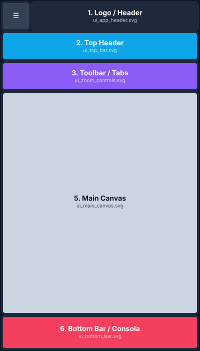
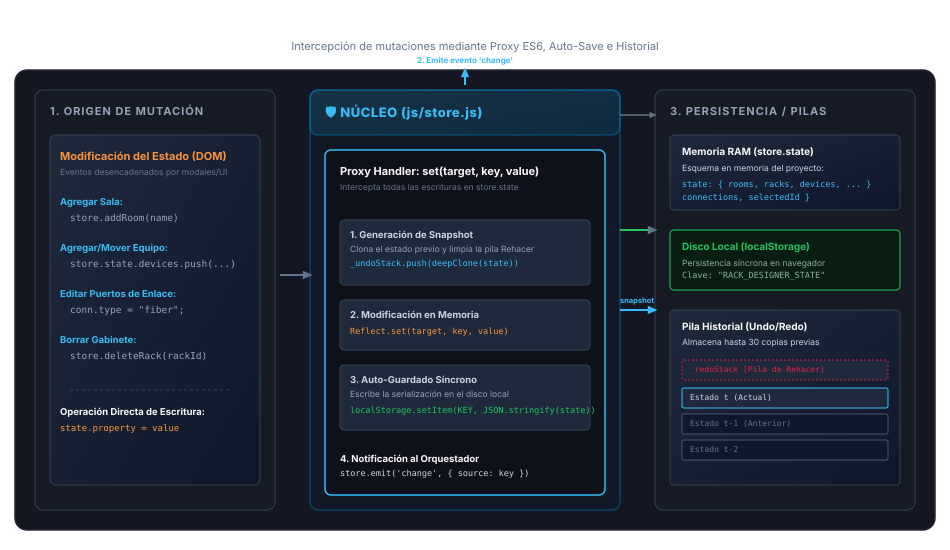
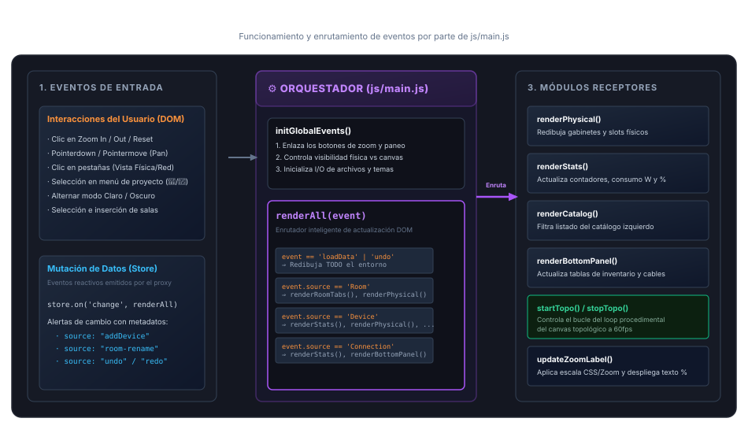
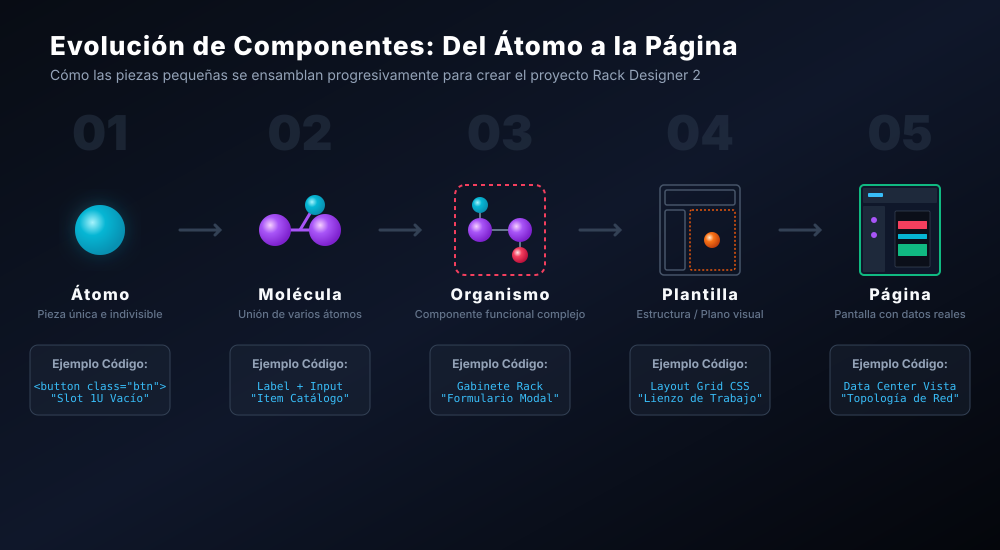

#  Documentación Técnica - RACK Designer

Este documento detalla la arquitectura, el modelo de datos subyacente y las convenciones de desarrollo de RACK Designer. Está orientado a desarrolladores que deseen extender o auditar la aplicación.

## 1. Arquitectura de la Aplicación

RACK Designer es una Single Page Application (SPA) implementada en **Vanilla JavaScript** (ES6+), HTML5 y CSS3. 

### Decisiones de Diseño Clave:
* **Cero Dependencias de Frameworks:** No utiliza React, Vue ni Angular. El DOM se manipula directamente mediante selectores nativos, lo que garantiza tiempos de carga ultrarrápidos y facilita la auditoría estática.
* **CSS Grid y Flexbox:** Toda la estructura de diseño (incluyendo el "lienzo" de las salas y los modales) está basada en un sistema puro de CSS Grid, asegurando un diseño "responsive" y control preciso de alineaciones sin librerías externas como Bootstrap o Tailwind.
* **Persistencia Local (Local Storage):** La aplicación no requiere backend por defecto. Toda la infraestructura se guarda de forma persistente en el `localStorage` del navegador, garantizando privacidad y acceso offline.

### Estructura de Archivos
* `index.html`: Plantilla principal. Contiene la estructura de contenedores estáticos (Cabecera, Modales, Contenedores de Vistas).
* `css/style.css`: Estilos unificados. Utiliza un robusto sistema de variables CSS (`--bg`, `--surface`, `--accent`) para gestionar el sistema de tematización (Modo Claro/Oscuro).
* `js/models/`: **Lógica de Negocio Pura.** Clases base que definen qué es un Rack, un Equipo o un Cable (`Rack.js`, `Device.js`, `Cable.js`).
* `js/api/` y `js/core/`: Conexión externa (cliente API mock) y lógicas base de exportación.
* `js/store.js`: El corazón de persistencia y reactividad. Coordina los Modelos, dispara eventos y sincroniza con el `localStorage`. No sabe nada de HTML ni CSS.
* `js/main.js`: Lógica principal de inicialización y enrutamiento (Despachador) entre pestañas.
* `js/ui/*.js`: Lógica de la interfaz de usuario segregada en dominios (Ej. `modals.js` para los popups, `faceplates.js` para renderizar visualmente los frontales de los gabinetes, `tables.js` para el panel de inventario).

### Responsive Design y Layouts Estructurales
La aplicación utiliza un sistema estricto de CSS Grid que transmuta dependiendo de la resolución de pantalla.

**Estructura Base (Desktop / Tablet):**
Un sistema tradicional de dos columnas, maximizando el espacio del lienzo de trabajo mientras se mantienen accesibles las herramientas laterales y los registros en la base.


**Adaptación Móvil (Responsive):**
En pantallas estrechas, la interfaz muta a un sistema estrictamente vertical de una sola columna. El Sidebar (Panel Lateral) se colapsa en un menú tipo "Hamburguesa" junto al logo, liberando el 100% del ancho para el Main Canvas interactivo.


## 2. Modelo de Datos (JSON Schema)

El estado de la aplicación se almacena como un único objeto JSON jerárquico. 

### Objeto Raíz (`store._raw`)
```json
{
  "version": "1.0",
  "rooms": [],
  "racks": [],
  "devices": [],
  "connections": [],
  "currentRoomId": "string"
}
```

### Esquema: Sala (`Room`)
Representa una ubicación física.
* `id` (String): Identificador único (UUID v4).
* `name` (String): Nombre descriptivo (Ej. "Sala de Comunicaciones").

### Esquema: Gabinete (`Rack`)
* `id` (String): Identificador único.
* `roomId` (String): Referencia a la Sala a la que pertenece.
* `name` (String): Identificador del rack (Ej. "RACK-01").
* `height` (Integer): Número total de Unidades (U). Generalmente 42 o 48.
* `color` (String): Color en código HEX para la cabecera visual del rack.

### Esquema: Equipo / Dispositivo (`Device`)
Representa un activo de hardware. Las propiedades varían ligeramente si es de montaje en rack o de piso.
* `id` (String): Identificador único.
* `rackId` (String | null): ID del gabinete donde reside. `null` si es equipo de piso.
* `roomId` (String | null): Obligatorio si el equipo no está en un rack.
* `category` (String): "rack" o "floor".
* `type` (String): Clasificación semántica (Ej. `server`, `switch`, `camera`).
* `name`, `brand`, `model`, `serial` (Strings): Datos de Identidad.
* `size` (Integer): Unidades ocupadas (Ej. 2U). Para `floor`, este valor suele ignorarse o forzarse a 0.
* `slotStart` (Integer): Ubicación en el rack (U inferior ocupada).
* `side` (String): Montaje: "front" (Frontal) o "rear" (Trasero).
* `ip`, `mac` (Strings): Módulo de Red (Habilitable dinámicamente).
* `user`, `pass` (Strings): Módulo de Credenciales.
* `power`, `plugs`, `plugsOut` (Integers): Módulo de Energía (Consumo, Entradas, Salidas).

### Esquema: Conexión (`Connection`)
* `id` (String): Identificador de la conexión.
* `srcId`, `dstId` (Strings): IDs de los Equipos de origen y destino.
* `type` (String): Tipo de cableado (Ej. `eth` para Ethernet, `fiber` para Fibra Óptica, `power` para Corriente).

## 3. Dinámica de la UI (Patrones Destacados)

### Formularios Dinámicos
Los modales de edición (ej. `modals.js` -> Modal de Equipos) evitan almacenar propiedades de estado innecesarias utilizando el paradigma del DOM como fuente de verdad en el momento de edición, emparejando la captura con el estado nativo de los `checkboxes` ("Toggles" de Activación).

### Topología Basada en Canvas/DOM
La vista topológica interactúa directamente con eventos de puntero (drag/zoom) sin depender de librerías como D3.js. Esto mantiene el "bundle size" al mínimo.

### Gestión de Vistas (Caras del Rack)
Para resolver la ocupación independiente del frontal y la parte posterior del armario, el motor de dibujado (`faceplates.js`) agrupa a los equipos basándose en el atributo `side`, renderizando una de las dos "colecciones" sin colisiones lógicas en las Unidades (U).

## 4. Estructura y Funcionamiento Técnico Detallado

### Clean Architecture y Modelos (`js/models/`)
Para garantizar la escalabilidad y mantenibilidad, la lógica de negocio se ha separado de la persistencia de estado:
* **Modelos Base:** Las clases `Rack`, `Device` y `Cable` viven en el directorio `js/models/`. Son responsables de las reglas de negocio lógicas y matemáticas (ej. instanciación segura, validación).
* **Servicios Core:** Funcionalidades pesadas como el generador de PDF/JSON o llamadas HTTP se aíslan en `js/core/` y `js/api/`.

### Almacén Central Reactivo (`store.js`)

El estado de la aplicación reside en un almacén único, centralizado y reactivo implementado mediante un **Proxy ES6** que envuelve al objeto interno `_raw`. 


*Figura: Funcionamiento detallado del Almacén Central Reactivo (js/store.js) y persistencia.*

#### 1. Detección de Mutaciones (Proxy ES6)
Cualquier intento de escritura (`set`) sobre las propiedades del estado (como agregar una nueva sala al array `state.rooms` o modificar las propiedades de un puerto de enlace) es interceptado de forma inmediata por el controlador del Proxy. 

#### 2. Mecanismos del Ciclo de Vida del Cambio
Cuando ocurre una interceptación de mutación, el Proxy ejecuta los siguientes procesos en orden:
1. **Historial de Snapshots (Undo/Redo):** Antes de aplicar la mutación, clona en profundidad (`deepClone`) el estado previo de la aplicación y lo guarda en la pila de deshacer (`_undoStack`). Al mismo tiempo, limpia la pila de rehacer (`_redoStack`) para mantener un flujo de historial coherente. Mantiene un límite estricto de hasta 30 capturas para evitar el desbordamiento de memoria.
2. **Modificación en Memoria RAM:** Modifica la propiedad en el objeto de datos real utilizando `Reflect.set()`.
3. **Auto-guardado Síncrono (Persistence):** Convierte el estado de memoria a una cadena de texto JSON y lo escribe de manera síncrona en el `localStorage` del navegador con la clave `RACK_DESIGNER_STATE`. Esto garantiza que los datos se guarden al instante tras cada clic o arrastre, protegiendo al usuario ante caídas del navegador.
4. **Emisión del Evento `'change'`:** Finalmente, el almacén notifica al exterior emitiendo el evento `'change'`, adjuntando metadatos sobre qué propiedad cambió (`event.source`). Esto avisa al orquestador global (`js/main.js`) para que decida qué vistas del DOM actualizar selectivamente.

### Flujo de Actualización DOM y Renderizado (`main.js` y Componentes UI)

El archivo `js/main.js` actúa como el **Controlador / Orquestador** central de la aplicación. Su función principal es doble: inicializar el entorno global del cliente y actuar como un despachador inteligente de eventos ("Dispatcher") para evitar sobrecargas de procesamiento en el DOM.


*Figura: Funcionamiento y enrutamiento de eventos reactivos por parte del orquestador central js/main.js.*

#### 1. Estructura y Componentes
* **`initGlobalEvents()`**: Función encargada de suscribir los manejadores de eventos síncronos de la interfaz de usuario en el arranque. Enlaza los botones de zoom, los controles de paneo, el menú principal (I/O, Modo Claro/Oscuro) y las transiciones de pestañas (Vista Física vs. Vista de Red).
* **`renderAll(event)`**: Enrutador inteligente reactivo. Está suscrito al evento global `'change'` emitido por el `store` reactivo. Cada vez que el estado cambia, el `store` envía un objeto de evento que contiene metadatos sobre qué modelo se mutó (`source`).

#### 2. Funcionamiento y Enrutamiento Selectivo
Al recibir el evento, `renderAll` realiza una evaluación condicional basándose en los metadatos para propagar la actualización únicamente a las partes afectadas de la interfaz:
1. **Inicialización o Carga Global (`event === 'loadData'` o cambios masivos como `undo`/`redo`):** Se ejecuta un redibujo total del entorno: se regeneran las pestañas de salas, se redibuja el rack físico, se actualiza el panel inferior de tablas y se actualiza la topología de red.
2. **Mutaciones en Sala (`event.source === 'Room'` o `'changeRoom'`):** Actualiza el listado superior de pestañas de sala (`renderRoomTabs()`) y redibuja la distribución física de gabinetes y equipos correspondientes a la sala seleccionada.
3. **Mutaciones en Equipos o Dispositivos (`event.source === 'Device'`):** Llama a `renderStats()` para actualizar el panel de consumo de energía, espacio y conectividad. Redibuja los slots físicos (`renderPhysical()`) y regenera el catálogo izquierdo (`renderCatalog()`) o las tablas de inventario en el panel inferior.
4. **Mutaciones de Red o Enlaces (`event.source === 'Connection'`):** Llama a `renderStats()` para actualizar los contadores e interactúa con el panel de cables y la vista de topología (`renderBottomPanel()`), asegurando que las líneas y tablas reflejen los nuevos enlaces síncronamente.

Esta estrategia de enrutamiento selectivo desacopla la lógica de almacenamiento del estado de la lógica del DOM y previene la degradación del rendimiento al actualizar solo los fragmentos HTML requeridos.

### Inicialización y Carga Dinámica de Datos
El ciclo de arranque de la aplicación se ha optimizado para priorizar la velocidad y la protección del estado:
* **Lectura del Estado Inicial (Primer uso vs Recuperación):** Al inicializar `store.js`, el sistema verifica inmediatamente el `localStorage` del navegador. Si encuentra un proyecto guardado, lo restaura en la memoria. Si la memoria está vacía (primer uso), el sistema no bloquea el arranque cargando una maqueta gigante; en su lugar, genera dinámicamente un estado en blanco básico (una sola sala vacía).
* **Carga Dinámica de Datos (Demos bajo demanda):** El archivo de datos de demostración (`demoData.js`) se ha desacoplado del flujo de arranque inicial. En lugar de ejecutarse al abrir `index.html`, este archivo se inyecta en el DOM de forma perezosa (`lazy loading`) mediante la creación dinámica de una etiqueta `<script>` únicamente cuando el usuario hace clic en el botón "✨ Cargar demos". Esto previene tiempos de bloqueo, economiza memoria y protege el trabajo del usuario.

### Seguridad Global y Modo Dios
Para prevenir la exposición indeseada de credenciales durante su uso habitual, se implementó el **Modo Dios** a través del estado de la variable global `window.SHOW_PASSWORDS`. 
* **Bloqueo Activo:** Todo el sistema renderiza por defecto los campos de contraseñas de las entidades como `••••••••` en Tooltips, el HUD de la topología y las celdas de las tablas de datos, así como en las exportaciones CSV/Excel generadas. 
* **Desbloqueo de Credenciales:** Tras activar el flag en el panel principal, el orquestador repinta (`renderAll`) el ecosistema para desclasificar y revelar visualmente los secretos sin comprometer la versión de almacenamiento.

### Los Lienzos de Trabajo (Canvas vs DOM)
El sistema divide su lógica gráfica en dos entornos independientes y adaptados a su propósito:
* **Vista Física (DOM HTML):** Renderizada en `div#view-physical`. Utiliza cajas y elementos DOM anidados en HTML (`.rack-wrapper`, `.rack-flipper`, `.rack-slot`, `.device-faceplate`) y estilos CSS (con rotación CSS-3D). Interactúa mediante la API nativa de Drag & Drop para arrastrar y soltar equipos.
* **Vista Topológica (Canvas 2D):** Dibujada sobre `canvas#topology-canvas`. Ejecuta un bucle procedimental interactivo a 60fps usando `requestAnimationFrame`. Maneja de forma matemática la interactividad mediante distancias euclidianas (`dx² + dy² <= r²`) para clicks o arrastres de nodos, y realiza transformaciones inversas de coordenadas para gestionar el zoom y paneo continuo.

### Catálogo de Equipos (`catalog.js`)
* **Base de Plantillas:** El archivo `catalog.js` define un array maestro `CATALOG` con plantillas preconfiguradas de servidores, switches, firewalls y periféricos de piso.
* **Render Reactivo:** Al buscar texto o cambiar de categoría, `renderCatalog()` limpia y reconstruye las tarjetas `.catalog-item` con propiedad `draggable="true"`.
* **Instalación:** Soporta arrastre nativo (`dragstart` genera la sombra flotante `#drag-ghost` y define el estado `dragState`) o doble click para abrir el **Asistente de Ubicación Rápida** (modal guiado por menús desplegables para pantallas táctiles).

### Canales de Exportación
* **Respaldo JSON:** Serializa `store._raw` as texto y descarga un archivo `.rack` o `.json` mediante un Blob `application/json`.
* **Tablas (Excel/CSV):** Extrae la información en matrices bidimensionales. Los CSV se crean mediante concatenaciones nativas (`join(',')`), mientras que los Excel se procesan con `xlsx.full.min.js`, agregando las hojas "Inventario" y "Conexiones" en un libro de trabajo consolidado.
* **Imágenes PNG:** Genera lienzos auxiliares (`offCanvas`) escalados a resolución HD (2x). En la física, dibuja las caras frontal y trasera del rack side-by-side; en la topológica, calcula la caja de colisión periférica de las salas para generar una instantánea completa del mapa de red.

## 5. Diseño Atómico (Atomic Design)

La interfaz y los módulos UI de RACK Designer se organizan conceptualmente siguiendo los principios de la metodología **Atomic Design**, ordenando los elementos desde los bloques unitarios hasta pantallas completas interactivas con flujo de datos en tiempo real.


*Figura: Evolución progresiva y composición de componentes desde la unidad básica (átomo) hasta la vista integrada (página).*

### Mapeo de Niveles del Sistema:

1. **Átomos (Atoms):** Elementos gráficos e interactivos indivisibles.
   * *Ejemplos:* Los slots vacíos de una unidad de rack (`.u-slot`), los botones de zoom (`#zoom-in`, `#zoom-out`), los iconos SVG independientes (⚡, 🔄) y las variables CSS del sistema de colores.
2. **Moléculas (Molecules):** Ensambles sencillos de dos o más átomos que cooperan entre sí.
   * *Ejemplos:* Los campos de entrada (Label + Input + Tooltip), los elementos del catálogo (`.catalog-item` que contiene nombre, icono y menú contextual `⋮`) y las pestañas de salas.
3. **Organismos (Organisms):** Estructuras complejas que cumplen un rol UI integral e independiente.
   * *Ejemplos:* El Gabinete (Rack) completo, el modal de configuración de equipos, el panel lateral off-canvas de estadísticas/catálogo y la grilla de tablas inferiores.
4. **Plantillas (Templates):** La maqueta o esqueleto de posicionamiento (wireframe) libre de datos reales.
   * *Ejemplos:* La estructura de distribución principal (CSS Grid), el lienzo de topología vacío y la plantilla general de modales.
5. **Páginas (Pages):** Instancias finales con datos persistentes del almacén reactivo inyectados en la plantilla.
   * *Ejemplos:* El entorno físico activo con racks y equipos renderizados según `demoData.js`, y el lienzo de topología con cables bezier e IPs cargados dinámicamente.


