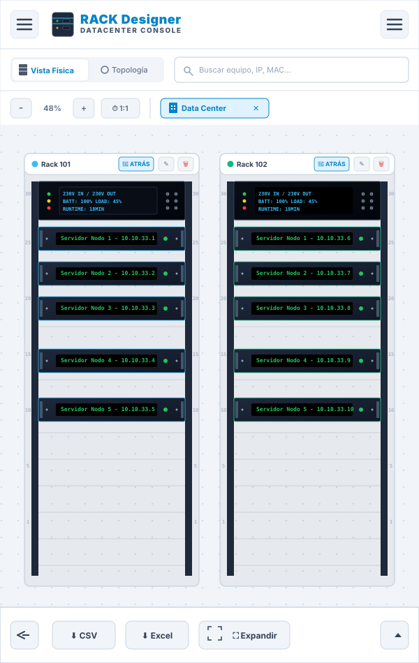
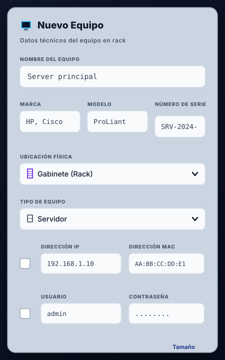
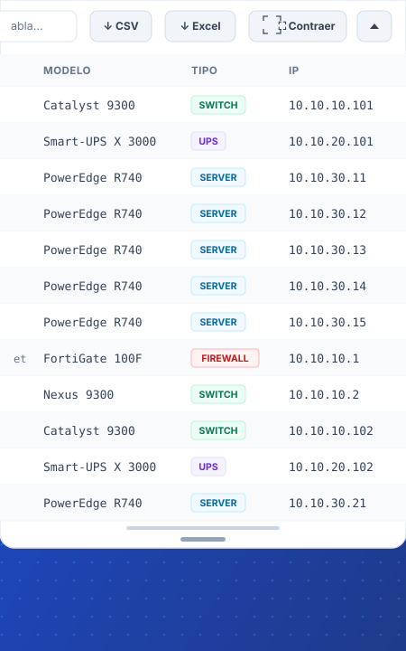
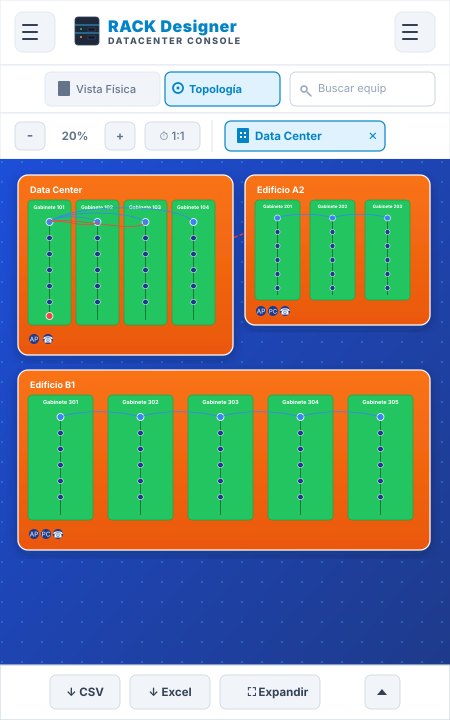
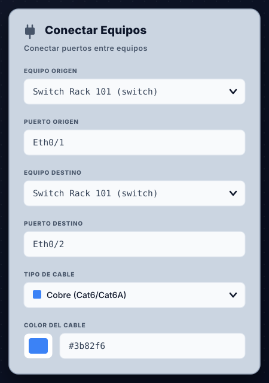

# Manual de Usuario - RACK Designer

RACK Designer es una herramienta gráfica profesional para el diseño, documentación e inventario de Centros de Datos. Permite modelar gabinetes, ubicar equipos en rack o en piso, trazar topologías de red y exportar datos para auditorías.

## 1. Interfaz Principal

La interfaz está diseñada para optimizar el área de trabajo y consta de tres áreas clave:
- **Cabecera y Barra de Herramientas:** Contiene las opciones globales (Alternar Modo Claro/Oscuro, Cargar/Guardar proyecto), los selectores de vistas (Vista Física, Topología) y la gestión de Salas.
- **Lienzo Central (Área de Trabajo):** El espacio interactivo donde se visualizan y distribuyen los gabinetes (racks) y equipos de piso.
- **Panel Inferior (Inventario y Catálogo):** Muestra los reportes tabulares en vivo y permite el acceso rápido al Catálogo de Dispositivos predefinidos.

**Adaptabilidad a Pantallas:**
La aplicación cuenta con soporte adaptativo completo para smartphones y tabletas. En pantallas de escritorio, el diseño se expande lateralmente. En dispositivos móviles, el layout es compacto: los paneles laterales se ocultan automáticamente bajo un menú hamburguesa `☰` para maximizar el área útil del lienzo físico, logrando una vista vertical optimizada.

*Figura: Vista vertical y compacta adaptada a dispositivos móviles.*

## 2. Gestión de Salas e Infraestructura

Las Salas representan espacios físicos aislados (ej. "Data Center Principal", "Sala Eléctrica").

* **Crear una Sala:** Haga clic en el símbolo `+` en la barra de pestañas de salas. En pantallas táctiles, las pestañas de salas soportan deslizamiento horizontal.
* **Renombrar:** Haga doble clic sobre el nombre de la pestaña de la sala.
* **Eliminar:** Utilice el icono `x` en la pestaña (solo visible si existe más de una sala).

**Interfaz Móvil:** El formulario de creación de salas se adapta automáticamente a la vista móvil para evitar desbordamientos.

*Figura: Modal simplificado para la creación de salas en móviles.*

### Añadir Gabinetes (Racks)
1. Sitúese en la **Vista Física** de la sala deseada.
2. Haga clic derecho en el fondo del área de trabajo (o mantenga presionado en pantallas táctiles).
3. Seleccione **"Añadir Rack"**, ingrese el nombre, defina la altura en Unidades (U) y seleccione un color para identificarlo.

## 3. Gestión de Equipos (Inventario)

Existen dos categorías principales de dispositivos: **Equipos en Rack** (Servidores, Switches, UPS) y **Equipos de Piso** (Cámaras IP, Workstations, APs).

### Insertar Equipos
* **Arrastrar y Soltar (Drag & Drop):** Abra el catálogo (botón `☰`), haga clic sostenido sobre un equipo y suéltelo sobre el espacio (`U`) deseado dentro de un rack, o en el área punteada de "Equipos de Piso".
* **Ubicación Rápida (⚡):** Operación simplificada para entornos táctiles donde el arrastre puede ser dificultoso. Utilice el icono de rayo junto a un equipo en el catálogo. Seleccione la sala y el gabinete de destino; el sistema encontrará automáticamente un espacio disponible y lo ubicará.

**Catálogo en Dispositivos Móviles:** Al pulsar el botón de menú hamburguesa o el de estadísticas, se despliega un panel lateral flotante (Off-Canvas) con métricas globales y el catálogo de dispositivos optimizado para scroll táctil.

*Figura: Panel lateral de Estadísticas y Catálogo de Dispositivos adaptado para pantallas móviles (Menú Off-Canvas).*

### Editar Configuración del Equipo
Haga clic sobre cualquier equipo ya ubicado y presione **"✏️ Editar"** en el panel lateral/inferior. El formulario está organizado lógicamente en módulos:

1. **Ubicación Física:** Permite reclasificar un equipo entre "Gabinete" o "Equipo de Piso", ajustando dinámicamente sus opciones (los equipos de piso no ocupan Unidades de altura).
2. **Identificación:** Marca, Modelo y Número de Serie.
3. **Módulos Opcionales (Casillas de Activación):**
   - **Habilitar Red:** Despliega campos para Dirección IP y Dirección MAC.
   - **Habilitar Credenciales:** Despliega Usuario y Contraseña.
   - **Habilitar Energía:** Despliega configuraciones detalladas de Tomas Eléctricas (Entrada y Salida) y Consumo (W). 

*Nota: La separación de tomas de "Salida" es ideal para documentar equipos proveedores de energía, como regletas (PDUs) o sistemas UPS.*

**Interfaz Móvil:** Los modales de configuración de equipo se reestructuran visualmente en pantallas verticales apilando los campos en una grilla compacta de dos columnas.

*Figura: Formulario de adición y edición de equipos optimizado para dispositivos móviles.*

### Inventario Deslizable
El panel inferior muestra todos los dispositivos. En escritorio, ocupa el ancho inferior. En **Móvil**, funciona como un contenedor deslizable verticalmente (drawer) que se puede arrastrar hacia arriba para expandir la lista, contando con desplazamiento horizontal táctil para las distintas columnas.

*Figura: Tabla de inventario expandida y adaptada para scroll en pantallas móviles.*

### Cara Frontal y Trasera de un Rack
El botón de rotación (`🔄 ATRÁS` / `🖥️ FRENTE`) en la cabecera de cada rack permite instalar equipos (como organizadores de cables o PDUs) en la cara posterior sin que colisionen físicamente con los servidores del frente.

## 4. Topología y Cableado

El modo **Topología** (accesible desde la barra superior) dibuja de forma automatizada un mapa de nodos interconectados.

* **Conectar Equipos:** Haga doble clic en un nodo (o utilice el botón derecho/pulsación larga) para iniciar una conexión. Luego, seleccione el equipo de destino.
* **Organización Visual:** Puede arrastrar libremente los nodos para organizar el mapa. La topología resalta automáticamente los equipos que pertenecen a la sala que esté actualmente activa.

**Topología en Dispositivos Móviles:** En pantallas pequeñas, el mapa auto-escala el nivel de zoom y organiza verticalmente las salas conectadas. Los modales de conexión de puertos también se redimensionan para evitar desbordamientos de campos.

*Figura: Vista de la topología lógica y cableado de red en dispositivos móviles.*

*Figura: Formulario estructurado para el trazado de conexiones y puertos en móviles.*

## 5. Exportación y Respaldo

### Guardar/Cargar Proyecto
Toda su infraestructura se guarda localmente en su navegador automáticamente, pero para respaldos de seguridad o para mover el proyecto a otro equipo:
* **Guardar Proyecto:** En el menú principal, seleccione guardar. Esto descargará un archivo `.json` con todo el centro de datos.
* **Cargar Proyecto:** Importe un archivo `.json` previamente guardado para restaurar el entorno completo.

**Gestión en Móvil:** El menú de opciones globales es accesible mediante un botón hamburguesa superior derecho, desplegando un menú claro y adaptado para comandos táctiles.

*Figura: Menú de gestión de proyectos adaptado a pantallas móviles.*

### Exportar Reportes (Excel / CSV)
En la sección inferior de "Inventario", los botones `⬇ Excel` y `⬇ CSV` generan instantáneamente un reporte tabular compatible con hojas de cálculo para facilitar la auditoría física.

### Exportar Diagramas Visuales (PNG)
Presione el botón `📷 PNG` en la barra de herramientas y seleccione un rack. El sistema procesará y descargará una imagen de alta resolución. Si el rack contiene equipos traseros, el PNG incluirá ambas caras (Frontal y Trasera) lado a lado automáticamente.

---
*Fin del Documento*
