#  Manual RACK Designer

Bienvenido al manual interactivo de **RACK Designer**. Esta herramienta gráfica está diseñada para simplificar el diseño, documentación e inventario de Centros de Datos.

> [!TIP]
> Puedes alternar entre el "Modo Oscuro" y "Modo Claro" usando el menú principal ☰ en la esquina superior derecha de la aplicación.

## 1. Introducción y Vista General

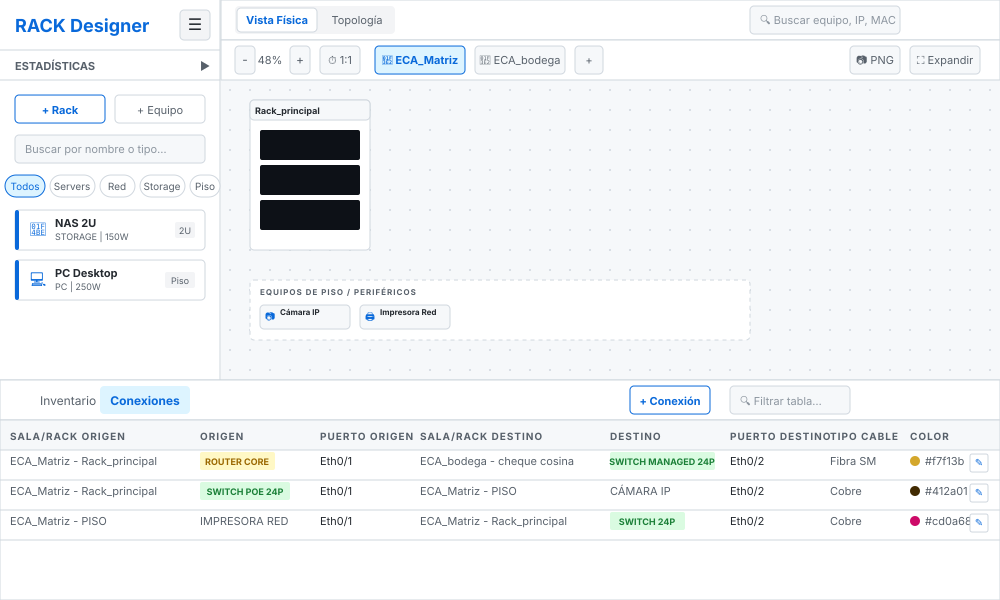
*Figura: Interfaz completa de la aplicación visualizada con el Tema Claro (Light Mode).*

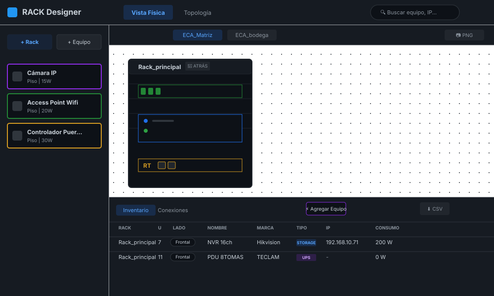
*Figura: Diseño esquemático de los paneles principales de RACK Designer.*

### Áreas de Trabajo

* **Menú Principal (Hamburguesa):** Abre un listado de opciones de persistencia para Guardar/Cargar el proyecto en archivos locales `.json`, cargar datos de demostración, gestionar la interfaz gráfica (Modo Claro/Oscuro) y la Privacidad.
* **👁 Modo Dios (Seguridad):** Accesible desde el Menú Principal, te permite revelar u ocultar todas las contraseñas de los equipos en la pantalla (Tooltips, HUD y Tablas) y controla si se incluyen en exportaciones CSV/Excel.
* **Pestañas Laterales:** Te permiten alternar entre buscar y agregar Racks o Equipos individuales.
* **Filtros Inferiores:** Rápidamente aíslan tipos de equipos en la lista inferior (Todos, Servers, Red, Storage, Piso).

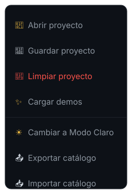
*Figura: Menú global de la aplicación (Modo Oscuro/Claro, I/O de proyectos).*

* **Cabecera y Modo Rendimiento:** Controles globales, cambio de Vistas (Física / Topología) y el punto verde luminoso de estado.
  > [!TIP]
  > **Tip de Rendimiento:** Al hacer clic en este punto verde se activa el *"Modo Rendimiento"*, deteniendo instantáneamente todas las animaciones gráficas para ahorrar batería y recursos en computadoras menos potentes.
* **Lienzo Central:** Tu área principal de diseño donde arrastrarás los equipos. Al utilizar el botón "Expandir" o "Contraer", los paneles laterales se ocultan para maximizar tu área de trabajo.
* **Panel Inferior:** Estadísticas, inventario tabular y catálogo de arrastre.

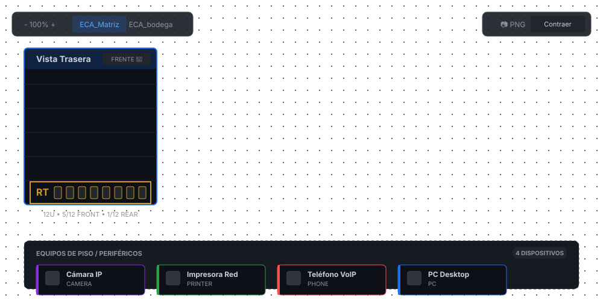
*Figura: Modo Expandido. Los paneles laterales se ocultan para dar prioridad total al lienzo de diseño.*

### Adaptabilidad a Pantallas
RACK Designer cuenta con soporte completo para pantallas táctiles y dispositivos móviles. En pantallas de escritorio, el diseño se expande lateralmente. En dispositivos móviles, la interfaz se adapta automáticamente apilando los gabinetes verticalmente y ocultando el catálogo lateral bajo el menú hamburguesa ☰ para maximizar el lienzo de trabajo, logrando una vista vertical optimizada.

*Figura: Interfaz base adaptada a pantallas táctiles mostrando los racks en formato vertical.*

## 2. Infraestructura (Salas y Gabinetes)

### Gestión de Salas
Todo el equipo debe organizarse dentro de una "Sala". Las salas contienen "Gabinetes" (Racks) donde atornillarás los servidores.

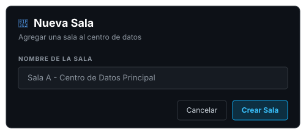
*Figura: Cuadro de diálogo para agregar una nueva sala en escritorio.*

**Interfaz Móvil:** En dispositivos móviles, el formulario se reestructura automáticamente para pantallas pequeñas, asegurando que los campos de texto se mantengan accesibles mediante teclado en pantalla y sin desbordamientos.

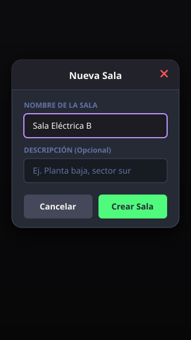
*Figura: Modal simplificado para la creación de salas adaptado a dispositivos móviles.*

### Crear un Gabinete

> [!NOTE]
> **✨ Atajos Rápidos:** Cuando una sala no contiene ningún gabinete (estado vacío), el sistema mostrará botones interactivos en el centro del lienzo para que puedas agregar tu primer Rack o Equipo de Piso instantáneamente con un solo clic.

Haciendo **clic derecho** en el lienzo azul, podrás crear un nuevo Rack. Deberás asignarle un Nombre, una altura en Unidades (U) (típicamente 42U o 48U) y un Color distintivo.

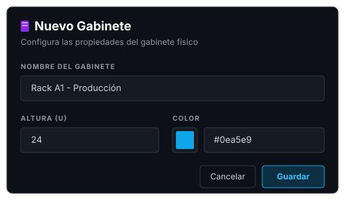
*Figura: Cuadro de diálogo para configurar un nuevo Rack.*

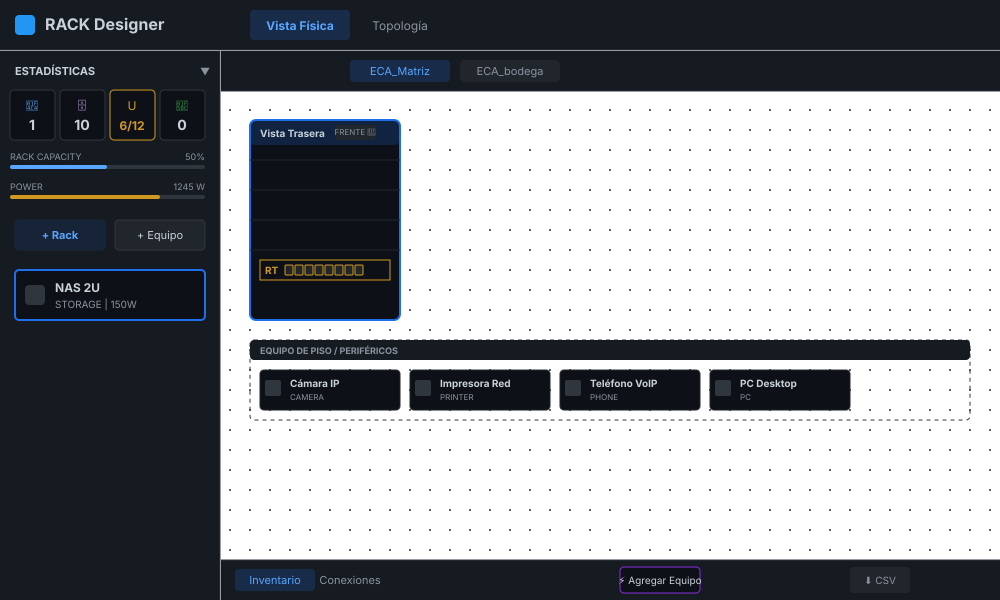
*Figura: Vista Trasera del Rack y Equipos de Piso. Observa el panel de Estadísticas a la izquierda.*

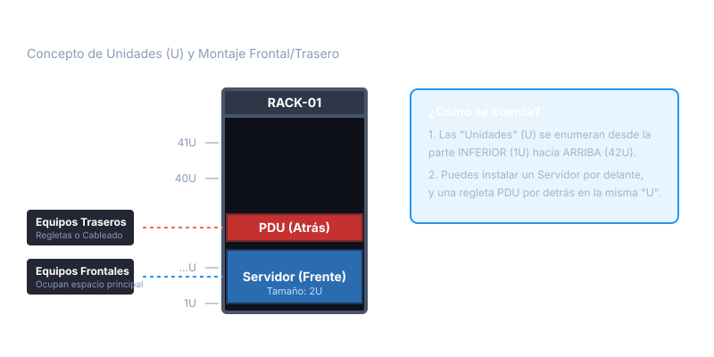
*Figura 1: Entendiendo las unidades (U) y la ocupación por caras.*

Como se muestra en la figura, cada unidad (U) puede alojar un equipo frontal y, de forma independiente, un equipo trasero (como regletas eléctricas o PDUs) sin chocar entre sí.

### Opciones del Gabinete (Menú Contextual)
Cada Gabinete posee un botón de opciones (`⋮`) en su cabecera superior. Al hacer clic, se despliega un menú contextual flotante que agrupa todas las acciones de administración del rack:
* **+ Equipo:** Atajo directo para instalar un nuevo dispositivo en este rack.
* **Editar:** Modificar el nombre, color o altura en unidades (U) del gabinete.
* **Limpiar Rack:** Elimina masivamente todos los equipos que se encuentran atornillados dentro del gabinete. El sistema mostrará una advertencia de seguridad pidiendo tu confirmación antes de la eliminación total.
* **Eliminar:** Borra el gabinete completo de la sala.

## 3. Gestión de Equipos

### Métodos de Instalación
* **Arrastrar y Soltar (Drag & Drop):** Arrastra un equipo desde el catálogo izquierdo y suéltalo sobre una U específica.
* **Por Menú Contextual:** Haz clic derecho en cualquier espacio vacío del Rack y selecciona "Instalar Equipo".
* **Ubicación Asistida:** Haz clic en el botón morado `⚡ Agregar Equipo` de la barra inferior para usar el asistente de instalación paso a paso sin arrastrar.

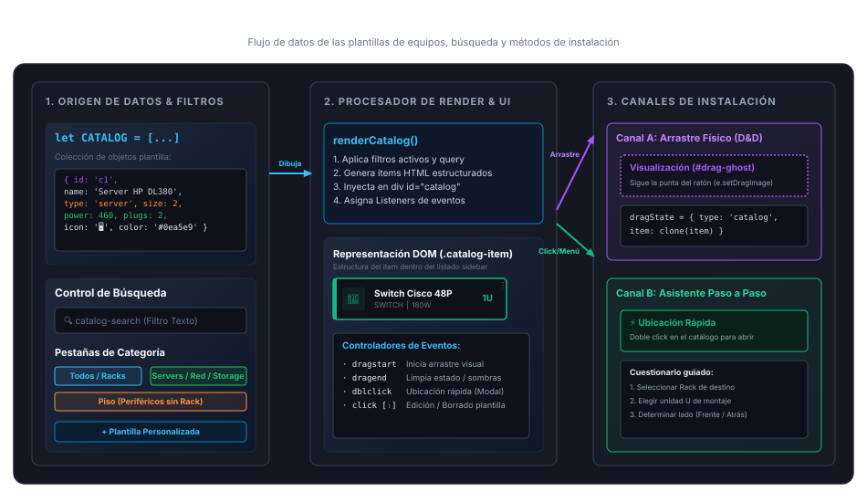
*Figura: Arquitectura, flujo de datos y canales de instalación desde el Catálogo de Equipos.*

**Catálogo Móvil:** En dispositivos móviles, al pulsar el menú hamburguesa, el sistema despliega un panel lateral flotante (off-canvas) con el catálogo y estadísticas optimizadas para arrastre y tap táctil.

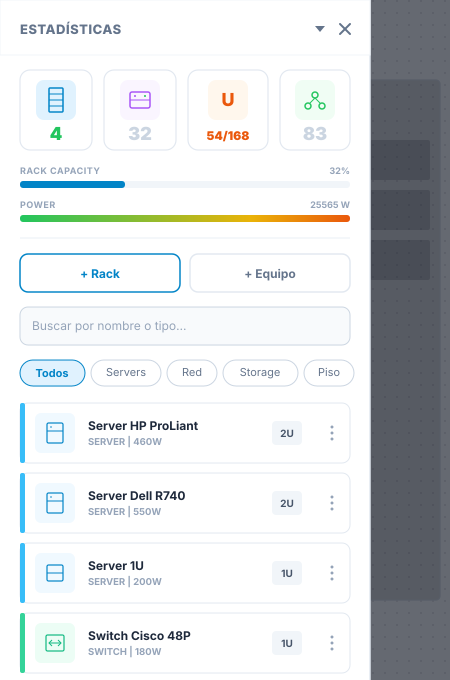
*Figura: Panel lateral de Estadísticas y Catálogo de Dispositivos adaptado para pantallas móviles.*

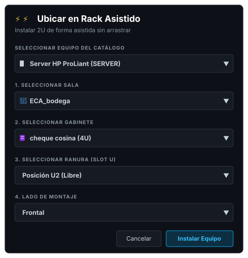
*Figura: Asistente paso a paso para ubicar equipos con precisión (Ideal para pantallas táctiles donde el drag&drop es difícil).*

### Módulos de Configuración
Al editar un equipo, verás casillas de verificación (Checkboxes) para habilitar configuraciones avanzadas. Si un equipo es "pasivo" (ej. un patch panel), no necesitas habilitar estos módulos.

### Propiedades y Ficha Técnica
Haciendo doble clic en un equipo, se abrirá su ficha técnica. Aquí puedes documentar:

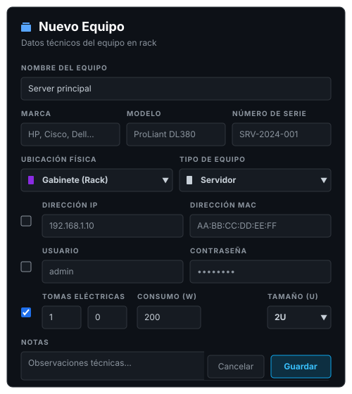
*Figura: Ficha técnica completa de un equipo, incluyendo credenciales, consumo eléctrico y puertos en escritorio.*

**Configuración Móvil:** En pantallas de smartphones, el formulario se reestructura visualmente en una grilla compacta de dos columnas con casillas de activación adaptadas a gestos táctiles amplios.

*Figura: Formulario de adición y edición de equipos optimizado para dispositivos móviles.*

* **Módulo de Red:** Despliega IP y MAC.
* **Módulo de Energía:** Despliega las Tomas de Entrada (requeridas para encender el equipo) y las Tomas de Salida (proporcionadas por el equipo, útil para UPS/PDU).

## 4. Topología y Redes
La vista topológica permite conectar los equipos mediante cables lógicos. Los equipos se renderizan como Nodos interconectados.

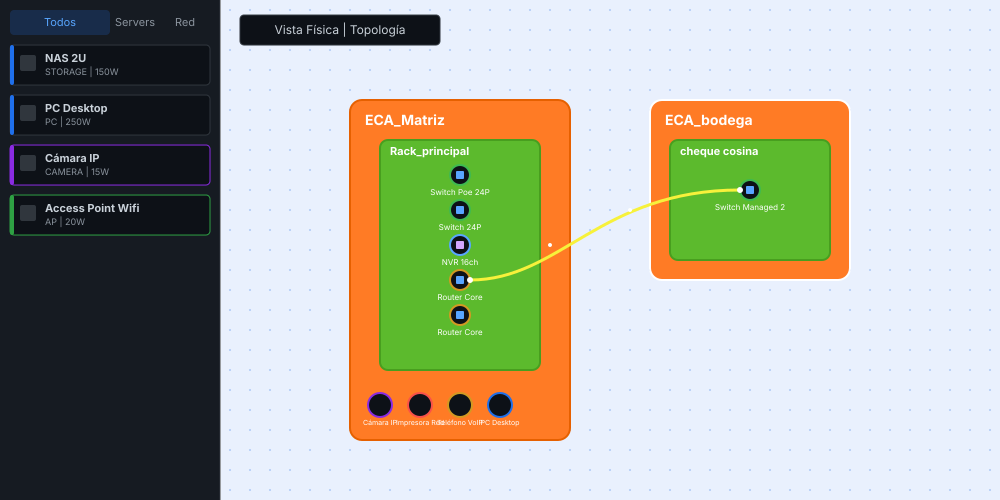
*Figura 2: Interpretación del lienzo topológico mostrando las Salas (Naranja), Gabinetes (Verde) y cableado lógico.*

**En dispositivos móviles**, el sistema auto-escala el nivel de zoom inicial al 20% y agrupa las salas de manera que los enlaces (fibra/ethernet) sean legibles rápidamente. Además, el diálogo de conexión se adapta al ancho de pantalla:

*Figura: Mapa interactivo de topología adaptado a pantallas móviles.*

*Figura: Modal de conexión de puertos adaptado a móviles.*

Para conectar dos equipos, simplemente haz **doble clic** en un nodo de origen y luego selecciona el nodo de destino. Esto abrirá el menú de configuración de enlace.

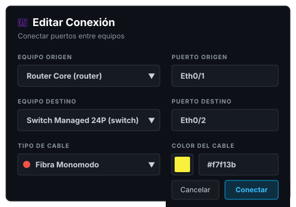
*Figura: Configuración de parámetros físicos y lógicos de un enlace de red.*

A medida que diseñes tu red, podrás visualizar la arquitectura completa (Full-Screen) donde se aprecian las rutas de cada cable. El color de las líneas representará los enlaces que has creado.

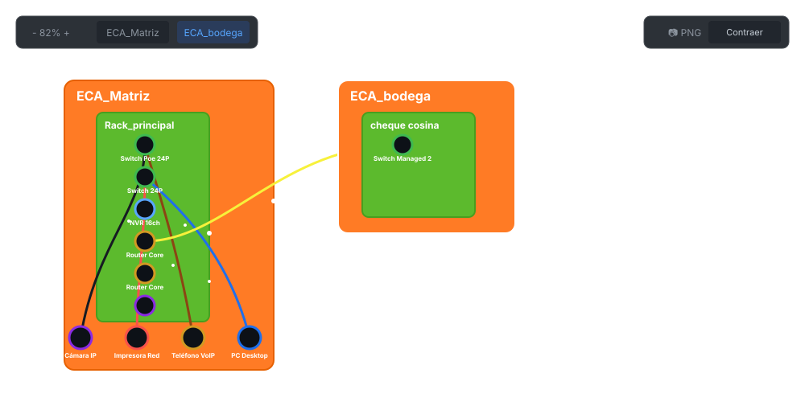
*Figura: Topología compleja ilustrando la conexión de equipos de piso hacia los switches de distribución en el Rack.*

Puedes utilizar la rueda del ratón o los controles de zoom (🔍) en la barra superior para acercarte (Zoom In) y observar en detalle los nodos y las rutas de cableado, incluyendo las IPs de los equipos principales.

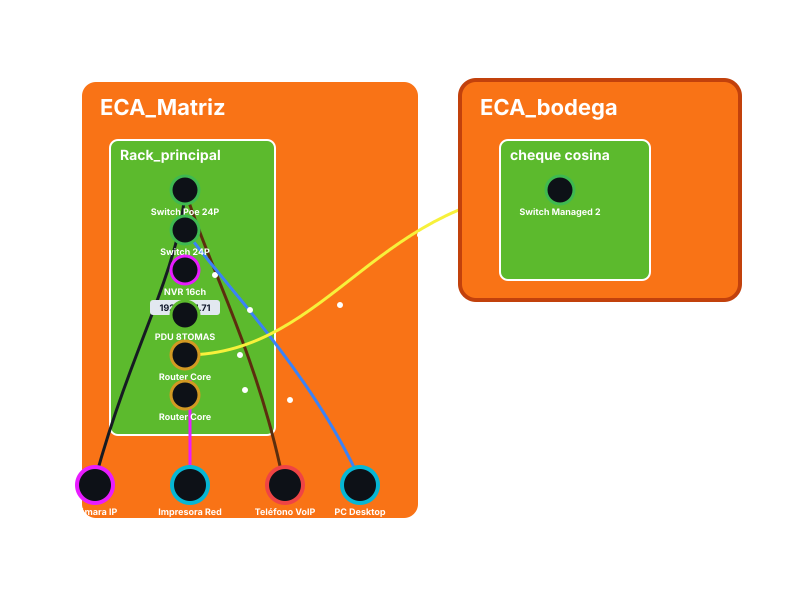
*Figura: Acercamiento a la topología revelando etiquetas dinámicas como la IP de un NVR y el ruteo físico de los cables.*

### Tabla de Conexiones
Alternando la pestaña del panel inferior a **Conexiones**, puedes acceder a una bitácora tabular de todos los enlaces que has creado. Aquí verás el detalle de los puertos y colores asignados, con la posibilidad de editarlos o eliminarlos masivamente.

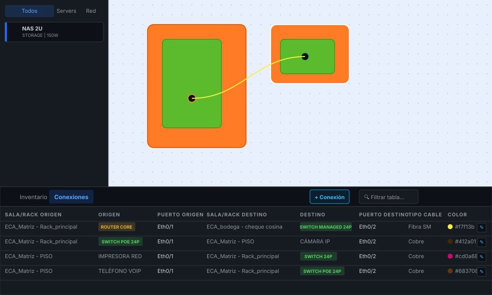
*Figura: Auditoría detallada del cableado lógico cruzado entre Salas, Racks y Equipos.*

Para mayor comodidad durante auditorías extensas, puedes hacer clic en el botón **Expandir** de la tabla para ocultar el lienzo y ver la bitácora en pantalla completa.

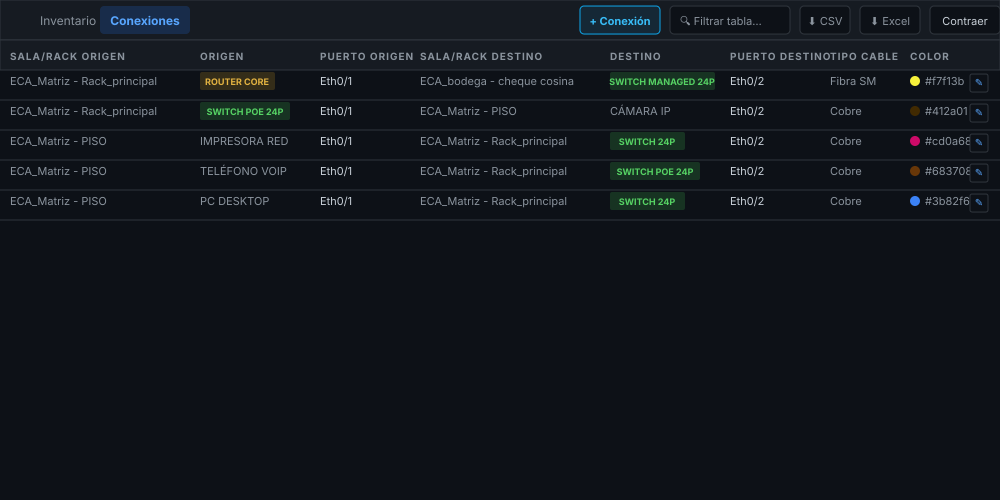
*Figura: Tabla de Conexiones en modo Pantalla Completa, revelando los controles para exportar a CSV y Excel en la parte superior derecha.*

## 5. Respaldos y Exportación
Es fundamental respaldar el trabajo periódicamente y utilizar la tabla de inventario para auditorías.

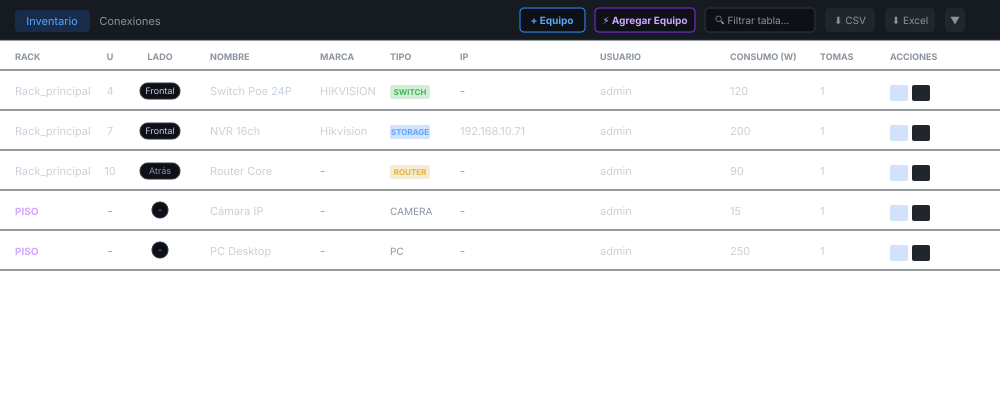
*Figura: Tabla de Inventario en modo expandido mostrando los equipos de rack y piso con todos sus detalles.*

**Inventario en Móvil:** En smartphones, la tabla se adapta mediante un contenedor deslizable verticalmente (drawer) que puede arrastrarse hacia arriba, con soporte para scroll horizontal que facilita la lectura de todas las columnas.

*Figura: Tabla de inventario expandida y adaptada para scroll en pantallas móviles.*

* **Archivo JSON:** En el menú superior, usa "Guardar Proyecto" para descargar todo el centro de datos.
* **Reporte Tabular:** En el panel de inventario o conexiones expandidas, presiona `⬇ Excel` o `⬇ CSV` para auditar los equipos.
* **Imagen Fotográfica:** Usa el botón `📷 PNG` en la barra superior y selecciona el rack a exportar para generar una instantánea del armario. Si hay equipos ubicados directamente en la sala, aparecerá la opción independiente para exportar "Equipos de Piso".

**Menú en Móvil:** Las opciones globales de importación, exportación y guardado se ubican en el menú hamburguesa adaptado a un panel táctil desplegable.

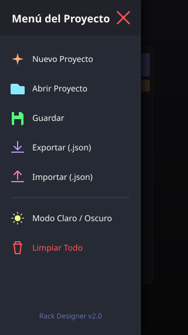
*Figura: Menú desplegable de opciones de proyecto y respaldo en dispositivos móviles.*

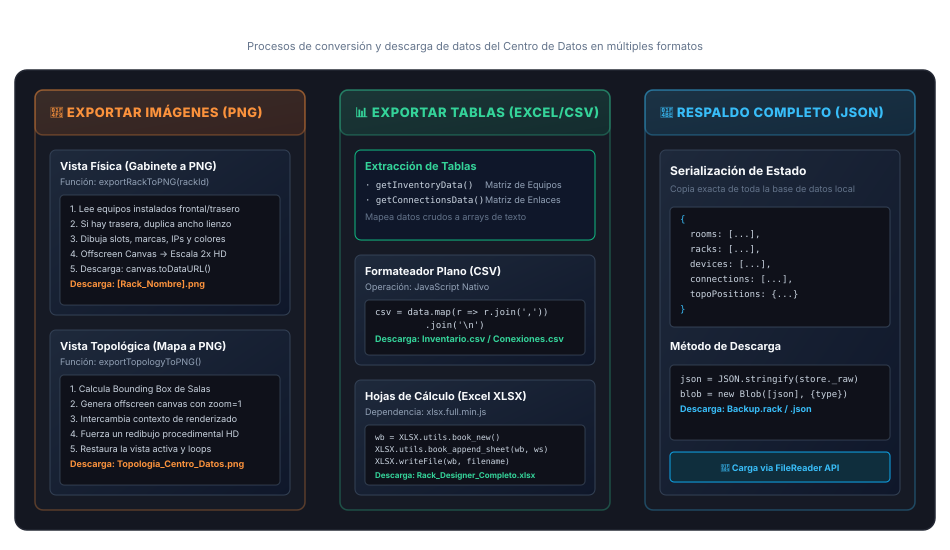
*Figura: Esquema técnico de los procesos de exportación de imágenes, tablas de datos y copias de seguridad del sistema.*

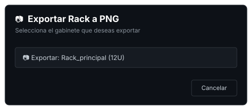
*Figura: Cuadro de diálogo para seleccionar el rack y renderizarlo como imagen PNG de alta resolución.*

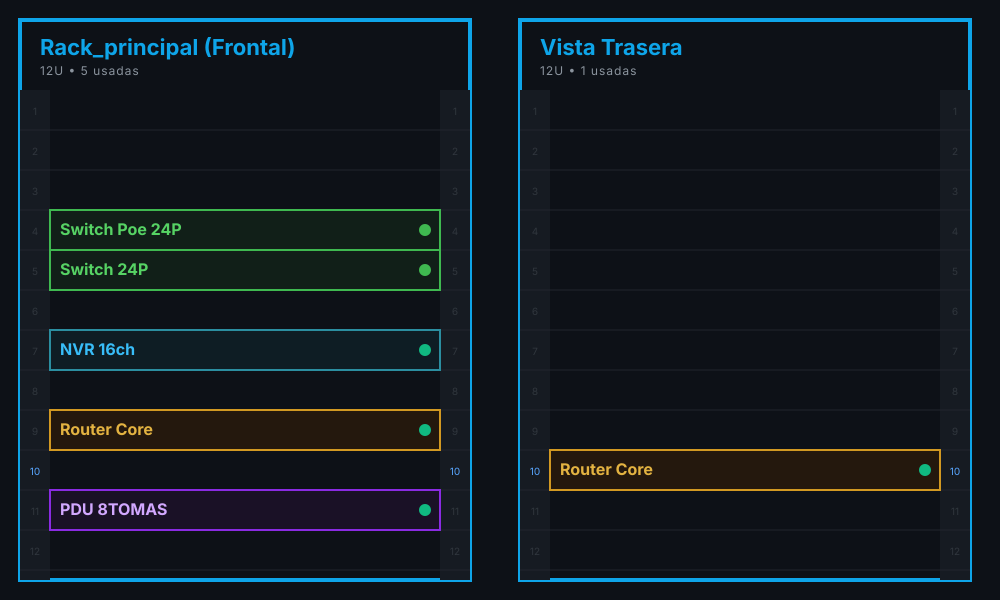
*Figura: Ejemplo del archivo de alta resolución exportado, mostrando el despiece técnico frontal y trasero del rack con sus unidades exactas.*
