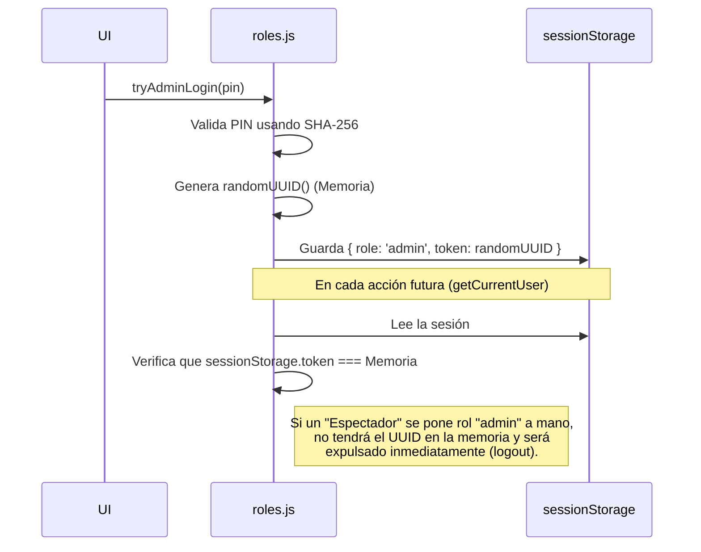

# 🛡️ Resumen de Parches de Seguridad (Client-Side)

Se han implementado con éxito los parches de seguridad recomendados para blindar el almacenamiento local de RACK Designer 2.

## 1. Criptografía SHA-256 Asíncrona
Se migró la lógica de contraseñas de texto plano a Hashes criptográficos utilizando la **Web Crypto API**.
- El PIN original `"rack2024"` fue destruido y reemplazado por su hash correspondiente: `392bd9077...`.
- El método `setAdminPin` ahora calcula el Hash antes de escribir en el `localStorage`.
- Los eventos de interfaz en `main.js` (`btn-login-admin` y `btn-pin-save`) fueron refactorizados a `async/await` para esperar el proceso de hashing asíncrono.

## 2. Sello de Integridad de Sesión en Memoria (Anti-Tampering)
Para evitar que un atacante salte las barreras de permisos mediante DevTools, se implementó un mecanismo de *closures* y memoria volátil.

> [!CAUTION]
> **Consecuencia de Seguridad (By Design)**
> Debido a que el Sello de Integridad se guarda en la memoria RAM (Closure) y no en el disco, **los Administradores y Editores perderán su sesión si recargan la página web (`F5`)**. Esta es una medida de seguridad intencional ("Fail-Safe") en aplicaciones puramente Client-Side para forzar re-autenticación y evitar el secuestro de sesión local.

## 3. Verificación
El login sigue operando a través de la misma UI. Sin embargo, debajo de la superficie, el sistema es considerablemente más seguro frente a accesos no autorizados al PC físico.
